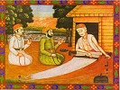

  
[Intangible Textual Heritage](../../index)  [Hinduism](../index) 
[Sufism](../../isl/index.htm#sufi)  [Index](index)  [Previous](sok030) 
[Next](sok032) 

------------------------------------------------------------------------

[Buy this Book at
Amazon.com](https://www.amazon.com/exec/obidos/ASIN/B002B55PTI/internetsacredte)

------------------------------------------------------------------------

  
*The Songs of Kabir*, tr. by Rabindranath Tagore, intro. by Evelyn
Underhill, \[1915\], at Intangible Textual Heritage

------------------------------------------------------------------------

# XXX

II\. 95.

yâ tarvar me<u>n</u> ek pakherû

ON this tree is a bird: it dances in the joy of life.  
None knows where it is: and who knows what the burden of its music may
be?  
Where the branches throw a deep p. 79 shade,
there does it have its nest: and it comes in the evening and flies away
in the morning, and says not a word of that which it means.  
None tell me of this bird that sings within me.  
It is neither coloured nor colourless: it has neither form nor
outline:  
It sits in the shadow of love.  
It dwells within the Unattainable, the Infinite, and the Eternal; and no
one marks when it comes and goes.  
Kabîr says: "O brother Sadhu! deep is the mystery. Let wise men seek to
know where rests that bird."

------------------------------------------------------------------------

[Next: XXXI](sok032)
