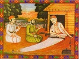

  
[Intangible Textual Heritage](../../index)  [Hinduism](../index) 
[Sufism](../../isl/index.htm#sufi)  [Index](index)  [Previous](sok049) 
[Next](sok051) 

------------------------------------------------------------------------

[Buy this Book at
Amazon.com](https://www.amazon.com/exec/obidos/ASIN/B002B55PTI/internetsacredte)

------------------------------------------------------------------------

  
*The Songs of Kabir*, tr. by Rabindranath Tagore, intro. by Evelyn
Underhill, \[1915\], at Intangible Textual Heritage

------------------------------------------------------------------------

### XLIX

I. 105.

jo dîsai, so to hai nâhî

n

THAT which you see is not: and for that which is, you have no words.  
Unless you see, you believe not: what is told you you cannot accept.  
He who is discerning knows by the word; and the ignorant stands gaping.
p. 96  
Some contemplate the Formless, and others meditate on form: but the wise
man knows that Brahma is beyond both.  
That beauty of His is not seen of the eye: that metre of His is not
heard of the ear.  
Kabîr says: "He who has found both love and renunciation never descends
to death."

------------------------------------------------------------------------

[Next: L](sok051)
