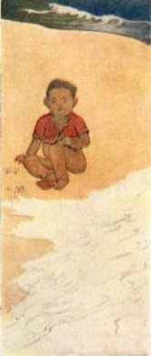

[Intangible Textual Heritage](../../../index)  [Hinduism](../../index) 
[Tagore](../index)  [Index](index)  [Next](cm01) 

------------------------------------------------------------------------

# The Crescent Moon

## By Rabindranath Tagore

#### Translated from the original Bengali by the author

#### with eight illustrations in colour

#### London and New York: Macmillan and Company, 1913

TO T. STURGE MOORE

###### redacted by Chetan K Jain, BharatLiterature

 

\[Frontispiece: From a drawing by Nandalall Bose\]

------------------------------------------------------------------------

[Next: Contents](cm01)
