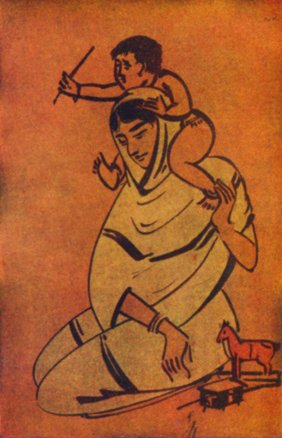

[Intangible Textual Heritage](../../../index)  [Hinduism](../../index) 
[Tagore](../index)  [Index](index)  [Previous](cm02)  [Next](cm04) 

------------------------------------------------------------------------

### THE HOME

 

\[Illustration: The Home--from a drawing by Nandalall Bose\]

I paced alone on the road across the field while the sunset was hiding
its last gold like a miser.

The daylight sank deeper and deeper into the darkness, and the widowed
land, whose harvest had been reaped, lay silent.

Suddenly a boy's shrill voice rose into the sky. He traversed the dark
unseen, leaving the track of his song across the hush of the evening.

His village home lay there at the end of the waste land, beyond the
sugar-cane field, hidden among the shadows of the banana and the slender
areca palm, the cocoa-nut and the dark green jack-fruit trees.

I stopped for a moment in my lonely way under the starlight, and saw
spread before me the darkened earth surrounding with her arms countless
homes furnished with cradles and beds, mothers' hearts and evening
lamps, and young lives glad with a gladness that knows nothing of its
value for the world.

------------------------------------------------------------------------

[Next: On The Seashore](cm04)
