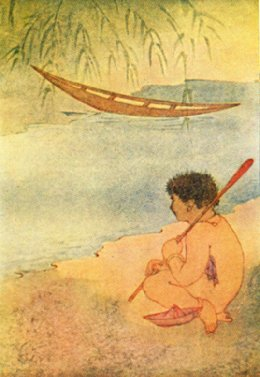

[Intangible Textual Heritage](../../../index)  [Hinduism](../../index) 
[Tagore](../index)  [Index](index)  [Previous](cm24)  [Next](cm26) 

------------------------------------------------------------------------

### THE MERCHANT

 

\[Illustration: From a drawing by Asit Kumar Haldar\]

Imagine, mother, that you are to stay at home and I am to travel into
strange lands.

Imagine that my boat is ready at the landing fully laden.

Now think well, mother, before you say what I shall bring for you when I
come back.

Mother, do you want heaps and heaps of gold?

There, by the banks of golden streams, fields are full of golden
harvest.

And in the shade of the forest path the golden *champa* flowers drop on
the ground.

I will gather them all for you in many hundred baskets. Mother, do you
want pearls big as the raindrops of autumn?

I shall cross to the pearl island shore. There in the early morning
light pearls tremble on the meadow flowers, pearls drop on the grass,
and pearls are scattered on the sand in spray by the wild sea-waves.

My brother shall have a pair of horses with wings to fly among the
clouds.

For father I shall bring a magic pen that, without his knowing, will
write of itself.

For you, mother, I must have the casket and jewel that cost seven kings
their kingdoms.

------------------------------------------------------------------------

[Next: Sympathy](cm26)
