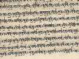

  
[Intangible Textual Heritage](../../index)  [Hinduism](../index) 
[Index](index)  [Previous](tmu32) 

------------------------------------------------------------------------

[Buy this Book on
Kindle](https://www.amazon.com/exec/obidos/ASIN/B0031574GO/internetsacredte)

------------------------------------------------------------------------

  
*Thirty Minor Upanishads*, tr. by K. Narayanasvami Aiyar, \[1914\], at
Intangible Textual Heritage

------------------------------------------------------------------------

p. 273

### INDEX OF PROPER NAMES

**A**

Abhimāna [157](tmu23.htm#page_157)

Achyuṭa [37](tmu09.htm#page_37)

Āḍhibhauṭika [265](tmu32.htm#page_265)

Aḍhibhūṭa [64](tmu13.htm#page_64)

Āḍhiḍaivika [265](tmu32.htm#page_265)

Aḍhyāṭma [64](tmu13.htm#page_64)

Aḍhyāṭma-Upanishaḍ [55](tmu12.htm#page_55)

Āḍiṭyas [128](tmu20.htm#page_128)

Āḍiṭyaloka [243](tmu30.htm#page_243)

Aḍvaiṭa [27](tmu06.htm#page_27)

Āgneya-sacrifice [143](tmu23.htm#page_143)

Agni [46](tmu11.htm#page_46), [61](tmu13.htm#page_61),
[62](tmu13.htm#page_62), [75](tmu13.htm#page_75),
[113](tmu17.htm#page_113), [116](tmu18.htm#page_116),
[121](tmu18.htm#page_121), [187](tmu24.htm#page_187),
[197](tmu25.htm#page_197), [237](tmu29.htm#page_237)

Agnihoṭra [138](tmu23.htm#page_138)

Agrāhya [22](tmu05.htm#page_22)

Āgāmin [221](tmu29.htm#page_221)

Ahambrahmāsmi [49](tmu11.htm#page_49)

Ahaṅkāra [27](tmu06.htm#page_27), [44](tmu11.htm#page_44),
[55](tmu12.htm#page_55), [116](tmu18.htm#page_116)

Āhavanīya [121](tmu18.htm#page_121)

Ahimsā [173](tmu24.htm#page_173)

Ainḍrī [255](tmu31.htm#page_255)

Ajapā-Gāyaṭrī [213](tmu27.htm#page_213)

Ajñāna [20](tmu05.htm#page_20)

Ājñā [212](tmu27.htm#page_212), [270](tmu32.htm#page_270)

Akāra [232](tmu29.htm#page_232), [254](tmu31.htm#page_254)

Akarma [201](tmu25.htm#page_201)

Ākāś [46](tmu11.htm#page_46), [61](tmu13.htm#page_61),
[62](tmu13.htm#page_62), [75](tmu13.htm#page_75),
[113](tmu17.htm#page_113), [116](tmu18.htm#page_116),
[197](tmu25.htm#page_197), [237](tmu29.htm#page_237)

Akshaṭa [248](tmu30.htm#page_248)

Alambusā [176](tmu24.htm#page_176), [206](tmu26.htm#page_206),
[239](tmu29.htm#page_239)

Amanaska [245](tmu30.htm#page_245), [251](tmu30.htm#page_251)

Amarolī [200](tmu25.htm#page_200)

Amṛṭanāḍa-Upanishaḍ [216](tmu28.htm#page_216)

Amṛṭabinḍu-Upanishaḍ [34](tmu08.htm#page_34)

Amūrṭi [245](tmu30.htm#page_245)

Ānanḍa [17](tmu04.htm#page_17)

Ānanḍamaya [14](tmu04.htm#page_14), [47](tmu11.htm#page_47)

Anāhata [212](tmu27.htm#page_212), [253](tmu30.htm#page_253)

Ananṭa [16](tmu04.htm#page_16)

Aṅganyāsas [214](tmu27.htm#page_214)

Anna [75](tmu13.htm#page_75), [260](tmu32.htm#page_260)

Annamaya [14](tmu04.htm#page_14)

Anṭaḥkaraṇa [44](tmu11.htm#page_44), [46](tmu11.htm#page_46),
[113](tmu17.htm#page_113)

Anṭarlakshya [244](tmu30.htm#page_244)

Anṭarveḍi [122](tmu18.htm#page_122)

Anṭaryāmin [15](tmu04.htm#page_15)

Apāna [177](tmu24.htm#page_177), [206](tmu26.htm#page_206),
[219](tmu28.htm#page_219)

Apānṭaraṭama [60](tmu12.htm#page_60), [69](tmu13.htm#page_69)

Aparā [57](tmu12.htm#page_57)

Apas [46](tmu11.htm#page_46), [61](tmu13.htm#page_61),
[62](tmu13.htm#page_62), [75](tmu13.htm#page_75),
[113](tmu17.htm#page_113), [116](tmu18.htm#page_116),
[197](tmu25.htm#page_197), [236](tmu29.htm#page_236)

Apoha [249](tmu30.htm#page_249)

Apsaras [134](tmu23.htm#page_134)

Āpyāyana [242](tmu29.htm#page_242)

Ārambha [193](tmu25.htm#page_193), [242](tmu29.htm#page_242)

Araṇi [203](tmu26.htm#page_203)

Āraṇyakas [i](tmu02.htm#page_i)

Arḍhamāṭrā [203](tmu26.htm#page_203), [232](tmu29.htm#page_232),
[254](tmu31.htm#page_254)

Arghya [248](tmu30.htm#page_248)

Ārjava [173](tmu24.htm#page_173)

Arunḍhaṭī [261](tmu32.htm#page_261)

Āruṇi [132](tmu22.htm#page_132)

Aśabḍhabrahman [38](tmu09.htm#page_38)

Asamsakṭi [232](tmu29.htm#page_232)

Āsana [238](tmu29.htm#page_238), [243](tmu30.htm#page_243),
[248](tmu30.htm#page_248)

Asamprajñāṭa-Samāḍhi [10](tmu03.htm#page_10)

Asaṭ [17](tmu04.htm#page_17), [61](tmu13.htm#page_61)

Asmaṭ [58](tmu12.htm#page_58)

Ashtākshara [124](tmu19.htm#page_124), [128](tmu20.htm#page_128)

Asipaṭravanaśreṇi [141](tmu23.htm#page_141)

Asuras [19](tmu05.htm#page_19)

Asṭeya [173](tmu24.htm#page_173)

Āsura [22](tmu05.htm#page_22)

Aśvalāyana [31](tmu07.htm#page_31)

Aśvaṭṭha [177](tmu24.htm#page_177)

Aṭaḍvyāvṛṭṭi-Samāḍhi [10](tmu03.htm#page_10)

Aṭala [187](tmu24.htm#page_187)

Aṭharvan [172](tmu23.htm#page_172)

Aṭharvaṇaveḍa [6](tmu03.htm#page_6), [62](tmu13.htm#page_62)

p. 274

Āṭivāhika [265](tmu32.htm#page_265)

Āṭmā [208](tmu26.htm#page_208)

Āṭmaboḍha-Upanishaḍ [37](tmu09.htm#page_37)

Āṭmanishtha-Viḍyā [4](tmu03.htm#page_4)

Āṭmajñāna [256](tmu31.htm#page_256)

Āṭma-Ṭaṭṭva [243](tmu30.htm#page_243)

Āṭura-Sannyāsa [137](tmu23.htm#page_137)

Avichchinna [47](tmu11.htm#page_47)

Avaḍhūṭa [153](tmu23.htm#page_153)

Āvāhana [248](tmu30.htm#page_248)

Āvaraṇa-Śakṭi [43](tmu11.htm#page_43), [130](tmu21.htm#page_130)

Avasṭhās [47](tmu11.htm#page_47), [232](tmu29.htm#page_232),
[249](tmu30.htm#page_249)

Aviḍyā [13](tmu04.htm#page_13)

Avimukṭa [124](tmu19.htm#page_124)

Avyakṭa [43](tmu11.htm#page_43), [47](tmu11.htm#page_47),
[115](tmu17.htm#page_115)

**B**

Bahirlakshya [244](tmu30.htm#page_244)

Bahūḍaka [132](tmu22.htm#page_132), [153](tmu23.htm#page_153)

Banḍha [13](tmu04.htm#page_13),[21](tmu05.htm#page_21)

Bhaḍra [174](tmu24.htm#page_174), [202](tmu26.htm#page_202),
[217](tmu28.htm#page_217)

Bharaṭa [1](tmu03.htm#page_1), [125](tmu19.htm#page_125)

Bhāraḍvāja [124](tmu19.htm#page_124), [132](tmu22.htm#page_132)

Bhasṭrī [261](tmu32.htm#page_261)

Bhāsvatī [73](tmu13.htm#page_73)

Bhikshā [27](tmu06.htm#page_27)

Bhikshuka-Upanishaḍ [132](tmu22.htm#page_132)

Bhinnas [268](tmu32.htm#page_268)

Bhūḥ [74](tmu13.htm#page_74), [187](tmu24.htm#page_187),
[254](tmu31.htm#page_254)

Bhūṭaśrāḍḍha [149](tmu23.htm#page_149)

Bhūṭāḍi [61](tmu13.htm#page_61)

Bhūmikā [232](tmu29.htm#page_232)

Bhuvaḥ [74](tmu13.htm#page_74), [187](tmu24.htm#page_187),
[254](tmu31.htm#page_254)

Bīja [232](tmu29.htm#page_232)

Binḍu [200](tmu25.htm#page_200), [202](tmu26.htm#page_202),
[208](tmu26.htm#page_208)

Boḍha [57](tmu12.htm#page_57)

Boar-shaped [220](tmu29.htm#page_220)

Brāhmī [255](tmu31.htm#page_255)

Brahmāṇda [44](tmu11.htm#page_44), [270](tmu32.htm#page_270)

Brahmā [19](tmu05.htm#page_19), [60](tmu12.htm#page_60),
[62](tmu13.htm#page_62), [69](tmu13.htm#page_69)

Brahmaṇya [129](tmu20.htm#page_129)

Brāhmaṇas [i](tmu02.htm#page_i), [62](tmu13.htm#page_62),
[110](tmu16.htm#page_110)

Brahman [16](tmu04.htm#page_16), [18](tmu05.htm#page_18)

Brahmacharya [135](tmu23.htm#page_135), [175](tmu24.htm#page_175)

Brahmachārin [212](tmu27.htm#page_212)

Brahmajñāna [106](tmu15.htm#page_106)

Brahma-nāḍa [2](tmu03.htm#page_2)

Brahmaranḍhra [238](tmu29.htm#page_238)

Brahmaviḍyā [31](tmu07.htm#page_31), [212](tmu27.htm#page_212),
[222](tmu29.htm#page_222)

Brahmaviṭ [51](tmu11.htm#page_51), [233](tmu29.htm#page_233)

Brahmaviḍvara [233](tmu29.htm#page_233)

Brahmaviḍvarīya [233](tmu29.htm#page_233)

Brahmaviḍvarishtha [233](tmu29.htm#page_233)

Brahmopanishaḍ [106](tmu15.htm#page_106)

Bṛhaḍratḥa [24](tmu06.htm#page_24)

Bṛhaspaṭi [124](tmu19.htm#page_124), [125](tmu19.htm#page_125)

Buḍḍhi [55](tmu12.htm#page_55)

**C**

Chakra [7](tmu03.htm#page_7),
[117](tmu18.htm#page_117), [205](tmu26.htm#page_205),
[238](tmu29.htm#page_238)

Chanḍra [19](tmu05.htm#page_19)

Chaṇdāla [51](tmu11.htm#page_51)

Chānḍrāyaṇa [132](tmu22.htm#page_132)

Chhanḍas [62](tmu13.htm#page_62), [128](tmu20.htm#page_128)

Chiḍābhāsa [47](tmu11.htm#page_47), [272](tmu32.htm#page_272)

Chiḍānanḍa [10](tmu03.htm#page_10)

Chinmāṭra [10](tmu03.htm#page_10), [82](tmu14.htm#page_82)

Chiṭ [248](tmu30.htm#page_248)

Chiṭṭa [7](tmu03.htm#page_7), [9](tmu03.htm#page_9),
[55](tmu12.htm#page_55)

Colours, Seven [117](tmu18.htm#page_117)

**D**

Ḍahara [63](tmu13.htm#page_63),
[75](tmu13.htm#page_75), [272](tmu32.htm#page_272)

Ḍakshiṇāgni [121](tmu18.htm#page_121)

Ḍānṭi [159](tmu23.htm#page_159)

Ḍarśanāgni [121](tmu18.htm#page_121)

Ḍaṭṭāṭreya [132](tmu22.htm#page_132), [145](tmu23.htm#page_145),
[190](tmu24.htm#page_190)

Ḍayā [173](tmu24.htm#page_173)

Ḍevas [19](tmu05.htm#page_19)

Ḍevaḍaṭṭa [177](tmu24.htm#page_177), [206](tmu26.htm#page_206)

Ḍevaṛshi [148](tmu23.htm#page_148)

Ḍevaśrāḍḍha [148](tmu23.htm#page_148)

Dhanañjaya [177](tmu24.htm#page_177), [206](tmu26.htm#page_206)

Ḍhāraṇā [173](tmu24.htm#page_173), [188](tmu24.htm#page_188),
[216](tmu28.htm#page_216), [238](tmu29.htm#page_238),
[243](tmu30.htm#page_243)

Ḍharma [110](tmu16.htm#page_110)

Ḍharma-megha [50](tmu11.htm#page_50), [58](tmu12.htm#page_58)

Ḍharma-Śāsṭras [62](tmu13.htm#page_62)

Ḍhāṭus [116](tmu18.htm#page_116), [121](tmu18.htm#page_121)

Ḍhṛṭi [173](tmu24.htm#page_173), [255](tmu31.htm#page_255)

Ḍhruva [188](tmu24.htm#page_188), [255](tmu31.htm#page_255)

Ḍhūpa [248](tmu30.htm#page_248)

Ḍhyāna [26](tmu06.htm#page_26), [173](tmu24.htm#page_173),
[189](tmu24.htm#page_189), [216](tmu28.htm#page_216),
[238](tmu29.htm#page_238), [243](tmu30.htm#page_243),
[248](tmu30.htm#page_248)

Ḍhayānabinḍu-Upanishaḍ [202](tmu26.htm#page_202)

Ḍik [46](tmu11.htm#page_46), [221](tmu29.htm#page_221)

Ḍīkshā [121](tmu18.htm#page_121)

Ḍīpa [248](tmu30.htm#page_248)

p. 275

Diseases [264](tmu32.htm#page_264)

Ḍivyaśrāḍḍha [149](tmu23.htm#page_149)

Ḍṛk [248](tmu30.htm#page_248)

Ḍuḥkha [20](tmu05.htm#page_20)

Ḍunḍubhi [259](tmu31.htm#page_259)

Ḍurvāsas [145](tmu23.htm#page_145)

Ḍvāḍaśānṭa [184](tmu24.htm#page_184)

Ḍvāparayuga [130](tmu21.htm#page_130)

Ḍvaiṭa [27](tmu06.htm#page_27)

**E**

Ekaḍaṇdī [156](tmu23.htm#page_156)

Ekānṭa [27](tmu06.htm#page_27)

**G**

Gānḍhārī [174](tmu24.htm#page_174),
[206](tmu26.htm#page_206)

Ganḍharvas [62](tmu13.htm#page_62), [64](tmu13.htm#page_64)

Gaṇeśa [179](tmu24.htm#page_179)

Garbha-Upanishaḍ [116](tmu18.htm#page_116)

Gārhapaṭya [121](tmu18.htm#page_121)

Gauṭama [132](tmu22.htm#page_132), [212](tmu27.htm#page_212)

Gāyaṭrī [180](tmu24.htm#page_180), [190](tmu24.htm#page_190),
[217](tmu28.htm#page_217)

Ghata [193](tmu25.htm#page_193), [242](tmu29.htm#page_242)

Ghora-Aṅgiras [60](tmu12.htm#page_60), [69](tmu13.htm#page_69)

Ghoshiṇī [255](tmu31.htm#page_255)

Gomukha [174](tmu24.htm#page_174)

Goraksha [135](tmu23.htm#page_135)

Goṭra [12](tmu03.htm#page_12)

Grāhya [22](tmu05.htm#page_22)

Graṇthi [56](tmu12.htm#page_56), [241](tmu29.htm#page_241),
[266](tmu32.htm#page_266)

Gṛhasṭha [135](tmu23.htm#page_135)

Gūdhasupṭi [234](tmu29.htm#page_234)

Gulma [182](tmu24.htm#page_182), [261](tmu32.htm#page_261)

Guru [93](tmu14.htm#page_93), [267](tmu32.htm#page_267)

**H**

Ha [198](tmu25.htm#page_198),
[210](tmu26.htm#page_210)

Hamsa [132](tmu22.htm#page_132), [147](tmu23.htm#page_147),
[153](tmu23.htm#page_153), [161](tmu23.htm#page_161),
[206](tmu26.htm#page_206), [213](tmu27.htm#page_213),
[254](tmu31.htm#page_254)

Hamsa-Upanishaḍ [212](tmu27.htm#page_212)

Hanūmān [1](tmu03.htm#page_1), [125](tmu19.htm#page_125)

Haraḍhvaja [137](tmu23.htm#page_137)

Hārīṭaka [132](tmu22.htm#page_132)

Hasṭjihvā [176](tmu24.htm#page_176), [206](tmu26.htm#page_206),
[239](tmu29.htm#page_239)

Hathayoga [196](tmu25.htm#page_196), [238](tmu29.htm#page_238)

Havirāts [62](tmu13.htm#page_62)

Hiraṇyagarbha [44](tmu11.htm#page_44)

Hiṭa [64](tmu13.htm#page_64)

Hṛḍaya [117](tmu18.htm#page_117), [160](tmu23.htm#page_160),
[201](tmu25.htm#page_201), [204](tmu26.htm#page_204),
[208](tmu26.htm#page_208)

Hrīm [204](tmu26.htm#page_204)

Hṛshīkeśa [192](tmu25.htm#page_192)

**I**

Ichchhā [75](tmu13.htm#page_75)

Idā [122](tmu18.htm#page_122), [176](tmu24.htm#page_176),
[206](tmu26.htm#page_206), [239](tmu29.htm#page_239)

Īkshaṇā [226](tmu29.htm#page_226)

Ikshvāku [24](tmu06.htm#page_24)

Inḍra [19](tmu05.htm#page_19), [187](tmu24.htm#page_187),
[221](tmu29.htm#page_221)

Īshaṇa [28](tmu06.htm#page_28)

Ishtaḍevaṭā [179](tmu24.htm#page_179)

Īśvara [19](tmu05.htm#page_19)

Īśvara-chaiṭanya [43](tmu11.htm#page_43)

Iṭihāsas [54](tmu11.htm#page_54)

**J**

Jadabharaṭa [132](tmu22.htm#page_132),
[145](tmu23.htm#page_145)

Jāgraṭa [13](tmu04.htm#page_13), [47](tmu11.htm#page_47),
[113](tmu17.htm#page_113), [232](tmu29.htm#page_232),
[234](tmu29.htm#page_234)

Jalajyoṭis [246](tmu30.htm#page_246)

Jālanḍhara [194](tmu25.htm#page_194), [207](tmu26.htm#page_207),
[263](tmu32.htm#page_263)

Jaloḍara [261](tmu32.htm#page_261)

Jāmbavān [125](tmu19.htm#page_125)

Janoloka [187](tmu24.htm#page_187), [254](tmu31.htm#page_254)

Jāṭi [20](tmu05.htm#page_20)

Japa [53](tmu11.htm#page_53)

Jayanṭa [64](tmu13.htm#page_64)

Jīva [14](tmu04.htm#page_14), [19](tmu05.htm#page_19),
[47](tmu11.htm#page_47)

Jīvanmukṭa [6](tmu03.htm#page_6), [88](tmu14.htm#page_88),
[232](tmu29.htm#page_232), [234](tmu29.htm#page_234)

Jīviṭa [122](tmu18.htm#page_122), [237](tmu29.htm#page_237)

Jñāna [16](tmu04.htm#page_16), [20](tmu05.htm#page_20),
[184](tmu24.htm#page_184), [193](tmu25.htm#page_193)

Jñānenḍriyas [45](tmu11.htm#page_45), [113](tmu17.htm#page_113)

Jvalanṭī [239](tmu29.htm#page_239)

Jvālakīla [75](tmu13.htm#page_75)

Jyoṭisha [62](tmu13.htm#page_62)

**K**

Kailās [25](tmu06.htm#page_25)

Kaivalya-Upanishaḍ [31](tmu07.htm#page_31)

Kaivalya [139](tmu23.htm#page_139)

Kalā [125](tmu19.htm#page_125)

Kalāṭīṭa [125](tmu19.htm#page_125), [130](tmu21.htm#page_130)

Kālahamsa [202](tmu26.htm#page_202)

Kālavañchana [239](tmu29.htm#page_239)

Kalisanṭāraṇa-Upanishaḍ [130](tmu21.htm#page_130)

Kālasūṭra [141](tmu23.htm#page_141)

Kalpa [62](tmu13.htm#page_62)

p. 276

Kanḍa [238](tmu29.htm#page_238)

Kanthaṭa [214](tmu27.htm#page_214)

Kanṭhamuḍrā [241](tmu29.htm#page_241)

Karanyāsa [213](tmu27.htm#page_213)

Karma [20](tmu05.htm#page_20)

Karmenḍriyas [44](tmu11.htm#page_44), [213](tmu27.htm#page_213)

Karkata [107](tmu15.htm#page_107)

Karṭā [14](tmu04.htm#page_14)

Kāśi [42](tmu10.htm#page_42)

Kausṭubha [204](tmu26.htm#page_204)

Kāya-rūpa [188](tmu24.htm#page_188)

Kāya-vyūha [188](tmu24.htm#page_188)

Kevala [56](tmu12.htm#page_56), [182](tmu24.htm#page_182),
[261](tmu32.htm#page_261)

Khaga [107](tmu15.htm#page_107)

Khaṇda-paraśu [61](tmu13.htm#page_61)

Khecharīmuḍrā [183](tmu24.htm#page_183), [194](tmu25.htm#page_194),
[207](tmu26.htm#page_207), [266](tmu32.htm#page_266)

Kīlaka [213](tmu27.htm#page_213)

Kimpurusha [134](tmu23.htm#page_134)

Kinnaras [134](tmu23.htm#page_134)

Koka [75](tmu13.htm#page_75)

Kośa [46](tmu11.htm#page_46)

Koshthāgni [121](tmu18.htm#page_121)

Krama-mukṭa [236](tmu29.htm#page_236)

Kravyāḍi [75](tmu13.htm#page_75)

Kṛchchhra [148](tmu23.htm#page_148)

Kṛkara [177](tmu24.htm#page_177), [206](tmu26.htm#page_206)

Kṛshṇa-Yajurveḍa [5](tmu03.htm#page_5)

Kshamā [173](tmu24.htm#page_173)

Ksheṭrajña [15](tmu04.htm#page_15), [221](tmu29.htm#page_221)

Kshaṭriya [62](tmu13.htm#page_62), [110](tmu16.htm#page_110)

Kudupa [122](tmu18.htm#page_122)

Kuhūḥ [176](tmu24.htm#page_176), [206](tmu26.htm#page_206),
[239](tmu29.htm#page_239)

Kumbhaka [10](tmu03.htm#page_10), [182](tmu24.htm#page_182),
[241](tmu29.htm#page_241)

Kuṇdalinī vi, [174](tmu24.htm#page_174), [185](tmu24.htm#page_185),
[238](tmu29.htm#page_238)

Karma [177](tmu24.htm#page_177), [188](tmu24.htm#page_188)

Kurmira [72](tmu13.htm#page_72)

Kuruksheṭra [124](tmu19.htm#page_124)

Kuśa [217](tmu28.htm#page_217)

Kūtasṭha [15](tmu04.htm#page_15)

Kūta [268](tmu32.htm#page_268)

Kutīchaka [132](tmu22.htm#page_132), [147](tmu23.htm#page_147),
[153](tmu23.htm#page_153)

**L**

La [197](tmu25.htm#page_197),
[210](tmu26.htm#page_210)

Lakshmī [222](tmu29.htm#page_222)

Lakshmaṇa [125](tmu19.htm#page_125)

Layayoga [193](tmu25.htm#page_193), [228](tmu29.htm#page_228),
[238](tmu29.htm#page_238)

Liṅga [216](tmu28.htm#page_216)

Liṅgī [137](tmu23.htm#page_137)

Lokas [74](tmu13.htm#page_74)

Lokāloka [77](tmu13.htm#page_77)

**M**

Maḍhusūḍana [37](tmu09.htm#page_37)

Maḍhyamā [122](tmu18.htm#page_122)

Maḍhyamalakshya [245](tmu30.htm#page_245)

Mahābanḍha, [194](tmu25.htm#page_194)

Mahāḍeva [25](tmu06.htm#page_25), [41](tmu10.htm#page_41)

Mahāmuḍrā [194](tmu25.htm#page_194)

Maharloka [254](tmu31.htm#page_254)

Mahāraurava [156](tmu23.htm#page_156)

Mahaṭ [44](tmu11.htm#page_44)

Mahāṭala [187](tmu24.htm#page_187)

Mahā-samvarṭaka [75](tmu13.htm#page_75)

Mahāvākyas [49](tmu11.htm#page_49)

Mahā-vīchi-vāgura [141](tmu23.htm#page_141)

*Maiṭrāyaṇī* [i](tmu02.htm#page_i)

Maiṭreya-Upanishaḍ [24](tmu06.htm#page_24)

Maiṭri [10](tmu03.htm#page_10)

Makāra [232](tmu29.htm#page_232)

Malas [116](tmu18.htm#page_116)

Manana [49](tmu11.htm#page_49)

Manas [34](tmu08.htm#page_34), [54](tmu11.htm#page_54)

Maṇdalabrāhmaṇa-Upanishaḍ [243](tmu30.htm#page_243)

Maṇipūraka [205](tmu26.htm#page_205), [213](tmu27.htm#page_213),
[270](tmu32.htm#page_270)

Manomaya [14](tmu04.htm#page_14), [47](tmu11.htm#page_47)

Manṭrayoga [193](tmu25.htm#page_193), [238](tmu29.htm#page_238)

Manushya-Ṛshi [148](tmu23.htm#page_148)

Manushyaśrāḍḍha [149](tmu23.htm#page_149)

Manushyas [19](tmu05.htm#page_19)

Marḍala [257](tmu31.htm#page_257)

Māṭrās [179](tmu24.htm#page_179), [194](tmu25.htm#page_194),
[216](tmu28.htm#page_216), [218](tmu28.htm#page_218),
[254](tmu31.htm#page_254)

Maṭhana [261](tmu32.htm#page_261)

Māyā [17](tmu04.htm#page_17)

Mayūra [174](tmu24.htm#page_174)

Melana [267](tmu32.htm#page_267), [270](tmu32.htm#page_270)

Mīmāmsā [62](tmu13.htm#page_62)

Miṭāhāra [173](tmu24.htm#page_173)

Miṭhyā [17](tmu04.htm#page_17)

Moksha [13](tmu04.htm#page_13), [21](tmu05.htm#page_21)

Mauna [8](tmu03.htm#page_8), [79](tmu14.htm#page_79)

Mūdha [27](tmu06.htm#page_27)

Muhūrṭa [40](tmu09.htm#page_40)

Mukṭa [174](tmu24.htm#page_174)

Mukṭikopanishaḍ [1](tmu03.htm#page_1)

Mukhya [71](tmu13.htm#page_71)

Mūlakanḍa [260](tmu32.htm#page_260)

Mūlāḍhāra [205](tmu26.htm#page_205), [213](tmu27.htm#page_213),
[270](tmu32.htm#page_270)

p. 277

Mūlabanḍha [79](tmu14.htm#page_79), [194](tmu25.htm#page_194),
[263](tmu32.htm#page_263)

Mūrchchhā [47](tmu11.htm#page_47), [228](tmu29.htm#page_228)

Marti [245](tmu30.htm#page_245)

Mṛṭyu [221](tmu29.htm#page_221)

**N**

Nāḍa [200](tmu25.htm#page_200),
[202](tmu26.htm#page_202), [214](tmu27.htm#page_214)

Nāḍabinḍu-Upanishaḍ [254](tmu31.htm#page_254)

Nāḍarūpiṇī [239](tmu29.htm#page_239)

Nādis [14](tmu04.htm#page_14), [68](tmu13.htm#page_68),
[80](tmu14.htm#page_80), [176](tmu24.htm#page_176)

Naga [177](tmu24.htm#page_177), [206](tmu26.htm#page_206)

Naimiśa , [134](tmu23.htm#page_134)

Naiveḍya [248](tmu30.htm#page_248)

Nāmaḍheya [255](tmu31.htm#page_255)

Namaskāra [248](tmu30.htm#page_248)

Nāraḍa [130](tmu21.htm#page_130), [134](tmu23.htm#page_134)

Naraḍaparivrājaka-Upanishaḍ [134](tmu23.htm#page_134)

Naraka [21](tmu05.htm#page_21), [249](tmu30.htm#page_249)

Narasimha [42](tmu10.htm#page_42)

Nārāyaṇa [37](tmu09.htm#page_37), [67](tmu13.htm#page_67),
[127](tmu19.htm#page_127)

Nārāyaṇa-Upanishaḍ [127](tmu19.htm#page_127)

Nāsīnām [72](tmu13.htm#page_72)

Niḍāgha [93](tmu14.htm#page_93), [145](tmu23.htm#page_145),
[232](tmu29.htm#page_232)

Niḍiḍhyāsana [49](tmu11.htm#page_49)

Nīlakaṇtha [246](tmu30.htm#page_246)

Nirālamba-Upanishaḍ [18](tmu05.htm#page_18)

Nirukṭa [62](tmu13.htm#page_62)

Nirvikalpa Samāḍhi [56](tmu12.htm#page_56)

Nishāḍas [62](tmu13.htm#page_62)

Nishkalā [190](tmu24.htm#page_190)

Nishpaṭṭi [193](tmu25.htm#page_193), [242](tmu29.htm#page_242)

Nivṛṭṭi [57](tmu12.htm#page_57)

Niyama [79](tmu14.htm#page_79), [174](tmu24.htm#page_174),
[243](tmu30.htm#page_243)

Nyāya [62](tmu13.htm#page_62)

**O**

Om [124](tmu19.htm#page_124),
[125](tmu19.htm#page_125), [128](tmu20.htm#page_128),
[167](tmu23.htm#page_167), [180](tmu24.htm#page_180),
[202](tmu26.htm#page_202), [254](tmu31.htm#page_254)

Om-namo-Nārāyaṇāya [124](tmu19.htm#page_124), [128](tmu20.htm#page_128)

**P**

Paḍa [216](tmu28.htm#page_216)

Paḍārṭhabhāvanā [232](tmu29.htm#page_232)

Paḍma [174](tmu24.htm#page_174), [205](tmu26.htm#page_205),
[217](tmu28.htm#page_217), [260](tmu32.htm#page_260)

Palam [123](tmu18.htm#page_123)

Paiṅgala-Upanishaḍ [43](tmu11.htm#page_43)

Pañchavarga [15](tmu04.htm#page_15)

Para [122](tmu18.htm#page_122)

Parākāś [252](tmu30.htm#page_252)

Paramapaḍa [22](tmu05.htm#page_22)

Paramāṭmā [16](tmu04.htm#page_16)

Parāvāk [215](tmu27.htm#page_215)

Paramjyoṭis [242](tmu29.htm#page_242)

Paramahamsa [132](tmu22.htm#page_132), [147](tmu23.htm#page_147),
[153](tmu23.htm#page_153), [212](tmu27.htm#page_212)

Parameshṭhī [31](tmu07.htm#page_31)

Parameśvara [31](tmu07.htm#page_31)

Pararanḍhra [239](tmu29.htm#page_239)

Pārṭhiva-Praṇava [218](tmu28.htm#page_218)

Pārvaṭī [212](tmu27.htm#page_212)

Parichaya [193](tmu25.htm#page_193), [242](tmu29.htm#page_242)

Parivrāt [172](tmu23.htm#page_172)

Parivrājaka [134](tmu23.htm#page_134)

Paśyanṭī [122](tmu18.htm#page_122)

Paṭaṅginī [255](tmu31.htm#page_255)

Pāṭāla [187](tmu24.htm#page_187)

Paṭhya [268](tmu32.htm#page_268)

Payasvinī [176](tmu24.htm#page_176), [239](tmu29.htm#page_239)

Phūṭkāra [244](tmu30.htm#page_244)

Piṇdas [149](tmu23.htm#page_149)

Piṇdāṇda [271](tmu32.htm#page_271)

Piṅgalā [122](tmu18.htm#page_122), [176](tmu24.htm#page_176),
[206](tmu26.htm#page_206), [239](tmu29.htm#page_239)

Pippalāḍa [106](tmu15.htm#page_106), [123](tmu18.htm#page_123)

Piśāchas [19](tmu05.htm#page_19)

Pluṭamātrās [196](tmu25.htm#page_196)

Piṭṛśrāḍḍha [149](tmu23.htm#page_149)

Plīha [182](tmu24.htm#page_182), [261](tmu32.htm#page_261)

Praḍakshiṇa [248](tmu30.htm#page_248)

Praḍhāna [115](tmu17.htm#page_115), [171](tmu23.htm#page_171)

Prajāpaṭis [62](tmu13.htm#page_62)

Prājāpaṭya [138](tmu23.htm#page_138)

Prakṛṭi [19](tmu05.htm#page_19)

Prajñā [37](tmu09.htm#page_37), [168](tmu23.htm#page_168)

Prājña [47](tmu11.htm#page_47), [169](tmu23.htm#page_169),
[232](tmu29.htm#page_232)

Prajñāna [37](tmu09.htm#page_37)

Prāṇa [10](tmu03.htm#page_10), [177](tmu24.htm#page_177),
[206](tmu26.htm#page_206), [218](tmu28.htm#page_218),
[219](tmu28.htm#page_219)

Prāṇamaya [14](tmu04.htm#page_14), [47](tmu11.htm#page_47),
[86](tmu14.htm#page_86), [173](tmu24.htm#page_173),
[216](tmu28.htm#page_216), [238](tmu29.htm#page_238),
[243](tmu30.htm#page_243)

Prārabḍha [2](tmu03.htm#page_2), [4](tmu03.htm#page_4),
[51](tmu11.htm#page_51), [221](tmu29.htm#page_221)

Prasṭha [123](tmu18.htm#page_123)

Prāṭibhāsika [47](tmu11.htm#page_47)

Praṭyāhāra [79](tmu14.htm#page_79),
[173](tmu24.htm#page_173),[188](tmu24.htm#page_188),
[216](tmu28.htm#page_216), [238](tmu29.htm#page_238),
[243](tmu30.htm#page_243)

Pṛṭhivī [45](tmu11.htm#page_45), [61](tmu13.htm#page_61),
[62](tmu13.htm#page_62), [75](tmu13.htm#page_75),
[113](tmu17.htm#page_113), [116](tmu18.htm#page_116),
[197](tmu25.htm#page_197), [237](tmu29.htm#page_237)

Praveśa [226](tmu29.htm#page_226)

Pūjā, [248](tmu30.htm#page_248)

p. 278

Punarbhava [75](tmu13.htm#page_75)

Puṇdarīkāksha [37](tmu09.htm#page_37)

Purāṇas [54](tmu11.htm#page_54)

Pūraka [217](tmu28.htm#page_217)

Purīṭaṭi [122](tmu18.htm#page_122)

Pūrva [245](tmu30.htm#page_245)

Purushasūkṭa [136](tmu23.htm#page_136)

Pasha [176](tmu24.htm#page_176), [206](tmu26.htm#page_206),
[239](tmu29.htm#page_239)

Pushkara [107](tmu15.htm#page_107)

**R**

Ra [198](tmu25.htm#page_198),
[210](tmu26.htm#page_210)

Raivaṭaka [145](tmu23.htm#page_145)

Raikva [60](tmu12.htm#page_60), [61](tmu13.htm#page_61),
[69](tmu13.htm#page_69)

Rajas [112](tmu16.htm#page_112)

Rajas-Śakṭi [265](tmu32.htm#page_265)

Rājaṛshi [148](tmu23.htm#page_148)

Rājayoga [193](tmu25.htm#page_193)

Rākshasas [62](tmu13.htm#page_62), [64](tmu13.htm#page_64)

Rāma [60](tmu12.htm#page_60)

Rāma [75](tmu13.htm#page_75)

Rambhā [64](tmu13.htm#page_64)

Rasāṭala [187](tmu24.htm#page_187)

Ratha-Maṇdala [217](tmu28.htm#page_217)

Rechaka  [217](tmu28.htm#page_217)

Reṭas [121](tmu18.htm#page_121)

Ruchira [217](tmu28.htm#page_217)

Ruḍra [62](tmu13.htm#page_62), [124](tmu19.htm#page_124),
[127](tmu19.htm#page_127)

Ruḍra-Manṭras [54](tmu11.htm#page_54)

Ṛbhu [93](tmu14.htm#page_93), [145](tmu23.htm#page_145),
[220](tmu29.htm#page_220)

Ṛgveḍa [5](tmu03.htm#page_5), [62](tmu13.htm#page_62)

Ṛshabha [145](tmu23.htm#page_145)

Ṛshiśrāḍḍha [148](tmu23.htm#page_148)

Ṛṭu [117](tmu18.htm#page_117)

**S**

Sa [198](tmu25.htm#page_198)

Śabḍabrahman [35](tmu08.htm#page_35)

Sachchiḍānanḍa [85](tmu14.htm#page_85), [244](tmu30.htm#page_244)

Saḍāśiva [42](tmu10.htm#page_42)

Sāḍhana-chaṭushtaya [135](tmu23.htm#page_135), [235](tmu29.htm#page_235)

Saḍyomukṭas [236](tmu29.htm#page_236)

Sahasrāra vi, [246](tmu30.htm#page_246), [254](tmu31.htm#page_254),
[266](tmu32.htm#page_266)

Sahajolī [194](tmu25.htm#page_194)

Sahiṭa [182](tmu24.htm#page_182)

Sainḍhava [268](tmu32.htm#page_268)

Śākāyanya [24](tmu06.htm#page_24)

Śākhā [134](tmu23.htm#page_134), [269](tmu32.htm#page_269)

Sakalā [190](tmu24.htm#page_190)

Śakṭi-chālana [260](tmu32.htm#page_260)

Sākshī [15](tmu04.htm#page_15), [232](tmu29.htm#page_232)

Sālokya [2](tmu03.htm#page_2)

Samāḍhi
[10](tmu03.htm#page_10),[173](tmu24.htm#page_173),[189](tmu24.htm#page_189),
[216](tmu28.htm#page_216), [238](tmu29.htm#page_238),
[246](tmu30.htm#page_246)

Sāmaveḍa [5](tmu03.htm#page_5), [62](tmu13.htm#page_62)

Samāna [177](tmu24.htm#page_177), [206](tmu26.htm#page_206),
[219](tmu28.htm#page_219)

Śāmbhavīmuḍrā [245](tmu30.htm#page_245)

Sāmīpya [3](tmu03.htm#page_3)

Samhiṭā [i](tmu02.htm#page_i)

Samprajñāṭa [10](tmu03.htm#page_10)

Samprasāḍa [64](tmu13.htm#page_64)

Samputayoga [240](tmu29.htm#page_240)

Samrāt [62](tmu13.htm#page_62)

Samsāra [24](tmu06.htm#page_24)

Samskāras [135](tmu23.htm#page_135)

Samvarṭaka [132](tmu22.htm#page_132), [148](tmu23.htm#page_148)

Sanaka [1](tmu03.htm#page_1), [82](tmu14.htm#page_82)

Sanaṭkumāra [212](tmu27.htm#page_212)

Sanaṭsujāṭa [145](tmu23.htm#page_145)

Sañchiṭa [221](tmu29.htm#page_221)

Sanḍhyā [27](tmu06.htm#page_27)

Sanḍhyāvanḍana [109](tmu15.htm#page_109)

Śāṇdilya-Upanishaḍ [173](tmu24.htm#page_173)

Saṅkalpa [225](tmu29.htm#page_225)

Saṅkalpa-Vikalpa [113](tmu17.htm#page_113)

Śāṅkhinī [176](tmu24.htm#page_176), [206](tmu26.htm#page_206),
[239](tmu29.htm#page_239)

Śāṅkarī [255](tmu31.htm#page_255)

Sannyāsa [13](tmu04.htm#page_13), [151](tmu23.htm#page_151),
[152](tmu23.htm#page_152)

Sannyāsin [22](tmu05.htm#page_22), [151](tmu23.htm#page_151)

Śānṭi [159](tmu23.htm#page_159)

Sanṭosha [138](tmu23.htm#page_138)

Sarasvaṭī [176](tmu24.htm#page_176), [180](tmu24.htm#page_180)

Sarasvaṭī-chālana [261](tmu32.htm#page_261)

Śāriraka-Upanishaḍ [113](tmu17.htm#page_113)

Sārūpya [3](tmu03.htm#page_3)

Saṭ [17](tmu04.htm#page_17), [61](tmu13.htm#page_61)

Saṭ-asaṭ [61](tmu13.htm#page_61)

Saṭṭra [134](tmu23.htm#page_134)

Saṭya [16](tmu04.htm#page_16), [138](tmu23.htm#page_138),
[173](tmu24.htm#page_173), [187](tmu24.htm#page_187)

Saṭyaloka [252](tmu30.htm#page_252)

Saṭyavasu [148](tmu23.htm#page_148)

Saṭṭva [114](tmu17.htm#page_114)

Saṭṭvāpaṭṭi [232](tmu29.htm#page_232)

Śaucha [26](tmu06.htm#page_26), [173](tmu24.htm#page_173)

Sāviṭrī [180](tmu24.htm#page_180)

Schopenhauer [i](tmu02.htm#page_i)

Śesha [86](tmu14.htm#page_86)

Shaṇmukhī [246](tmu30.htm#page_246)

Siḍḍhāsana [174](tmu24.htm#page_174), [205](tmu26.htm#page_205),
[257](tmu31.htm#page_257)

p. 279

Śikhā [108](tmu15.htm#page_108), [132](tmu22.htm#page_132),
[144](tmu23.htm#page_144)

Śikshā [62](tmu13.htm#page_62), [110](tmu16.htm#page_110)

Simha [174](tmu24.htm#page_174), [205](tmu26.htm#page_205)

Śirobanḍha [268](tmu32.htm#page_268)

Śiro-vasṭra [268](tmu32.htm#page_268)

Śishya [22](tmu05.htm#page_22)

Śisna [213](tmu27.htm#page_213)

Sīṭā [1](tmu03.htm#page_1), [125](tmu19.htm#page_125)

Śiṭalī [261](tmu32.htm#page_261)

Śiva [187](tmu24.htm#page_187)

Skanḍa [64](tmu13.htm#page_64)

Skanḍa-Upanishaḍ. [41](tmu10.htm#page_41)

Snāna [26](tmu06.htm#page_26), [248](tmu30.htm#page_248)

Snuhī [268](tmu32.htm#page_268)

So’ham [26](tmu06.htm#page_26),[55](tmu12.htm#page_55)

Soma [187](tmu24.htm#page_187)

Śoṇiṭa [117](tmu18.htm#page_117)

Soumiṭri [1](tmu03.htm#page_1)

Sounds, Seven [117](tmu18.htm#page_117), [134](tmu23.htm#page_134)

Śrībīja [239](tmu29.htm#page_239)

Śrī-Rāma [1](tmu03.htm#page_1)

Śri Śaṅkarāchārya [i](tmu02.htm#page_i)

Śraḍḍhā [52](tmu11.htm#page_52), [148](tmu23.htm#page_148)

Śrāḍḍha [31](tmu07.htm#page_31)

Śravaṇa [49](tmu11.htm#page_49)

Sṭhaṇdila [133](tmu22.htm#page_133)

Sṭhāvara [19](tmu05.htm#page_19)

Sṭhiṭa-Prajñā [58](tmu12.htm#page_58)

Sṭhūla [232](tmu29.htm#page_232)

Subāla-Upanishaḍ [61](tmu13.htm#page_61)

Śubhechchhā [232](tmu29.htm#page_232)

Śūḍras [62](tmu13.htm#page_62), [110](tmu16.htm#page_110)

Śuklā-ḍhyāna [133](tmu22.htm#page_133)

Śukla [117](tmu18.htm#page_117)

Śukla-Yajurveḍa [5](tmu03.htm#page_5)

Śuka [1](tmu03.htm#page_1), [82](tmu14.htm#page_82),
[132](tmu22.htm#page_132), [155](tmu23.htm#page_155),
[235](tmu29.htm#page_235)

Sukha [20](tmu05.htm#page_20)

Sūkshma [232](tmu29.htm#page_232)

Sūrya [19](tmu05.htm#page_19), [261](tmu32.htm#page_261)

Sūryākāś [262](tmu32.htm#page_262)

Sushumnā [122](tmu18.htm#page_122), [176](tmu24.htm#page_176),
[206](tmu26.htm#page_206), [239](tmu29.htm#page_239)

Sushupṭi [14](tmu04.htm#page_14), [47](tmu11.htm#page_47),
[113](tmu17.htm#page_113), [232](tmu29.htm#page_232)

Suṭala [187](tmu24.htm#page_187)

Silva [108](tmu15.htm#page_108)

Suvar [187](tmu24.htm#page_187), [254](tmu31.htm#page_254)

Svapna [13](tmu04.htm#page_13), [47](tmu11.htm#page_47),
[113](tmu17.htm#page_113)

Svara [34](tmu08.htm#page_34)

Śveṭa [72](tmu13.htm#page_72)

Śveṭakeṭu [132](tmu22.htm#page_132), [145](tmu23.htm#page_145)

Svasṭika [174](tmu24.htm#page_174), [217](tmu28.htm#page_217)

Svāḍhishthāna [202](tmu26.htm#page_202), [212](tmu27.htm#page_212),
[270](tmu32.htm#page_270)

Svarūpa-ḍhyāna [1](tmu03.htm#page_1)

Śyena [72](tmu13.htm#page_72)

**T**

Ṭaijasa [47](tmu11.htm#page_47),
[168](tmu23.htm#page_168), [232](tmu29.htm#page_232)

Ṭalaṭala [187](tmu24.htm#page_187)

Ṭamas [112](tmu16.htm#page_112)

Ṭāṇa [263](tmu32.htm#page_263)

Tanumānasī [232](tmu29.htm#page_232)

Ṭanmāṭras [44](tmu11.htm#page_44)

Ṭapa [181](tmu24.htm#page_181), [187](tmu24.htm#page_187),
[254](tmu31.htm#page_254)

Ṭapa s [22](tmu05.htm#page_22)

Ṭāraka [2](tmu03.htm#page_2), [124](tmu19.htm#page_124),
[244](tmu30.htm#page_244), [245](tmu30.htm#page_245)

Ṭārka [216](tmu28.htm#page_216)

Ṭārasāra-Upanishaḍ [124](tmu19.htm#page_124)

Ṭaṭ [49](tmu11.htm#page_49)

Ṭatasṭha [159](tmu23.htm#page_159)

Ṭaṭṭvas [27](tmu06.htm#page_27), [220](tmu29.htm#page_220)

Ṭaṭṭvajñāna [256](tmu31.htm#page_256)

Ṭaṭṭvamasi [49](tmu11.htm#page_49)

Ṭejobinḍu-Upanishaḍ [78](tmu14.htm#page_78)

Triangle [78](tmu14.htm#page_78), [210](tmu26.htm#page_210)

Ṭrimurṭi [148](tmu23.htm#page_148)

Ṭriputi [249](tmu30.htm#page_249)

Ṭṛshṇā [244](tmu30.htm#page_244)

Ṭurya [14](tmu04.htm#page_14), [70](tmu13.htm#page_70)

Ṭuryaka [239](tmu29.htm#page_239)

Ṭurīyāṭīṭa [153](tmu23.htm#page_153)

Ṭurīyāṭīṭa-Avaḍhūṭa-Upanishaḍ [55](tmu12.htm#page_55)

Ṭvam [49](tmu11.htm#page_49)

Ṭvambrahmāsi [49](tmu11.htm#page_49)

Ṭvamṭaḍasi [49](tmu11.htm#page_49)

Tyāga [97](tmu14.htm#page_97)

**U**

Uḍāna [177](tmu24.htm#page_177),
[219](tmu28.htm#page_219)

Uddiyāṇa [194](tmu25.htm#page_194), [207](tmu26.htm#page_207),
[237](tmu29.htm#page_237), [263](tmu32.htm#page_263)

Uddīyaṭē [263](tmu32.htm#page_263)

Ujjāyī [261](tmu32.htm#page_261)

Ukāra [232](tmu29.htm#page_232)

Umā [31](tmu07.htm#page_31)

Unmanī [214](tmu27.htm#page_214)

Upanayana [134](tmu23.htm#page_134)

Uparaṭi [87](tmu14.htm#page_87)

Upāsya [21](tmu05.htm#page_21)

Upavāsa [142](tmu23.htm#page_142), [225](tmu29.htm#page_225)

p. 280

Upenḍra [125](tmu19.htm#page_125), [221](tmu29.htm#page_221)

Uragas [134](tmu23.htm#page_134)

Uṭṭara [245](tmu30.htm#page_245)

**V**

Va [198](tmu25.htm#page_198),
[210](tmu26.htm#page_210)

Vaiḍeha [145](tmu23.htm#page_145)

Vaikhānasa [137](tmu23.htm#page_137)

Vaikharī [122](tmu18.htm#page_122)

Vairāgya [2](tmu03.htm#page_2), [57](tmu12.htm#page_57),
[58](tmu12.htm#page_58)

Vaishṇavī [255](tmu31.htm#page_255), [257](tmu31.htm#page_257)

Vaiśvānara [62](tmu13.htm#page_62)

Vaiśyas [62](tmu13.htm#page_62), [111](tmu16.htm#page_111)

Vajra [260](tmu32.htm#page_260)

Vajrasūchi-Upanishaḍ [110](tmu16.htm#page_110)

Vajrolī [200](tmu25.htm#page_200)

Vāk [93](tmu14.htm#page_93)

Vāmaḍeva [132](tmu22.htm#page_132), [145](tmu23.htm#page_145),
[235](tmu29.htm#page_235)

Vānaprasṭha [135](tmu23.htm#page_135)

Varāha-Upanishaḍ [220](tmu29.htm#page_220)

Varṇa-haṭyā-ḍosha [iii](tmu02.htm#page_iii)

Varuṇa [187](tmu24.htm#page_187), [221](tmu29.htm#page_221),
[239](tmu29.htm#page_239)

Vāruṇī [176](tmu24.htm#page_176)

Vāsanās [7](tmu03.htm#page_7), [260](tmu32.htm#page_260)

Vasishtha [1](tmu03.htm#page_1), [132](tmu22.htm#page_132)

Vatasiḍḍha [145](tmu23.htm#page_145)

Vaushat [213](tmu27.htm#page_213)

Vāyu [46](tmu11.htm#page_46), [61](tmu13.htm#page_61),
[62](tmu13.htm#page_62), [75](tmu13.htm#page_75),
[113](tmu17.htm#page_113), [116](tmu18.htm#page_116),
[187](tmu24.htm#page_187), [221](tmu29.htm#page_221)

Vāyuveginī [255](tmu31.htm#page_255)

Veḍānṭa [i](tmu02.htm#page_i)

Veḍa-Vyāsa [viii](tmu02.htm#page_viii)

Vichāraṇā [232](tmu29.htm#page_232)

Viḍehamukṭa [6](tmu03.htm#page_6), [90](tmu14.htm#page_90),
[272](tmu32.htm#page_272)

Viḍhimukha [10](tmu03.htm#page_10)

Viḍvān [22](tmu05.htm#page_22)

Viḍyā [4](tmu03.htm#page_4), [13](tmu04.htm#page_13),
[35](tmu08.htm#page_35)

Viḍyunmāli [255](tmu31.htm#page_255)

Vijñānamaya [14](tmu04.htm#page_14)

Vikshepa-Śakṭi [44](tmu11.htm#page_44)

Vīṇā [257](tmu31.htm#page_257)

Vipra [108](tmu15.htm#page_108)

Vīra [174](tmu24.htm#page_174)

Virāt-chaiṭanya [45](tmu11.htm#page_45)

Virātpurusha [136](tmu23.htm#page_136)

Visarjana [248](tmu30.htm#page_248)

Vishṇu [19](tmu05.htm#page_19)

*Vishṇu-Purāṇa* [viii](tmu02.htm#page_viii)

Viśuḍḍhi [213](tmu27.htm#page_213)

Viśva [47](tmu11.htm#page_47), [168](tmu23.htm#page_168),
[232](tmu29.htm#page_232)

Viśvambhara [62](tmu13.htm#page_62)

Viśvoḍharī [76](tmu13.htm#page_76), [239](tmu29.htm#page_239)

Viṭala [187](tmu24.htm#page_187)

Vivarṭa-Upāḍāna [230](tmu29.htm#page_230)

Vraṭa [143](tmu23.htm#page_143)

Vyāhṛṭi [122](tmu18.htm#page_122), [190](tmu24.htm#page_190)

Vyākaraṇa [62](tmu13.htm#page_62)

Vyāna [177](tmu24.htm#page_177), [206](tmu26.htm#page_206)

**Y**

Ya [198](tmu25.htm#page_198),
[210](tmu26.htm#page_210)

Yājñavalkya [43](tmu11.htm#page_43), [124](tmu19.htm#page_124),
[125](tmu19.htm#page_125), [132](tmu22.htm#page_132),
[243](tmu30.htm#page_243)

Yajnopavīṭa [108](tmu15.htm#page_108), [132](tmu22.htm#page_132),
[144](tmu23.htm#page_144)

Yajurveḍa [5](tmu03.htm#page_5), [62](tmu13.htm#page_62)

Yakshas [62](tmu13.htm#page_62), [64](tmu13.htm#page_64)

Yama [19](tmu05.htm#page_19), [79](tmu14.htm#page_79),
[173](tmu24.htm#page_173), [187](tmu24.htm#page_187),
[238](tmu29.htm#page_238), [243](tmu30.htm#page_243)

Yaśasvinī [176](tmu24.htm#page_176), [206](tmu26.htm#page_206),
[239](tmu29.htm#page_239)

Yoga [183](tmu24.htm#page_183), [193](tmu25.htm#page_193)

Yogakuṇdalī-Upanishaḍ [260](tmu32.htm#page_260)

Yogaṭaṭṭva-Upanishaḍ [192](tmu25.htm#page_192)

 

 

 

 

\_\_\_\_\_\_\_\_\_\_\_\_\_\_\_\_\_\_\_\_\_\_\_\_\_\_\_\_\_\_\_\_\_\_\_\_\_\_\_\_  
Printed by Annie Besant at
the Vasanṭā Press, Adyar, Madras.

 

 

 
