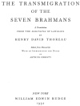
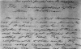

  
[Intangible Textual Heritage](../../index)  [Hinduism](../index) 
[Index](index)  [Next](tsb01) 

------------------------------------------------------------------------

[Buy this Book at
Amazon.com](https://www.amazon.com/exec/obidos/ASIN/1425488269/internetsacredte)

------------------------------------------------------------------------

*The Transmigration of the Seven Brahmans*, by Henry David Thoreau,
\[1932\], at Intangible Textual Heritage

------------------------------------------------------------------------

# THE TRANSMIGRATION

## OF THE

# SEVEN BRAHMANS

###### A Translation

##### FROM THE HARIVANSA OF LANGLOIS

###### BY

### HENRY DAVID THOREAU

###### Edited from Manuscript

##### WITH AN INTRODUCTION AND NOTES

##### BY

#### ARTHUR CHRISTY

#### NEW YORK

#### WILLIAM EDWIN RUDGE

#### \[1932\]

Scanned, proofed, and formatted at Intangible Textual Heritage,
September 2007 by John Bruno Hare. This text is in the public domain in
the United States because its copyright was not renewed in a timely
fashion as required by law at the time. These files may be used for any
purpose.

[  
Click to enlarge](img/title.jpg)  
Title Page  

[  
Click to enlarge](img/manu.jpg)  
Thoreau's manuscript, detail  

------------------------------------------------------------------------

[Next: Acknowledgement](tsb01)
