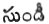
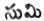

  
[Intangible Textual Heritage](../../index)  [Hinduism](../index) 
[Index](index)  [Previous](vov11)  [Next](vov13) 

------------------------------------------------------------------------

1000

If you one day put your anus in your hand and wash it, what have you
gained? How [much](errata.htm#182) so ever you wash the scales off your
teeth, will its stink ever depart?

1001

p. 241

Of gifts, the gift of food is the noblest. In music, the melody of the
*Sama Veda* is the sweetest, In meditation that of Siva is the noblest.

1002

Burn him, Burn him, cries Pluto. This is more talking like a magpie. He
cannot see what the truth is (that he is himself but a component part of
creation). They who participate in the deity cannot themselves see god.

1003

Let us adore and glorify the (Pranalinga) prime spirit. But for what
offence do ye bind it about your neck. Joy (i.e., the deity) is a
witness to us of this folly.

1004

Wearing ashes of things that are bhavi (i.e., not lingamite) he calls
this a form of Siva devoid of shame. But surely all animals are gifted
with the linga. (Ye are as proud as a dog with two).

1005

Stupid fools are they who hide their wealth in the earth, and again
dress their food in the earthen vessel of the body. Why should ye be so
foolish for this muddy life?

p. 242

1006

To the whole of the Siva sect, Hari is Teacher (by a refined
explanation) and Hara (Siva) is Teacher, to the Hari creed. What sort of
teacher is the wretch void of qualities of excellence.

1007

He that is unborn (Aja, Brahma) shines betwixt Vishnu and Siva, and in
the midst of these does the *yoni* shine; It possesses a peculiar *kala*
which however is unperceptible.

1008

When one life is past the fool shall again be born; again shall he love
and again feel affection; again shall he roam the countries and villages
like to a homeless monkey.

1009

How long does the soul, unprotected continue to die and be born again
naturally (sahaja is born with us). To live without forgetting him is
perfection,

1010

p. 248

When all those who talk of the high deity as in unity, are freed from
the body, then shall they be secure from sorrow and sin and enjoy
happiness.

1011

To know the nature of the fluctuating and that of the changeless, is in
the power of astrologers; who can inspect the body? Like as the swan is
said to discriminate between water and milk.

1012

In the five faces of Siva the five letters (na-ma-si-va-ya) produced; by
them is the world supported. Then how is it that they fail to praise the
Five Faced.

1013

The Goddess of Earth as they call her is clay, seeing that all men know
how that [Goddess](errata.htm#183) was produced, she became very
weighty, They even call that Goddess equal to Siva as sustaining all.

1014

Lime is the best of all matters. Lime displays the present world in the
earth, and it also shows us heaven.

p. 244

1015

If thy good acts be great they shall not pass away; alas surely fate in
a fitting place changed Dharmaraj into Kanku Bhattu.

1016

He puts his gift into the hand and pours the water of donation; thus
doth he make fitting benefactions; but knows not that he and that of his
neighbours are one. (Each is a form of Eswara.)

1017

They muse on the mantras but know not their meaning; ignorant of that
signification they become blind. To become reborn and great let him
learn it from the Teacher.

1018

Maya, that is, Vishnu--is there any other to whom the name applies?
'Cupid' is the dear son (son of kisses) of Maya; in Maya do his powers
originate.

1019

p. 245

Vishnu, he who hath a burnt body, he, Siva with the burnt throat, Brahma
who smeareth over his body--these are allies. When the three thus meet
it is a joy to the world.

1020

Let us not trust him who walks in another path; consider even his vest
as a species of evil. It is the form of Ravanasura well known.

1021

Gadheyudu (Viswamitra, son of Gadhi) formed a world in imitation of that
formed by Brahma and unable to know the truth gained (he gained only his
pain). Doth the angry man know himself?

1022

Do not Siva (Shambhudu) slay and restore his son Viswamitra to life. Did
not Vishnu revive his son Manmatha? The Vedas give numberless meanings
of these stories.

1023

p. 246

A thousand and thousands of the leaders of fishes who caused the Vedas
(nigama) to float on the sea, to churn nectar beneath that hill did he
place three thousand firm tortoises, a thousand tens of Krishnas to see
the shepherdesses in the shepherds' hamlet, four thousands of Narasimha
incarnations to tear the breast of the Rakshasas, to slay Ravanasura,
ten thousand Ramas, Parasuramas, ten thousand--if thou ask where is
Siva, He who in the form of Vishnu underwent the incarnations. He
dwelleth in Kasi.

1024

If the teachers be ruined is not the whole caste destroyed? If Brahmins
be destroyed he shall turn to ashes. If thou destroy Hara and Hari far
is beatitude from thee.

1025

Our limbs to the God of fire, the bones, when burnt to the Goddess of
earth, the excess of wealth to the kings, the entire soul to lovers,
stubbornness to fools--the Sankara Vismriti to pariars and to the great
avenger (Pluto) wrath belong.

p. 247

1026

In whatever direction each man's desire is, in proportion to his desire,
shall Vema cause them to attain the blessings of this and the next
world. By the favour of Siva shalt thou render them acceptable, O Vema.

1027

They think on the mantras, but know not their meaning. How are those
twice born who are ignorant of the meaning. He who comprehends the
signification this is the only Bramha Rishi.

1028

The wild melon leaf is still more poisonous than the margosa. The
heretical prathama shakhi (sectory) is more venomous than a serpent and
a black complexioned Brahmin is worse poison than musk.

1029

By not quitting the assertions (violence) of the eight creeds, the holy
have all become ruined. If you hold dung in your hand why cleanse it
externally.

1030

p. 248

Soul and the divinity exist in full force in the (diverse) forms that
are in this world. But the Jangams, ignorant of this, cannot find the
path.

1031

What means "Bramin", what means "devotee", what means "enjoyer", what
means donor--however diverse their names, Plato's realm is their
portion.

1032

Those of the Bouddha sect consider the intellect to be the divinity.
They reckon, with degraded minds which is highest and which lowest. They
have left of discriminating both good and bad, the vile calves.

1033

The unholy wretch who joins the skull-sect is ignorant of the beginning
and the end of life; and in folly reviles Siva, alas he is ruined, (This
sect is atheistical and epicurean. They deny both creation and
destruction.)

1034

Likewise, by the Shacta creed, men consider power to be the divinity
and, void of all sense (fitness) they fully perform the rites of pariar
generations.

p. 249

1035

What sort of caste is that of Rishies? Enquire and know; they became
lovers of God. They became the divinity. Finally however great they be
they are devoured by the funeral flame.

1036

Born in the *rishi* tribe, thereafter they are exalted in the *gotra*
(tribe). They are not descended from Brahma, how then should they be
Brahmins?

1037

Those sinful ones who undertake to walk in luxury eating and resting,
and hard conduct--these shall not escape being bound in hell and cast
into the mills of Yama.

1038

The life we enjoy shall not pass in all one manner; wealth and poverty
await us all in this iron age; even Hari, Hara and Aja look upon evil
and good as one.

1039

p. 249

Holding Siva the Lord, the body to be his temple, and attaining rest, he
who uniteth his soul with Siva, this is the Siva-yogi.

1040

Brahma has given wealth to one man and a liberal disposition in the mind
to another. May Brahma perish and his wife's marriage cord be broken at
the wharf.

1041

On the day when the term expired, it is impossible even for the three
(Gods) to continue without suffering death. Why do ye dread the limit?
Is the life eternal? It is brief, O Vema!

1042

Why did Brahma bestow a delightful odour in a ball of ashes; what fault
(falsehood) had gold committed before him? Let the widow of Brahma have
her cord broken at the wharf.

1043

He made the waters of the sea salt. He made the man of wealth
avaricious. The acts of Brahma are acts of ashes.

1044

p. 251

Beholding the craft of women, Bhairu Siva (Dog headed) refrained from
[marriage](errata.htm#184). So did the Big-bellied. Anjaneya (Hanuman)
from his birth bound his *langoti* tight.

1045

Time and fate are boundless. Let us not oppose them but conduct
ourselves as they lead us here on earth. Leave Brahma (Vidhi) in his
eternal sleep and dream. O! ye idiots all! walk; O! men in the ways of
beatitude.

1046

While you perform the worship of the shakti (inferior Goddesses) how
should the Savitri (holy verse, Gayatri) continue on the earth? Sin is
produced. Do not seize and punish it.

1047

If a noble person comes and kills a cow, his crime-can by no means be
evaded, and at last, he is surely to Yama as a goat bound for sacrifice.

1048

The sun and the moon are present. The wind, fire and peacock spangled.
Divinities are before thee. The earth and air are present. So many
divinities are before thee. If thou wilt require, O Vema!

p. 252

1049

Why marry? Why beget children? Why suffer this sorrow? It is madness!
Like as though a man lifted a rock upon his head.

1050

The Divinity Himself became the universe. and was born when he hungers
he shall eat this universe with desire (lit, its noble juice), In
contradiction to his former acts he shall devour and destroy it. Alas!
what do they call this?

1051

The Deity became man, he became woman leaving sorrow and having those
desires that never relinquish in each age he is born. O ye wise! behold
this noble object of meditation.

1052

In the various tribes of animals the deity was repeatedly
[reborn](errata.htm#185); like as if confused he roamed and roved; were
we to call this body eternal? Would not the deity laugh?

1053

p. 253

Who is the living man? Who is he who bore him? Who is the dead? No one
knows this course! He that is, who produceth, who dieth, is one
divinity.

1054

United with every living creature, manifest is the deity within them.
Consider this deity carefully, whether it is female or male?

1055

Born, he existeth, unborn he existeth not, awhile he dieth; awhile lives
again, This is the mere diceplay of Brahma! Nothing is stable!

1056

Why first are we born? Why die at last? Why troubled by reason of the
ruthless Yama? Restrain thy mind from longing for birth.

1057

However great he be, to let the great sinner duly attain salvation there
is one expedient at the time of death; let him give up all his desires,
and think on God. Thus shall he become beatified.

p. 254

1058

Though you impress his image on thee or name thyself his son, or eat his
betel spittle serving him abjectly, shall any thing be attained by thee
beyond thy destiny?

1059

Entangled in vain desires, observing the lives of consanguinity, a man
becomes mad and roams the world. Where are our fathers and mothers? What
are they? and what do they for us? (lit. why they to us?)

1060

The hill monkey has (if you look) the monkey for a (pērantālu) wife; a
banda (a poor king) for a minister; (Banda--a [beggar](errata.htm#186)
who tortures himself to [extort](errata.htm#187) alms from fools). Look
at the Banda; villainous slanderers are his kin.

1061

Ignorant of the term set to the expenditure of life, it is fit for no
one to write or cause to write at any time or in any place never write.

(This folly signifies that what is rendered permanent by writing may
become false.)

p. 255

1062

He who duly reverences Bramins and the Gods, who justly governs the
earth, and thus gains wealth, which he spends in liberality, he, thus
looking to the path to the beatitude, and has love to God. This is a
king!

1063

Consider the spittle (leavings) of flies, of courtesans--they are
acceptable to men and gods. Then why is our own spittle unacceptable to
us?

1064

All wealth that is buried falls to the share of the earth; all that is
out falls into the hands of others; all that we eat is the gain merely
of straining inner system; what is bestowed alone remains ours.

1065

Give or not give, hope will bestow; however unsuccessful we still hope.
Give or not give, it gives the world. Examine and see this. In this
there are no free agents.

p. 256

1066

Becoming a foetus it will remain in the womb for a few days. Thereafter
it will surely not remain. The foetus is born in the earth; the foetus
is the protection of the spirit in the earth, O Vema!

1067

Foulness in the belly, masses of flesh, bones--if you view it there is
but a filthy skin over it. What manner of dwelling is this? What manner
of comfort is this?

1068

If we eat not [food](errata.htm#188), the fire in the belly devours the
impurities of the belly. Thus if he abstain from food, he who fasteth
devoureth impurity.

1069

If the *Carnam* be a low fellow, the farmers will all join and tell him
to bow down whenever they have a mind. But if the *Carnam* be firm, we
are your children, say they.

p. 257

1070

A cat that listens a squeak is annoyed, if while eating its food it sees
one of its own species (caste). He that hath no caste is considered a
god in the world (as impartial).

1071

A fellow on one leg is no saint. If one carries cow-dung she is no slut,
if one sees either of these he is merely astonished (his eyes redden).

1072

In the Linga sect, a set of hypocrites has arisen and these having
handsomely reviled one another are all turned to dust by the Turk tribe
to whom their discussion render them easy converts.

1073

A man is distinguished in the world, and becoming himself a great
*somayaji* is born, a brother to the village god Potarazu. But you may
consider him as merely the vile goddess of death to the rams that are
sacrificed.

1074

He who saith this (external) figure is thy form and beholdeth in his
internal image, Him that is worthy to be wore slipped of all worlds. In
that form in which he himself exists shall he behold the Lord.

p. 258

1075

He that hath not subdued (slain) his mind as we still further consider,
is lower than a pariar, O man! death (naraka) shall befall (lit. come
to) him after death.

1076

The chariot has five linch-pins; when the charioteer propels, the car
proceeds. The car of thy body has five linch pins the senses); seek him
who evidently guides it.

1077

Those wretches (lives) that artfully destroy animals while either
sleeping, drinking waters or standing still and singing shall at the end
in the same manner perish.

1078

Becoming free thinkers and ruined just like crows roaming the land
wandering without understanding in them, they devour dung and urine;
they die and become a part of earth.

1079

p. 259

That house that we call the body do we daily sweep, smear with cow-dung,
plaster, and order; at last we quit it and depart, so deceitful (or
fleeting) is the soul.

1080

To what end is all this reading, to what end are all these disputations?
If thou wouldest remain of one mind, thou shouldest become an
accomplished sage and attaining absorptions become thyself, the
Universe.

1081

Surely these vile tenets (Veda) are mere contention. The words of Vemana
are knowledge (Veda). Verify none can show you any good. Though good
were taught, you would not do it. If a man did well this would be the
perfect man.

(  is a vocative plural of
which   is the singular. )

1082

Like as camphor, burnt in fire loses its fine smelt. Thus the fragrance
of wisdom in the debased can attain no nobility.

1083

p. 260

He who knows the truth knows the Divinity and this will enable him to
slay all his lust (literally vigours). Will he who has swallowed a
delicious plantain swallow venom?

1084

Wonderful is it that the millions of animated beings should behold the
great spirit, if thou consider in thy heart.

1085

Sorrow originates in impurity of heart. Like as the sun shines on all
nature, pure water is in the sanctified body.

1086

Ye who [first](errata.htm#189) drove away all your original Gods, ye who
drove away the succeeding deities, smite with the slipper your present
paltry divinities.

1087

He who has beheld all the glory that is concealed within the veil, and
has also fixed his mind on the divinity, that mighty saint who existeth
in exalted holiness, at where shall we seek him?

p. 261

1088

To know myself is to know thee How should he who knoweth not himself
know thee. Let us learn from Boya Caannappa the prayer that teaches a
knowledge of [ourselves](errata.htm#190) and thee (easy and useful in
grammatical [construction](errata.htm#191)).

1089

That deity that alone comprehendeth the scriptures is found by constant
seeking The Lord seeketh the man that seeketh him. Are there any who are
wise and have learnt to seek him?

1090

If we love him, he will love us. If we love not him he will not love us
(in the world). All our gorgeous apparel any our devils are all of no
avail in the world.

1091

Without self possession the mere favour of learning will never remove
the doubts of the aspirant. No more than darkness will be dissipated by
a painted flame.

p. 262

1092

By gentleness every object is pleasantly attained. It is a true victory;
by it our vows are performed, I will lay you any bet. How great were the
difficulties that Dharmaraj conquered by means of gentleness? (admirable
and easy),

1093

When the men of this world see the exalted saint they will censure him
but cannot comprehend him. What difference can the hand perceive between
nectar and any other taste.

1094

From his birth onwards how many diverse evil thoughts the sinner
entertains. Like to a lame dog that is in imagination eating meat.

1095

If he have learnt to speak prudently (lit. knowing abstracts), why
should we consider his youth or age? May not a letter written by a child
be respectable?

1096

p. 263

[Continuing](errata.htm#192) to live and see (as in houses), listening
to modes contrary to sense, do men pass away like an old song, listening
to this they go on and go on and become a tale.

1097

As they who have lost their eyes or legs seek each others aid, and as
the beggar unites with beggar alone. Thus wealth and poverty associate
together.

1098

Is not the dying of some of our kin before our eyes an evidence/to us?
Can we look upon our frail lives as eternal?

1099

Like as the lamp of the sun enters into water, thus does the eye behold
the deity. Like as the glistening of the soil of the desert in the
mirage.

------------------------------------------------------------------------

[Next: 1100-1199](vov13)
