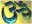

  
[Intangible Textual Heritage](../../index)  [Hinduism](../index) 
[Index](index)  [Previous](vp013)  [Next](vp015) 

------------------------------------------------------------------------

[Buy this Book at
Amazon.com](https://www.amazon.com/exec/obidos/ASIN/B0026P4NWS/internetsacredte)

------------------------------------------------------------------------

  
*The Vishnu Purana*, translated by Horace Hayman Wilson, \[1840\], at
Intangible Textual Heritage

------------------------------------------------------------------------

10\. The Brahma-vaivartta Puráńa

10\. Brahma-vaivartta Puráńa. "That Puráńa which is related by Sávarńi
to Nárada, and contains the account of the greatness of Krishńa, with
the occurrences of the Rathantara Kalpa, where also the story of
Brahma-varáha is repeatedly told, is called the Brahma-vaivartta, and
contains eighteen thousand stanzas [64](#fn_63)." The account here given of the
Brahma-vaivartta Puráńa agrees with its present state as to its extent.
The copies rather exceed than fall short of eighteen thousand stanzas.
It also correctly represents its comprising a Máhátmya or legend of
Krishńa; but it is very doubtful, nevertheless, if the same work is
intended.

The Brahma-vaivartta, as it now exists, is narrated, not by Sávarńi, but
the Rishi Náráyańa to Nárada, by whom it is communicated to Vyása: he
teaches it to Súta, and the latter repeats it to the Rishis at
Naimishárańya. It is divided into four Khańd́as, or books; the Bráhma,
Prakriti, Ganeśa, and Krishńa Janma Khańd́as; dedicated severally to
describe the acts of Brahmá, Deví, Ganeśa, and Krishńa; the latter,
however, throughout absorbing the interest and importance of the work.
In none of these is there any account of the Varáha Avatára of Vishńu,
which seems to be intended by the Matsya; nor any reference to a
Rathantara Kalpa. It may also be observed, that, in describing the merit
of presenting a copy of this Puráńa, the Matsya adds, "Whoever makes
such gift, is honoured in the Brahma-loka;" a sphere which is of very
inferior dignity to that to which a worshipper of Krishńa is taught to
aspire by this Puráńa. The character of the work is in truth so
decidedly sectarial, and the sect to which it belongs so distinctly
marked,

p. xlii

that of the worshippers of the juvenile Krishńa and Rádhá, a form of
belief of known modern origin, that it can scarcely have found a notice
in a work to which, like the Matsya, a much more remote date seems to
belong. Although therefore the Matsya may be received in proof of there
having been a Brahma-vaivartta Puráńa at the date of its compilation,
dedicated especially to the honour of Krishńa, yet we cannot credit the
possibility of its being the same we now possess.

Although some of the legends believed to be ancient are scattered
through the different portions of this Puráńa, yet the great mass of it
is taken up with tiresome descriptions of Vrindavan and Goloka, the
dwellings of Krishńa on earth and in heaven; with endless repetitions of
prayers and invocations addressed to him; and with insipid descriptions
of his person and sports, and the love of the Gopís and of Rádhá towards
him. There are some particulars of the origin of the artificer castes,
which is of value because it is cited as authority in matters affecting
them, contained in the Bráhma Khańd́a; and in the Prákrita and Ganeśa
Khańd́as are legends of those divinities, not wholly, perhaps, modern
inventions, but of which the source has not been traced. In the life of
Krishńa the incidents recorded are the same as those narrated in the
Vishńu and the Bhágavata; but the stories, absurd as they are, are much
compressed to make room for original matter, still more puerile and
tiresome. The Brahma-vaivartta has not the slightest title to be
regarded as a Puráńa [65](#fn_64).

------------------------------------------------------------------------

### Footnotes

[xli:64](vp014.htm#fr_63)   [  
Click to view](img/_04100.jpg)

[xlii:65](vp014.htm#fr_64) Analysis of the
Brahma-vaivartta Puráńa: Journal of the Asiatic Society of Bengal, June
1832.

------------------------------------------------------------------------

[Next: 11. The Linga Puráńa](vp015)
