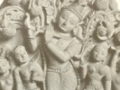

  
[Intangible Textual Heritage](../../index)  [Hinduism](../index) 
[Index](index)  [Previous](vp170)  [Next](vp172) 

------------------------------------------------------------------------

[Buy this Book at
Amazon.com](https://www.amazon.com/exec/obidos/ASIN/B0026P4NWS/internetsacredte)

------------------------------------------------------------------------

  
*The Vishnu Purana*, translated by Horace Hayman Wilson, \[1840\], at
Intangible Textual Heritage

------------------------------------------------------------------------

p. 677

H.

Haihaya, a prince of the Yádava race, [416](vp104.htm#page_416).

Haihayas, a tribe, conquer Báhu, [373](vp095.htm#page_373). conquered by
Sagara, [374](vp095.htm#page_374). five divisions of,
[418](vp104.htm#page_418), n. [20](vp104.htm#fn_1118). Scythian origin
of, ib. invade Káśí, [410](vp101.htm#page_410), n.
[17](vp101.htm#fn_1085).

Hair, how worn by ancient nations, [375](vp095.htm#page_375), n.
[17](vp095.htm#fn_987).

Haitukas, a class of heretics, [345](vp092.htm#page_345).

Hála, a prince, [473](vp117.htm#page_473).

Hansa, a mountain, [169](vp059.htm#page_169).

Hara, a Rudra, r[21](vp037.htm#page_21).

Hari, name of Vishńu, [7](vp036.htm#page_7), n. [1](vp036.htm#fn_114),
&c. see Vishńu.

Hari or Hari-varsha, a country, [168](vp059.htm#page_168).

Harikeśa, a solar ray, [236](vp069.htm#page_236), n.
[3](vp069.htm#fn_717).

Haris, a class of deities, [122](vp050.htm#page_122), n.
[20](vp050.htm#fn_297). [262](vp075.htm#page_262).

Hariśchandra, a prince, s. of Triśanku, [372](vp095.htm#page_372).
raised to heaven, ib. n. [9](vp095.htm#fn_979).

Hariśravá, a river, [183](vp061.htm#page_183).

Harita, a prince, s. of Yuvanáśwa, [369](vp095.htm#page_369). s. of
Rohitáśwa, [373](vp095.htm#page_373). s. of Paravrit,
[420](vp105.htm#page_420). k. of Videha, [421](vp105.htm#page_421), n.
[13](vp105.htm#fn_1131).

Haritas, a class of deities, [268](vp076.htm#page_268).

Haritas, sons of Harita; Brahmans, [369](vp095.htm#page_369), n.
[3](vp095.htm#fn_973). Haritáśwa, s. of Sudyumna,
[350](vp093.htm#page_350), n. [6](vp093.htm#fn_921).

Hari-vanśa, notice of, [lviii](vp023.htm#page_lviii).

Harivarsha, s. of Agnídhra, [162](vp058.htm#page_162), k. of Nishadha,
[163](vp058.htm#page_163). a country, [168](vp059.htm#page_168).

Harsha, s. of Ráma, [55](vp041.htm#page_55).

Harshavarddhana, a prince, [412](vp102.htm#page_412).

Haryyaksha, s. of Prithu, [106](vp049.htm#page_106), n.
[1](vp049.htm#fn_275).

Haryyanga, a prince, [445](vp111.htm#page_445).

Haryyaśwa, s. of Drid́háśwa, [362](vp094.htm#page_362). s. of
Prishadaśwa, [371](vp095.htm#page_371). s. of Drisht́aketu,
[390](vp097.htm#page_390). s. of Chakshu, [453](vp112.htm#page_453).

Haryaśwas, son of Daksha, [117](vp050.htm#page_117).

Haryatmá, a Vaasa, [273](vp077.htm#page_273).

Hastá, a lunar mansion, [226](vp066.htm#page_226), n.
[21](vp066.htm#fn_700).

Hastin, s. of Suhotra, [451](vp112.htm#page_451).

Hastinápur, founded by Hastin, [452](vp112.htm#page_452). washed away by
the Ganges, [461](vp114.htm#page_461). undermined by Balaráma,
[602](vp152.htm#page_602).

Hastisomá, a river, [182](vp061.htm#page_182).

Havirbhú, w. of Pulastya, [55](vp041.htm#page_55), n.
[12](vp041.htm#fn_210). [83](vp045.htm#page_83), n.
[5](vp045.htm#fn_244).

Havirdhańa, s. of Antarddhi, [106](vp049.htm#page_106).

Havishmantas, a class of Pitris, [321](vp088.htm#page_321), n.
[1](vp088.htm#fn_878).

Havya, s. of Atri, [83](vp045.htm#page_83), n. [4](vp045.htm#fn_243).

Havyaváhana, s. of Kochi, [84](vp045.htm#page_84), n.
[9](vp045.htm#fn_248).

Haya, a Yádava prince, [416](vp104.htm#page_416).

Hayaśiras, d. of Vrishaparvan, [147](vp056.htm#page_147). d. of
Vaiswánara, and w. of Kratu, ib. n. [7](vp056.htm#fn_335).

Hema, a prince, [444](vp111.htm#page_444).

Hemá, a river, [183](vp061.htm#page_183).

Hemachandra, k. of Vaisáli, [354](vp093.htm#page_354).

Hemakút́a, range of mountains, [167](vp059.htm#page_167).

Heretics, sects of, [47](vp040.htm#page_47). Jains, Bauddhas, &c.
[338](vp092.htm#page_338). sin of conversing with,
[345](vp092.htm#page_345).

Hermit, duties of, [295](vp083.htm#page_295).

Heti, a Rákshas, [233](vp068.htm#page_233).

Himavat, k. of mountains, [153](vp057.htm#page_153), n.
[1](vp057.htm#fn_353). snowy range, [167](vp059.htm#page_167).

Hindus, origin and first settlements of in India,
[lxv](vp028.htm#page_lxv).

Hirańmaya, a country, [168](vp059.htm#page_168).

Hirańvat, s. of Agnídhra, [162](vp058.htm#page_162). k. of Śweta-dwípa,
[163](vp058.htm#page_163).

Hirańvatí, a river, [183](vp061.htm#page_183).

Hirańyagarbha, name of Brahmá, [7](vp036.htm#page_7), n.
[1](vp036.htm#fn_114).

Hirańyakaśipu, s. of Kaśyapa and Diti, [123](vp050.htm#page_123). k. of
the Daityas, [124](vp050.htm#page_124). his power,
[126](vp052.htm#page_126). enmity to Vishńu, [127](vp052.htm#page_127).
put to death by him as Narasinha, [145](vp055.htm#page_145), n.
[2](vp055.htm#fn_325).

Hirańyáksha, s. of Kaśyapa and Diti, [123](vp050.htm#page_123).

Hirańyanábha, teacher of the Sáma-veda, [282](vp080.htm#page_282). a
prince, pupil of Jaimini, [386](vp096.htm#page_386).

Hirańyaretas, s. of Priyavrata, [162](vp058.htm#page_162), n.
[2](vp058.htm#fn_365).

Hirańyaroman, a Lokapála, s. of Maríchi, [83](vp045.htm#page_83). s. of
Parjanya, regent of the north, [153](vp057.htm#page_153).
[226](vp066.htm#page_226).

Hláda, s, of Hirańyakaśipu, [124](vp050.htm#page_124).

Hládiní, a river, [171](vp059.htm#page_171), n. [12](vp059.htm#fn_385).

Horse of Indra and of the sun produced at the churning of the ocean,
[78](vp044.htm#page_78), n. [8](vp044.htm#fn_236).

Horses of the sun, [218](vp066.htm#page_218). of the moon,
[238](vp070.htm#page_238). of Mercury and Venus,
[239](vp070.htm#page_239). of Mars, Jupiter, Saturn,. Rahu, and Ketu,
[240](vp070.htm#page_240). of Krishńa's car, [429](vp106.htm#page_429).

Hospitality, duties of, [305](vp085.htm#page_305).

Householder, duties of, [294](vp083.htm#page_294).
[300](vp085.htm#page_300). [310](vp086.htm#page_310).

Hotri, reciter of hymns, [276](vp078.htm#page_276).

Hraswaroman, a prince, [390](vp097.htm#page_390).

Hrí, 'modesty,' d. of Daksha, w. of Dharma, [55](vp041.htm#page_55), n.
[12](vp041.htm#fn_210).

Hridíka, a Yádava prince, [436](vp107.htm#page_436).

Hrishikeśa, name of Vishńu, [2](vp035.htm#page_2). lord of the senses,
[2](vp035.htm#page_2), n. [2](vp035.htm#fn_99),

Húńas, a people, [177](vp060.htm#page_177). and n.
[6](vp060.htm#fn_394). [194](vp061.htm#page_194).

Hutáśana, god of fire, [72](vp044.htm#page_72).

Hylozoism, of Cudworth, [32](vp038.htm#page_32), n.
[8](vp038.htm#fn_166).

Hymn, to Vishńu, by Earth, [29](vp038.htm#page_29). by Brahmá and the
gods, [72](vp044.htm#page_72). to Śrí, by Indra,
[78](vp044.htm#page_78). to Vishńu, by Dhruva, [93](vp047.htm#page_93).
by the Prachetasas, [108](vp049.htm#page_108). by Prahláda,
[141](vp054.htm#page_141). by Brahmá, [494](vp118.htm#page_494). to
Krishńa, by Kálíya, [515](vp124.htm#page_515). by Akrúra,
[547](vp135.htm#page_547). by Adití, [585](vp147.htm#page_585).

Hypostases, three of Vishńu; a similar triad known to the ancients,
[7](vp036.htm#page_7), n. [1](vp036.htm#fn_114).

------------------------------------------------------------------------

[Next: I](vp172)
