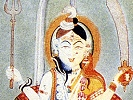

  
[Intangible Textual Heritage](../../index)  [Hinduism](../index) 
[Index](index)  [Previous](yvhf04)  [Next](yvhf06) 

------------------------------------------------------------------------

[Buy this Book at
Amazon.com](https://www.amazon.com/exec/obidos/ASIN/1432515268/internetsacredte)

------------------------------------------------------------------------

  
*Yoga Vashisht or Heaven Found*, by Rishi Singh Gherwal, \[1930\], at
Intangible Textual Heritage

------------------------------------------------------------------------

p. 34

### HOW SUKA ATTAINED HIGHEST STATE OF BLISS.

After hearing the story of Ram concerning the Universe and its miseries,
every one in the assembly hall were not only pleased but the Sidhas
(masters of psychic power who can remain in the air as long as they
wish) showered flowers and spoke words of praise.

"O Ram, your utterances are full of wisdom. It is very difficult to
drive joy from this world, for though it was created for Devas, who were
full of joy, it is now full of suffering and pain. if Ram's indifference
toward the world is true. O Rishis, then we may be justified with what
we are doing. If we, the Sidhas and Rishis, love the things or objects
which Ram hated, we should perhaps be classed with the ignorant."

Raja Rishi Viswamitra said to Ram: "Thou knowest all that should be
known. Thou and Rishi Suka are full of spiritual wisdom. Both of you
have attained equally the highest wisdom,

p. 35

but you need to acquire the state of quietness and stillness."

Ram: "O, please inform me how Brahm Rishi Suka achieved wisdom without
quiescence of mind, and how he secured that blissful state?"

The Master: "Rishi Suka had absolute spiritual wisdom which is the only
sword to cut the rope of re-birth. Once he tried to inquire of the
origin of things, as thou art doing, and he then became doubtful of his
wisdom. The object of his mind became disturbed, but he was free from
sensual desires. Rishi Suka went to the Himalaya Mountains to his
father, who was one of the Masters there, and asked for instruction that
he might not lose his faith. Thus he said to his father: 'O Father, from
whence came all this Maya (illusion), which produces misery and
darkness? How did it originate? How may it be destroyed?' What part does
it play in the origin of the universe?' His father replied with wisdom,
as he did unto all others, but his answer did not dispel his son's
doubt. Suka said to his father: 'I know all that'. And alas! his father
was unable to remove his doubt. His father then requested him to go to
King Janak, who was the highest being in spiritual wisdom of his time.

p. 36

"Rishi Suka left the Himalaya Mountains and later approached the golden
gates of the King's palace. Although the King was aware of Brahm Rishi's
(Suka) arrival, he refused to go forth and meet him. He requested that
the Rishi should not be admitted into his palace, as he wanted to test
the sincerity of his mind. Rishi Suka waited full seven days at the
golden gate. At last he was conducted into a magnificent hall where
beautiful women were indulging in worldly enjoyments. But Suka's mind
did not lose its balance. He was not affected by the unjust act of the
King in making him wait seven days at his gate, nor was he moved by the
disgraceful conduct of worldly association. The King came and addressed
him thus: 'O, Brahm Rishi (there are three kinds of Rishis), thou hast
reached the highest state. The worldly joys and sorrows do not affect
thee. I beseech thee to tell what hast brought thee here?' Rishi Suka
asked: 'What has caused my illusion? How does it generate? How can it be
destroyed? Please instruct me.' The King gave him the same explanation
that his father had given him. Rishi Suka returned: 'I know that, and my
father gave me the same

p. 37

information. If Maya (illusion) which is produced by a differentiation
of one Atma as breath, etc.) and merged again into the Atma, then no
benefit can be derived from this perishable Maya (illusion). O Highest
Guru, Thou art able to dispel this delusion of my mind! Please enlighten
me on this matter.'

"The King: 'Thou hast known what shouldst be known, but still thou
asketh me—although thy father has instructed thee aright. The
enlightenment we have given to thee is the real one. Atma alone, is that
which is everywhere, just as the ether pervades all space and
atmosphere. Wisdom is bound by naught else but its own thought. Freeing
thyself from sensual thoughts, is freeing thyself from bondage. Thou
hast clearly realized the Atmic wisdom for thou hast given up all
longing for sensual objects. Thou hast by thine own efforts, through the
higher mind, reached the highest Brahmic State; thou hast become a
Jivanmukta (the state of emancipated embodiment). But one thing thou
hast yet to accomplish—that of giving up the delusion of the illusion
which has arisen through doubt in thy mind. When thou hast accomplished
this, then thou wilt be free.' King Janak thus initiated Rishi Suka into
the Atmic mysteries,

p. 38

where he acquired the highest state of wisdom, and was freed from all
misery, doubt, death and rebirth. He lived for 1000 years, then merged
into that higher wisdom, which is Brahm. As water returns to the ocean,
so the light which departs from the "I", returns to the higher light
(Atma), and becomes Brahm. Thus Rishi attained that liberation, which is
above all else. O Ram, you should follow the same path.

"To become a slave of desire is bondage; to master it, is liberation.
Master your desires and become indifferent to worldly enjoyments; become
a Jivanmukta (emancipated embodiment), without the assistance of
austerities of religions; follow the path of wisdom and you will realize
the reality. O Ram, there is but one person who can remove the doubt
from thy mind, and that is the Omniscient Vashisht, who knows the past,
present, and the future. He is the Guru (spiritual teacher) of all
mankind."

Rishi Viswamitra turned toward Rishi Vashisht and suggested that he
should be taught the stories of Brahmic Wisdom, since he is qualified
for such instruction. The Brahmic Wisdom should be given only to those
who have complete control of themselves and [withheld](errata.htm#1)

p. 39

from those who doubt and are full of vice. Thus Viswamitra ends the
story of Suka.

The Munis and Rishis, who were present in the assembly hall, praised
Rishi Viswamitra's noble instruction.

Rishi Vashisht said: "O Muni, well Learned One in all Knowledge, I shall
do according to thy request. I shall relate the stories of pure wisdom,
which have been given out by Brahma, that mankind may be liberated from
the chain of rebirth."

------------------------------------------------------------------------

[Next: The Way to Blessed Liberation](yvhf06)
