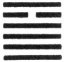

  
[Intangible Textual Heritage](../index)  [Index](index) 
[Previous](ic13)  [Next](ic15) 

------------------------------------------------------------------------

p. 88

###  [XIV](#fn_73). THE TÂ YÛ HEXAGRAM

 

Tâ Yû indicates that, (under the circumstances which it implies), there
will be great progress and success.

1\. In the first NINE, undivided, there is no approach to what is
injurious, and there is no error. Let there be a realisation of the
difficulty (and danger of the position), and there will be no error (to
the end).

2\. In the second NINE, undivided, we have a large waggon with its load.
In whatever direction advance is made, there will be no error.

3\. The third NINE, undivided, shows us a feudal prince presenting his
offerings to the Son of Heaven. A small man would be unequal (to such a
duty).

4\. The fourth NINE, undivided, shows its subject keeping his great
resources under restraint. There will be no error.

5\. The fifth SIX, divided, shows the sincerity of its subject
reciprocated by that of all the others (represented in the hexagram).
Let him display a proper majesty, and there will be good fortune.

6\. The topmost NINE, undivided, shows its subject with help accorded to
him from Heaven. There will be good fortune, advantage in every respect.

------------------------------------------------------------------------

### Footnotes

[88:XIV](ic14.htm#fr_73) Tâ Yû means 'Great
Havings;' denoting in a kingdom a state of prosperity and abundance, and
in a, family or individual, a p. 89 state of
opulence. The danger threatening such a condition arises from the pride
which it is likely to engender. But everything here is against that
issue. Apart from the symbolism of the trigrams, we have the place of
honour occupied by a weak line, so that its subject will be humble; and
all the other lines, strong as they are, will act in obedient sympathy.
There will be great progress and success.

Line 2, though strong, is at the lowest part of the figure, and has no
correlate above. No external influences have as yet acted injuriously on
its subject. Let him do as directed, and no hurtful influence will ever
affect him.

The strong line 2 has its proper correlate in line 5, the ruler of the
figure, and will use its strength in subordination to his humility.
Hence the symbolism.

Line 3 is strong, and in the right (an odd) place. The topmost line of
the lower trigram is the proper place for a feudal lord. The subject of
this will humbly serve the condescending ruler in line 5. A small man,
having the place without the virtue, would give himself airs.

Line 4 is strong, but the strength is tempered by the position, which is
that of a weak line. Hence he will do no injury to the mild ruler, to
whom he is so near.

Line 5 symbolises the ruler. Mild sincerity is good in him, and affects
his ministers and others. But a ruler must not be without an
awe-inspiring majesty.

Even the topmost line takes its character from 5. The strength of its
subject is still tempered, and Heaven gives its approval.

------------------------------------------------------------------------

[Next: XV. The *Kh*ien Hexagram](ic15)
