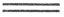
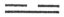
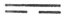
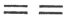

  
[Intangible Textual Heritage](../index)  [Index](index) 
[Previous](icap4-2)  [Next](icap6) 

------------------------------------------------------------------------

p. 422

# APPENDIX V

### Treatise of Remarks on the Trigrams

Chapter  [I](#fn_286). 1. Anciently, when the
sages made the Yî, in order to give mysterious assistance to the
spiritual Intelligences, they produced (the rules for the use of) the
divining plant.

2\. The number 3 was assigned to heaven, 2 to earth, and from these came
the (other) numbers.

3\. They contemplated the changes in the divided and undivided lines (by
the process of manipulating the stalks), and formed the trigrams; from
the movements that took place in the strong and weak lines, they
produced (their teaching about) the separate lines. There ensued a
harmonious conformity to the course (of duty) and to virtue, with a
discrimination of what was right (in each particular case). They (thus)
made an exhaustive discrimination of what was right, and effected the
complete development of (every) nature, till they arrived (in the Yî) at
what was appointed for it (by Heaven).

p. 423

Chapter  [II](#fn_287). 4. Anciently, when the
sages made the Yî, it was with the design that (its figures) should be
in conformity with the principles underlying the natures (of men and
things), and the ordinances (for them) appointed (by Heaven). With this
view they exhibited (in them) the way of heaven, calling (the lines) yin
and yang; the way of earth, calling (them) the weak (or soft) and the
strong (or hard); and the way of men, under the names of benevolence

p. 424

and righteousness. Each (trigram) embraced (those) three Powers; and,
being repeated, its full form consisted of six lines. A distinction was
made of (the places assigned) to the yin and yang lines, which were
variously occupied, now by the strong and now by the weak forms, and
thus the figure (of each hexagram) was completed.

Chapter  [III](#fn_288). 5. (The symbols of)
heaven and earth received their determinate positions; (those for)
mountains and collections of water interchanged their influences; (those
for) thunder and wind excited each other the more; and (those for) water
and fire did each other no harm. (Then) among these eight symbols there
was a mutual communication.

6\. The numbering of the past is a natural process.; the knowledge of
the coming is anticipation. Therefore in the Yî we have (both)
anticipation (and the natural process).

p. 425

Chapter  [IV](#fn_289). 7. Thunder serves to
put things in motion; wind to scatter (the genial seeds of) them; rain
to moisten them; the sun to warm them; (what is symbolised by) Kăn, to
arrest (and keep them in their places); (by) Tui, to give them joyful
course; (by) *Kh*ien, to rule them; and by Khwăn, to store them up.

Chapter  [V](#fn_290). 8. God comes forth in
*K*ăn (to His producing work); He brings (His processes) into full and
equal action in Sun; they are manifested to one another in Lî; the
greatest service is done for Him in Khwăn; He rejoices in Tui; He
struggles in *Kh*ien; He is comforted and enters into rest in Khân; and
He completes (the work of the year) in Kăn.

9\. All things are made to issue forth in *K*ăn, which is placed at the
east. (The processes of production) are brought into full and equal
action in Sun, which is placed at the south-east. The being brought into
full and equal action refers to the purity and equal arrangement of all
things. Lî gives the idea of brightness. All things are now made
manifest

p. 426

to one another. It is the trigram of the south. The sages turn their
faces to the south when they give audience to all under the sky,
administering government towards the region of brightness:--the idea in
this procedure was taken from this. Khwăn denotes the earth, (and is
placed at the south-west). All things receive from it their fullest
nourishment, and hence it is said, 'The greatest service is done for Him
in Khwăn.' Tui corresponds (to the west) and to the autumn,--the season
in which all things rejoice. Hence it is said, 'He rejoices in Tui.' He
struggles in *Kh*ien, which is the trigram of the north-west. The idea
is that there the inactive and active conditions beat against each
other. Khan denotes water. It is the trigram of the exact north,--the
trigram of comfort and rest, what all things are tending to. Hence it is
said, 'He is comforted and enters into rest in Khan. Kăn is the trigram
of the north-east. In it all things bring to a full end the issues of
the past (year), and prepare the commencement of the next. Hence it is
said, 'He completes (the work of the year) in Kăn.'

p. 427

Chapter  [VI](#fn_291). 10. When we speak of
Spirit we mean the subtle (presence and operation of God) with all
things. For putting all things in motion there is nothing more vehement
than thunder; for scattering them there is nothing more effective than
wind; for drying them up there is nothing more parching than fire; for
giving them pleasure and satisfaction there is nothing more grateful
than a lake or marsh; for moistening them there is nothing more
enriching than water; for bringing them to an end and making them begin
again there is nothing more fully adapted than Kăn. Thus water and fire
contribute together to the one object; thunder and wind do not act
contrary to each other; mountains and collections of water interchange
their influences. It is in this way, that they are able to change and
transform, and to give completion to all things.

p. 428

Chapter  [VII](#fn_292). 11. *Kh*ien is (the
symbol of) strength; Khwăn, of docility; *K*ăn, of stimulus to movement;
Sun, of penetration; Khan, of what is precipitous and perilous; Lî, of
what is bright and what is catching; Kăn, of stoppage or arrest; and
Tui, of pleasure and satisfaction.

p. 429

Chapter  [VIII](#fn_293). 12. *Kh*ien (suggests
the idea of) a horse; Khwăn, that of an ox; *K*ăn, that of the dragon;
Sun, that of a fowl; Khan, that of a pig; Lî, that of a pheasant; Kăn,
that of a dog; and Tui, that of a sheep.

Chapter  [IX](#fn_294), 13. *Kh*ien suggests
the idea of the head; Khwăn, that of the belly; *K*ăn, that of the feet
Sun, that of the thighs; Khan, that of the cars Lî, that of the eyes;
Kăn, that of the hands and Tui, that of the mouth.

Chapter  [X](#fn_295). 14. *Kh*ien is (the
symbol of) heaven, and hence has the appellation of father. Khwăn is
(the symbol of) earth, and hence has the appellation of mother, *K*ăn
shows a first application (of Khwăn to *Kh*ien), resulting in getting
(the first of) its male (or undivided lines), and hence is called 'the
oldest son.' Sun shows a first application (of *Kh*ien to Khwăn),
resulting in getting (the first of) its female (or divided lines), and
hence is called 'the oldest daughter.' Khan shows a second application

p. 430

(of Khwăn to *Kh*ien), resulting in getting (the second of) its male (or
undivided lines), and hence is called 'the second son.' Lî shows a
second application (of *Kh*ien to Khwăn), resulting in getting the
second of its female (or divided lines), and hence is called 'the second
daughter.' Kăn shows a third application (of Khwăn to *Kh*ien),
resulting in getting (the third of) its male (or undivided lines), and
hence is called 'the youngest son.' Tui shows a third application (of
*Kh*ien to Khwăn), resulting in getting (the third of) its female (or
divided lines), and hence is called 'the youngest daughter.'

Chapter  [XI](#fn_296). 15. *Kh*ien suggests
the idea of heaven; of a circle; of a ruler; of a father; of jade; of
metal; of cold; of ice; of deep red; of a good horse; of an old horse;
of a thin horse; of a piebald horse; and of the fruit of trees.

16\. Khwăn suggests the idea of the earth; of a mother; of cloth; of a
caldron; of parsimony; of a turning lathe; of a young heifer; of a large
waggon; of what is variegated; of a multitude; and of a handle and
support. Among, soils it denotes what is black.

17\. *K*ăn suggests the idea of thunder; of the dragon; of (the union
of) the azure and the yellow; of development; of a great highway; of the
eldest son; of decision and vehemence; of bright young bamboos; of
sedges and rushes; among horses, of

p. 431

the good neigher; of one whose white hind-leg appears, of the prancer,
and of one with a white star in his forehead. Among the productions of
husbandry it suggests the idea of what returns to life from its
disappearance (beneath the surface), of what in the end becomes the
strongest, and of what is the most luxuriant.

18\. Sun suggests the idea of wood; of wind; of the oldest daughter; of
a plumb-line; of a carpenter's square; of being white; of being long; of
being lofty; of advancing and receding; of want of decision; and of
strong scents. It suggests in the human body, the idea of deficiency of
hair; of a wide forehead; of a large development of the white of the
eye. (Among tendencies), it suggests the close pursuit of gain, even to
making three hundred per cent in the market. In the end it may become
the trigram of decision.

19\. Khan suggests the idea of water; of channels and ditches (for
draining and irrigation); of being hidden and lying concealed; of being
now straight, and now crooked; of a bow, and of a wheel. As referred to
man, it suggests the idea of an increase of anxiety; of distress of
mind; of pain in the ears;--it is the trigram of the blood; it suggests
the idea of what is red. As referred to horses, it suggests the idea of
the horse with an elegant spine; of one with a high spirit; of one with
a drooping head; of one with a thin hoof; and of one with a shambling
step. As referred to carriages, it suggests one that encounters many
risks. It suggests what goes right through; the moon; a thief. Referred
to trees, it suggests that which is strong, and firm-hearted.

p. 432

20\. Lî suggests the emblem of fire; of the sun; of lightning; of the
second daughter; of buff-coat and helmet; of spear and sword. Referred
to men, it suggests the large belly. It is the trigram of dryness. It
suggests the emblem of a turtle; of a crab; of a spiral univalve; of the
mussel; and of the tortoise. Referred to trees, it suggests one which is
hollow and rotten above.

21\. Kăn suggests the emblem of a mountain; of a by-path; of a small
rock; of a gateway; of the fruits of trees and creeping plants; of a
porter or a eunuch; of the (ring) finger; of the dog; of the rat; of
birds with powerful bills; among trees, of those which are strong, with
many joints.

22\. Tui suggests the emblem of a low-lying collection of water; of the
youngest daughter; of a sorceress; of the mouth and tongue; of the decay
and putting down (of things in harvest); of the removal (of fruits)
hanging (from the stems or branches); among soils, of what is strong and
salt; of a concubine; and of a sheep.

------------------------------------------------------------------------

### Footnotes

[422:I](icap5.htm#fr_286) Chapter I, paragraphs
1-3, treats of the rise of the scheme of the Yî from the wonderful
qualities of the divining plant, the use of certain numbers, and the
formation of the lineal figures.

P. Regis translates paragraph 1 by--'The ancient (sages), the most
excellent men, were the authors of the Yî-king, in making which they
were assisted by an intelligent spirit, who for their help produced the
plant called Shih.'

But the text will not admit of this version, nor have I found the view
given in it in any Chinese writer. It is difficult to make up one's mind
whether to translate--'the sage,' or 'the sages.' Khung Yin-tâ contends
that the writer had Fû-hsî and him alone in his p.
423 mind. To me it seems otherwise. Fû-hsî, if we accept the
testimony of universal Chinese consent, made the eight trigrams; but he
did not make the Yî, which, by the same consent, was the production of
king Wăn and his son.

The text would seem to say that the sages 'produced' the plant, but this
is so extravagant that the view indicated in my supplementary clause
appears in all the best commentators. So understood, the Yî may be said
to 'give mysterious assistance to the spiritual Intelligences,' or, if
we take that name as singular (according to the analogy of chapter 6),
to the Divine Being in affording a revelation of His will, as in
paragraph 3. We may well say that it is a pity the revelation should be
so enigmatical; but the author, it must be remembered, is writing from
his own standpoint. Wăn and his son, as I have endeavoured to show in
the Introduction, merely wished to convey, under the style and veil of
divination, their moral and political lessons.

On paragraph 2 it is said that heaven is round; and as the circumference
of a circle is three times its diameter, hence 3 is the number of
heaven. Again, earth is square, and as the circumference of a square is
four times its length or breadth, or it consists of two pairs of equal
sides, hence 2 is the number of earth.

The concluding statement about I the other numbers' is understood of the
manipulation of the divining stalks, as in Appendix III, i, 51. That
manipulation, thrice repeated, might leave three stalks each time, and 3
x 3 = 9; or 2, being in the same way in all = 6; or twice 3 and once 2 =
8; or twice 2 and once 3 = 7. These are the numbers of the 4 binary
symbols, employed in forming the new figures;  , the old yang, = 9;  , the young yin, = 8;  , the young yang, = 7; and
 , the old yin, = 6.

[424:II](icap5.htm#fr_287) Chapter II. The top
line in each trigram thus belongs to the category of heaven; the bottom
line to that of earth; and the middle line to that of man. The odd
places should be occupied, 1 correctly,' by the undivided lines; and the
even by the divided. The trigram being increased to the hexagram, lines
5 and 6 were assigned to heaven; 1 and 2 to earth; and 3 and 4 to man. 5
is the yang characteristic of heaven, and 6 the yin; so 1 and 2 in
regard to earth; while 3 represents the benevolence of man, and 4 his
righteousness. But all this is merely the play of fancy, and confuses
the mind of the student.

[424:III](icap5.htm#fr_288) Chapter III,
paragraphs 5 and 6, is understood, though not very clearly, by referring
to the circular arrangement of the trigrams according to Fû-hsî, as
shown in Figure 2, of Plate III. Paragraph 5 refers to the correlation
of *Kh*ien and Khwăn, Kăn and Tui, *K*ăn and Sun, Khân and Lî. Paragraph
6 is less easy of apprehension. Starting in the same figure from Khien
and numbering on the left we come to *K*ăn by a natural process. Then
p. 425 we turn back, and numbering on the
right, from Sun, we come by a backward process to Khwăn. The same
process is illustrated on a large scale by the circular arrangement of
the 64 hexagrams in Plate I. But what the scope of the paragraph is I
cannot tell, and am tempted to say of it, as P. Regis does, 'Haec
observatio prorsus inanis est.'

[425:IV](icap5.htm#fr_289) In chapter IV we
have the same circular arrangement of the trigrams, though they are
named in a different order; the last first and the first last. The first
four are mentioned by their elemental names; the last four by the names
of their lineal figures. No special significance is attached to this. If
it ever had any, it has been lost.

[426:V](icap5.htm#fr_290) Chapter V, paragraphs
8 and 9, sets forth the operations of nature in the various seasons, as
being really the operations of God, who is named Tî, 'the Lord and Ruler
of Heaven.' Those operations are represented in the progress by the
seasons of the year, as denoted by the trigrams, according to the
arrangement of them by king Wăn, as shown also in Plate III, Figure 2.

'The greatest service is done for Tî in Khwăn;' Yang Wan-lî (of our
twelfth century, but earlier than *K*û Hsî) says:--'Khwăn is a minister
or servant. Tî is his ruler, All that a ruler has to do with his
minister is to require his service.' 'On the struggles in *Kh*ien' he
says:--'*Kh*ien is the trigram of the north-west, when the yin influence
is growing strong and the yang diminishing.'

The 'purity' predicated in paragraph 9 of things in Sun, was p. 427 explained by *K*ăng Khang-*kh*ăng (our
second century) as equivalent to 'newness,' referring to the brightness
of all things in the light of spring and summer. On 'all things receive
from the earth their fullest nourishment' the same Yang, quoted above,
says:--'The earth performs the part of a mother, All things are its
children. What a mother has to do for her children is simply to nourish
them.'

[427:VI](icap5.htm#fr_291) Chapter VI is the
sequel of the preceding. There ought to have been some mention of Shăn
or, Spirit' in chapter 5. It is the first character in this chapter, and
the two characters that follow show that it is here resumed for the
purpose of being explained. As it does not occur in chapter 5, we must
suppose that the author of it here brings forward and explains the idea
of it that was in his mind. Many of the commentators recognise this,--e.
g. Liang Yin, as quoted in the Introduction, [p.
33](icintr03.htm#page_33).

Two other peculiarities in the style of the chapter are pointed out and
explained (after a fashion) by Žhui *K*ing (earlier, probably, than the
Sung dynasty):--'The action of six of the trigrams is described, but no
mention is made of *Kh*ien or Khwăn. But p.
428 heaven and earth do nothing, and yet do everything; hence
they are able to perfect the spirit-like subtilty of the action of
thunder, wind, and the other things. (Moreover), we have the trigram Kân
mentioned, the only one mentioned by its name, instead of our reading
"mountains," The reason is, that the putting in motion, the scattering,
the parching, and the moistening, are all the palpable effects of
thunder, wind, fire, and water. But what is ascribed to Kăn, the ending
and the recommencing all things, is not so evident of mountains. On this
account the name of the trigram is given, while the things in nature
represented by the trigrams are given in those other cases. The style
suitable in each case is employed.'

[428:VII](icap5.htm#fr_292) Chapter VII
mentions the attributes, called also the 'virtues,' of the different
trigrams. It is not easy to account for the qualities--'their nature and
feelings'--ascribed to them. Khung Ying-tâ says:--'*Kh*ien is
represented by heaven, which revolves without ceasing, and so it is the
symbol of strength; Khwăn by the earth, which receives docilely the
action of heaven, and so it is the symbol of docility; *K*ân by thunder,
which excites and moves all things, and so it is the symbol of what
produces movement; Sun by Wind, which enters everywhere, and so it is
the symbol of penetration; Khân by water, found in a place perilous and
precipitous, and the name is explained accordingly; Lî by fire, and fire
is sure to lay hold of things, and so it is the symbol of being attached
to; Kân by a mountain, the mass of which is still and arrests progress,
and so it is the symbol of stoppage or arrest; and Tui by a lake or
marsh, which moistens all things, and so it is the symbol of
satisfaction.'

The Khang-hsî editors consider this explanation of the qualities of the
trigrams to be unsatisfactory, and certainly it has all the appearance
of an e x post facto account. They prefer the views of the philosopher
Shâo (of our eleventh century), which is based on the arrangement of the
undivided and divided lines in the figures. This to me is more
unsatisfactory than the other. The editors say, p.
429 moreover, that Shâo's account of the three yang trigrams,
*K*ăn, Khan, and Kăn is correct, and that of the three yin, Sun, Lî, and
Tui incorrect; but this would be based on king Wăn's arrangement, which
does not appear to have place here.

[429:VIII](icap5.htm#fr_293) Chapter VIII. In
the Great Appendix, [p. 383](icap3-2.htm#page_383), it is said that
Fû-hsî, in making his trigrams, was guided by 'the consideration of
things apart from his own person.' Of such things we have a specimen
here. The creatures are assigned, in their classes, to the different
trigrams, symbolising the ideas in the last chapter. We must not make
any difference of sex in translating their names.

[429:IX](icap5.htm#fr_294) Chapter IX. Fû-hsî
found also 'things near at hand, in his own person,' while making the
trigrams. We have here a specimen of such things.

[430:X](icap5.htm#fr_295) Chapter X has been
discussed in the Introduction, pp. [49](icintr03.htm#page_49) and
[50](icintr03.htm#page_50). Let it simply be added here, that the
account which it does give of the formation of the six subsidiary
trigrams is inconsistent with their gradual rise from the mutual
imposition of the undivided and divided lines.

[432:XI](icap5.htm#fr_296) Chapter XI may be
made to comprehend all the paragraphs from the 15th to the end, and
shows how universally the ideas underlying the Yî are diffused through
the world of nature. The quality of the several trigrams will be found
with more or less of truth, and with less or more of fancy, in the
objects mentioned in connexion with them. More needs not to be said on
the chapter than has been done in the Introduction, pp.
[53](icintr03.htm#page_53) and [54](icintr03.htm#page_54).

------------------------------------------------------------------------

[Next: Appendix VI: The Orderly Sequence of the Hexagrams](icap6)
