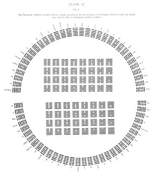

  
[Intangible Textual Heritage](../index)  [Index](index) 
[Previous](pl1)  [Next](pl2-2) 

------------------------------------------------------------------------

 

# PLATE II.

Fig. 1.

The HEXAGRAMS, exhibited circularly and in a square, according to the
natural process of development from the whole and divided lines, and the
order ascribed to Fû-hsî.

[  
Click to enlarge](img/pl2-1.jpg)

 

------------------------------------------------------------------------

[Next: Plate II, Figure 2](pl2-2)
