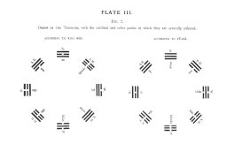

  
[Intangible Textual Heritage](../index)  [Index](index) 
[Previous](pl3-1)  [Next](ic01) 

------------------------------------------------------------------------

 

# PLATE III.

Fig 2.

ORDER OF THE TRIGRAMS, with the cardinal and other points to which they
are severally referred.

[  
Click to enlarge](img/pl3-2.jpg)

 

------------------------------------------------------------------------

[Next: I. The Khien Hexagram](ic01)
