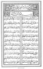

  
[Intangible Textual Heritage](../../index)  [Islam](../index) 
[Index](index)  [Next](arp001) 

------------------------------------------------------------------------

[Buy this Book at
Amazon.com](https://www.amazon.com/exec/obidos/ASIN/B002BNKRJ8/internetsacredte)

------------------------------------------------------------------------

  
*Arabian Poetry*, by W. A. Clouston, \[1881\], at Intangible Textual
Heritage

------------------------------------------------------------------------

# ARABIAN POETRY

###### FOR

## ENGLISH READERS.

##### EDITED, WITH INTRODUCTION AND NOTES,

###### BY

### W. A. CLOUSTON.

|                                                                                                                                                                                                                                                                                                                                     |
|-------------------------------------------------------------------------------------------------------------------------------------------------------------------------------------------------------------------------------------------------------------------------------------------------------------------------------------|
| The Arabian Poets were the historians and moralists of the age; and if they sympathised with the prejudices, they inspired and crowned the virtues of their countrymen: the indissoluble union of generosity and valour was the darling theme of their song.—** Gibbon**. |

#### Glasgow: (printed privately) M’Laren and Son, printers

#### \[1881\]

Scanned, proofed and formatted at Intangible Textual Heritage, October
2007 by John Bruno Hare. This text is in the public domain in the US
because it was published prior to 1923.

 
[  
Click to enlarge](img/front.jpg)  
Frontispiece  

Gilmour & Dean Lith. Glasgow.  
(*text at base of Frontispiece*)

  [  
Click to enlarge](img/title.jpg)  
Title Page  

------------------------------------------------------------------------

[Next: Preface](arp001)
