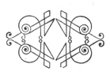

  
[Intangible Textual Heritage](../../index)  [Islam](../index) 
[Index](index)  [Previous](arp001)  [Next](arp003) 

------------------------------------------------------------------------

[Buy this Book at
Amazon.com](https://www.amazon.com/exec/obidos/ASIN/B002BNKRJ8/internetsacredte)

------------------------------------------------------------------------

  
*Arabian Poetry*, by W. A. Clouston, \[1881\], at Intangible Textual
Heritage

------------------------------------------------------------------------

### THE FRONTISPIECE.

THIS is a lithographed reproduction, in facsimile (but only in black and
white), of a page of a beautifully written and splendidly illuminated
Arabic manuscript volume, in the possession of Mr. E. J. W. Gibb, whose
translation of Mesīhī's Ode on Spring enriches the Appendix to the
present work. The page contains the eleven first couplets of El-Būsīrī's
celebrated Qasīda (Poem, or rather, Hymn) in praise of Muhammad, of
which an English translation, by Mr. J. W. Redhouse, will be found in
pages [319](arp141.htm#page_319)-[341](arp143.htm#page_341). It is
hardly necessary to state, what almost every English reader must already
know, that Arabic, like most Oriental languages, is written from right
to left; but it may be explained that the space in the centre of the
page separates the first and second hemistichs of each verse. For
example: the first couplet is contained in the *first* line, at the top
of *each* column; the second couplet, in the *second* line of *each*
column; and so on, reading across the central division. Mr. Redhouse has
favoured me with a transliteration of this page (not every Arabist can
correctly read any Arabic manuscript), and a translation of the titles
and the customary invocation. The titles of the poem and of the first
section, at the top of the page, are:

*qasīdatun burdatun faslun fi ta‘dīli ’n-nafsi*

A Poem; a Mantle. A Section on the Justification of the Carnal Man.

Then follows the invocation which is invariably placed at the beginning
of every Muslim composition, whether secular or religious:

*bi ’smi ’llāhi ’r-rahmānī ’r-rahīmi*

In the name of God, the Most Merciful,
the All-Compassionate.

Our old European authors in like manner always headed their

p. viii

writings with the sign of the cross, +. Thus, in the *King's Quair*, by
James I., of Scotland:

And forthwithal my pen in hand I took,  
And made a +, and thus began my book.

Modern Christians do not so literally follow the scriptural injunction:
"In all thy ways acknowledge Him, and He shall direct thy paths." But
with Muslims it is no empty form.

The English reader will be interested in observing, in the following
four first couplets of El-Būsīrī's Poem, in italic characters, the
movement of the qasīda rhyme:

1 *e min tezekkuri jīrāmin bi dhī-selemi  
  mezejta dem‘an jerà min muqletin bi demi*

2 *em hebeti ’r-rīhu min tilqā’i katzimetin  
  wa ewmadza ’l-barqu fī ’tz-tzalmā’i min idzami*

3 *fa mà li ‘ayney-ke in qulta ’kfufà hemetà  
  wa mà li qalbi-ke in qulta ’stefiq yehimi*

4 *e yahsibu ’s-sabbu enna ’l-hubba munketimun  
  mà beyna munsejimin min-hu wa mudztarimi*

The two halves of the first distich, as above, rhyme; and the final
syllable (*mi*) of the second half of every succeeding distich, to the
end of the poem, is the same as those of the hemistichs of the opening
verse.

W. A. C.    

 

------------------------------------------------------------------------

[Next: Contents](arp003)
