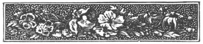

  
[Intangible Textual Heritage](../../index)  [Islam](../index) 
[Index](index)  [Previous](arp009)  [Next](arp011) 

------------------------------------------------------------------------

[Buy this Book at
Amazon.com](https://www.amazon.com/exec/obidos/ASIN/B002BNKRJ8/internetsacredte)

------------------------------------------------------------------------

  
*Arabian Poetry*, by W. A. Clouston, \[1881\], at Intangible Textual
Heritage

------------------------------------------------------------------------

p. 2

|                                                                                                                                                                                                                                                                                                                        |
|------------------------------------------------------------------------------------------------------------------------------------------------------------------------------------------------------------------------------------------------------------------------------------------------------------------------|
| *The Poems entitled* Almoällakât *exhibit an exact picture of their virtues and their vices, their wisdom and their folly; and show what may be constantly expected from men of open hearts and boiling passions, with no law to control, and little religion to restrain ahem*.—Six W. JONES: Discourse on The Arabs. |

p. 3

 

##### THE

## POEM

###### OF

# AMRIOLKAIS.

### THE ARGUMENT.

THE Poet, after the manner of his countrymen, supposes himself attended
on a journey by a company of friends; and as they pass near a place
where his mistress had lately dwelled, but from which her tribe was then
removed, he desires them to stop awhile, that he might indulge the
painful pleasure of weeping over the deserted remains of her tent. They
comply with his request, but exhort him to show more strength of mind,
and urge two topics of consolation, namely, that he had before been
equally unhappy, and that he had enjoyed his full share of pleasures.
Thus, by recollection of his past delight, his imagination is kindled,
and his grief suspended.

He then gives his friends a lively account of his juvenile frolics, to
one of which they had alluded. It seems he had been in love with a girl
named Onaiza, and had in vain sought an occasion to declare his passion.
One day, when her tribe

p. 4

had struck their tents, and were changing their station, the women, as
usual, came behind the rest, with the servants and baggage, in carriages
fixed on the backs of camels. Amriolkais advanced slowly at a distance,
and, when the men were out of sight, had the pleasure of seeing Onaiza
retire with a party of damsels to a rivulet or pool, called Daratjuljul,
where they undressed themselves, and were bathing, when the lover
appeared, dismounted from his camel, and sat upon their clothes,
proclaiming aloud that whoever would redeem her dress must present
herself naked before him.

They adjured, entreated, expostulated; but, when it grew late, they
found themselves obliged to submit, and all of them recovered their
clothes except Onaiza, who renewed her adjurations, and continued a long
time in the water: at length she also performed the condition, and
dressed herself. Some hours had passed, when the girls complained of
cold and hunger. Amriolkais therefore instantly killed the young camel
on which he had ridden, and having called the female attendants
together, made a fire and roasted him. The afternoon was spent in gay
conversation, not without a cheerful cup, for he was provided with wine
in a leathern bottle. But, when it was time to follow the tribe, the
prince (for such was his rank) had neither camel nor horse; and Onaiza,
after much importunity, consented to take him on her camel, before the
carriage, while the other damsels divided among themselves the less
agreeable burden of his arms and the furniture of his beast.

He next relates his courtship of Fatima, and his more dangerous amour
with a girl of a tribe at war with his own, whose beauties he very
minutely and luxuriantly delineates. From these love-tales he proceeds
to the commendation of his own fortitude, when he was passing a desert
in the darkest night; and the mention of the morning which succeeded
leads him to a long description of his hunter, and of a chase in the
forest, followed by a feast on the game which had been pierced by his
javelins.

p. 5

Here his narrative seems to be interrupted by a storm of lightning and
violent rain;—he nobly describes the shower, and the torrent which it
produced down all the adjacent mountains; and, his companions retiring
to avoid the storm, the drama (for the poem has the form of a dramatic
pastoral) ends abruptly.

\_\_\_\_\_\_\_\_\_\_

The metre is of the *first* species, called *long verse*, and consists
of the *bacchius* or *amphibrachys*, followed by the first *epitrite;*
or, in the fourth and eighth places of the distich, by the *double
iambus*, the last syllable being considered as a long one: the regular
form, taken from the second chapter of "Commentaries on Asiatic Poetry,"
is this:

"Amator \| puellarum \| miser sæ \| pe fallitur  
 Ocellis \| nigris, labris \| odoris, \| nigris comis."

------------------------------------------------------------------------

[Next: The Poem of Amriolkais](arp011)
