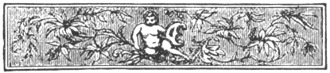

  
[Intangible Textual Heritage](../../index)  [Islam](../index) 
[Index](index)  [Previous](arp024)  [Next](arp026) 

------------------------------------------------------------------------

[Buy this Book at
Amazon.com](https://www.amazon.com/exec/obidos/ASIN/B002BNKRJ8/internetsacredte)

------------------------------------------------------------------------

  
*Arabian Poetry*, by W. A. Clouston, \[1881\], at Intangible Textual
Heritage

------------------------------------------------------------------------

p. 95

 

###### ON THE

### TOMB OF MANO.

#### BY HASSAN ALASADY.

FRIENDS of my heart, who share my sighs!  
Go seek the turf where Mano lies,  
And woo the dewy clouds of Spring  
To sweep it with prolific wing.

Within that cell, beneath that heap,  
Friendship and Truth and Honour sleep.  
Beneficence, that used to clasp  
The world within her ample grasp,  
There rests entombed—of thought bereft;  
For were one conscious atom left,  
New bliss, new kindness to display,  
’T would burst the grave, and seek the day.

But though in dust thy relics lie,  
Thy virtues, Mano, ne’er shall die:  
Though Nile's full stream be seen no more,  
That spread his waves from shore to shore,  
Still in the verdure of the plain  
His vivifying smiles remain.

------------------------------------------------------------------------

[Next: On the Tomb of Sayid, by Abd Almalec Alharithy](arp026)
