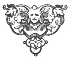

  
[Intangible Textual Heritage](../../index)  [Islam](../index) 
[Index](index)  [Previous](arp051)  [Next](arp053) 

------------------------------------------------------------------------

[Buy this Book at
Amazon.com](https://www.amazon.com/exec/obidos/ASIN/B002BNKRJ8/internetsacredte)

------------------------------------------------------------------------

  
*Arabian Poetry*, by W. A. Clouston, \[1881\], at Intangible Textual
Heritage

------------------------------------------------------------------------

p. 124

### ON A CAT,

#### THAT WAS KILLED AS SHE WAS ATTEMPTING TO ROB A DOVE-HOUSE.

##### BY IBN ALALAF ALNAHARWANY.

POOR Puss is gone!—’tis Fate's decree—  
  Yet I must still her loss deplore;  
For dearer than a child was she,  
  And ne’er shall I behold her more.

With many a sad presaging tear,  
  This morn I saw her steal away,  
While she went on without a fear,  
  Except that she should miss her prey.

I saw her to the dove-house climb,  
  With cautious feet and slow she stept,  
Resolved to balance loss of time  
  By eating faster than she crept.

Her subtle foes were on the watch,  
  And marked her course, with fury fraught;  
And while she hoped the birds to catch,  
  An arrow's point the huntress caught.

In fancy she had got them all,  
  And drunk their blood and sucked their breath;  
Alas! she only got a fall,  
  And only drank the draught of death.

p. 125

Why, why was pigeon's flesh so nice,  
  That thoughtless cats should love it thus?  
Hadst thou but lived on rats and mice,  
  Thou hadst been living still, poor Puss!

Cursed be the taste, howe’er refined,  
  That prompts us for such joys to wish;  
And cursed the dainty where we find  
  Destruction lurking in the dish!

 

------------------------------------------------------------------------

[Next: Epigram On Ebn Naphta-Wah, by Mohammed Ben Zeid
Almotakalam](arp053)
