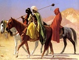

  
[Intangible Textual Heritage](../../index)  [Islam](../index) 
[Index](index)  [Previous](arp055)  [Next](arp057) 

------------------------------------------------------------------------

[Buy this Book at
Amazon.com](https://www.amazon.com/exec/obidos/ASIN/B002BNKRJ8/internetsacredte)

------------------------------------------------------------------------

  
*Arabian Poetry*, by W. A. Clouston, \[1881\], at Intangible Textual
Heritage

------------------------------------------------------------------------

p. 128

### ON THE VICISSITUDES OF LIFE.

##### BY THE SAME.

MORTAL joys, however pure,  
  Soon their turbid source betray;  
Mortal bliss, however sure,  
  Soon must totter and decay.

Ye who now, with footsteps keen,  
  Range through Hope's delusive field,  
Tell us what the smiling scene  
  To your ardent grasp can yield?

Other youths have oft before  
  Deemed their joys would never fade,  
Till themselves were seen no more—  
  Swept into oblivion's shade.

Who, with health and pleasure gay,  
  E’er his fragile state could know,  
Were not age and pain to say—  
  Man is but the child of woe?

------------------------------------------------------------------------

[Next: To a Dove, by Serage Alwarak](arp057)
