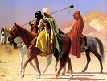

  
[Intangible Textual Heritage](../../index)  [Islam](../index) 
[Index](index)  [Previous](arp080)  [Next](arp082) 

------------------------------------------------------------------------

[Buy this Book at
Amazon.com](https://www.amazon.com/exec/obidos/ASIN/B002BNKRJ8/internetsacredte)

------------------------------------------------------------------------

  
*Arabian Poetry*, by W. A. Clouston, \[1881\], at Intangible Textual
Heritage

------------------------------------------------------------------------

p. 163

#### ON LOVE.

##### BY ABU ALI, THE MATHEMATICIAN.

\[ABU ALI flourished in Egypt about a.h. 530, and was equally celebrated as a
mathematician and as a poet. In the following odd composition he seems
to have united these two discordant characters.\]

I NEVER knew a sprightly fair  
  That was not dear to me;  
And freely I my heart could share  
  With every one I see.

It is not *this* or *that* alone  
  On whom my choice would fall:  
I do not more incline to one  
  Than I incline to all.

The circle's bounding line are they;  
  Its centre is my heart;  
My ready love, the equal ray  
  That flows to every part.

------------------------------------------------------------------------

[Next: A Remonstrance with a Drunkard, by Yahia Ben Salamet](arp082)
