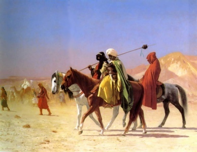

  
[Intangible Textual Heritage](../../index)  [Islam](../index) 

------------------------------------------------------------------------

[Buy this Book at
Amazon.com](https://www.amazon.com/exec/obidos/ASIN/B002BNKRJ8/internetsacredte)

------------------------------------------------------------------------

<table width="75%">
<colgroup>
<col style="width: 50%" />
<col style="width: 50%" />
</colgroup>
<tbody>
<tr class="odd">
<td width="50%" data-valign="TOP"> 
Arabs Crossing the Desert, by Jean-Leon Gerome [19th Cent.] (Public Domain Image)</td>
<td width="50%" data-valign="CENTER"><h1 id="arabian-poetry" data-align="CENTER">Arabian Poetry</h1>
<h2 id="by-w.a.-clouston" data-align="CENTER">by W.A. Clouston</h2>
<h4 id="section" data-align="CENTER">[1881]</h4></td>
</tr>
</tbody>
</table>

------------------------------------------------------------------------

[Contents](#contents)    [Start Reading](arp000)    [Page
Index](pageidx)    [Text \[Zipped\]](arp.txt.gz)

------------------------------------------------------------------------

> Ibn Altalmith was expiring when his son approached
> his bed, and inquired whether there was anything he wished for. Upon
> which the old man in a faint voice exclaimed: 'I only wish that I
> could wish for anything!'--p. 435.

|                                                                                                                           |
|---------------------------------------------------------------------------------------------------------------------------|
|  |

This is an anthology of 19th century Orientalist translations of Arabian
poetry, many of which are very rare, as is this particular book. Most of
the included works either predated Muhammed or were contemporary, so
there are many fascinating bits of pre-Islamic lore. Included is the
Moallakat, or the 'Hanged' Poems, a collection of seven pre-Islamic
poets whose works were once displayed (i.e. 'hanged') in the Ka'ba.
Another highlight is a synopsis of the 'Romance of Antar,' an oral saga
of a brave prince of old Arabia, and many deeds of derring-do. The one
downside here is all of the variant ways of transliterating Arabic
words, which probably will take an specialist in Arabic literature to
sort out.

------------------------------------------------------------------------

 [Title Page](arp000)  
[Preface](arp001)  
[The Frontispiece](arp002)  
[Contents](arp003)  

### Introduction

[I.—The Ancient Arabs](arp004)  
[II.—The Mu‘allaqāt, or, Seven Ancient Arabic Prize Poems](arp005)  
[III.—Genuineness of the Early Arabic Poetry](arp006)  
[IV.—Arabian Literature Under the Khalifate](arp007)  
[Genealogy of the Seven Arabian Poets](arp008)  

### The Moallakát

[Title Page](arp009)  
[The Poem of Amriolkais: The Argument](arp010)  
[The Poem of Amriolkais](arp011)  
[The Poem of Tarafa: The Argument](arp012)  
[The Poem of Tarafa](arp013)  
[The Poem of Zohair: The Argument](arp014)  
[The Poem of Zohair](arp015)  
[The Poem of Lebeid: The Argument](arp016)  
[The Poem of Lebeid](arp017)  
[The Poem of Antara: The Argument](arp018)  
[The Poem of Antara](arp019)  
[The Poem of Amru: The Argument](arp020)  
[The Poem of Amru](arp021)  
[The Poem of Hareth: The Argument](arp022)  
[The Poem of Hareth](arp023)  

### Shorter Pieces of Arabian Poetry

[Title Page and Front Matter](arp024)  
[On the Tomb of Mano, by Hassan Alasady](arp025)  
[On the Tomb of Sayid, by Abd Almalec Alharithy](arp026)  
[On The Death Of His Mistress, By Abu Saher Alhedily](arp027)  
[On Avarice, by Hatem Tai](arp028)  
[On The Battle of Sabla, by Jaafer Ben Alba](arp029)  
[Verses Addressed to a Kindred Tribe at Variance with the One to Which
the Poet Belonged, by Alfadhel Ibn Alabas](arp030)  
[On His Friends, by Meskin Aldaramy](arp031)  
[On Temper, by Nabegat Beni Jaid](arp032)  
[The Song of Maisuna](arp033)  
[Verses of Yezid To His Father, Mowiah, Who Reproached Him For
Drunkenness](arp034)  
[On Fatalism, by The Imam Shafay Mohammed Ben Idris](arp035)  
[To The Khalif Haroun Alrashid, On His Undertaking A Pilgrimage to
Mecca, by Ibrahim Ben Adhem](arp036)  
[On The Inauguration of Haroun Alrashid, and the Appointment of Yahia,
by Isaac Almousely](arp037)  
[On The Ruin of the Barmecides](arp038)  
[Epigram on Taher Ben Hosein, Who Was Ambidexter and One-Eyed](arp039)  
[The Adieu, by Abu Mohammed](arp040)  
[Verses Addressed To His Mistress, Who Had Found Fault With Him For
Profusion, by Abu Teman Habib](arp041)  
[To a Female Cupbearer, by Abd Alsalam Ben Ragban](arp042)  
[Songs by Mashdud, Rakeek, and Rais](arp043)  
[Mashdud on the Monks of Khabbet](arp044)  
[Rakeek to his Female Companions](arp045)  
[Dialogue by Rais](arp046)  
[To a Lady Weeping, by Ebn Alrumi](arp047)  
[On a Valetudinarian, by Ebn Alrumi](arp048)  
[On a Miser, by Ebn Alrumi](arp049)  
[To Cassim Obid Allah, On the Death of One of His Sons, by Ali Ben Ahmed
Ben Mansour](arp050)  
[To a Friend, On His Birthday](arp051)  
[On a Cat, That Was Killed As She Was Attempting to Rob A Dove-House, by
Ibn Alalaf Alnaharwany](arp052)  
[Epigram On Ebn Naphta-Wah, by Mohammed Ben Zeid Almotakalam](arp053)  
[Fire: A Riddle](arp054)  
[To a Lady, On Seeing Her Blush, by the Khalif Radhi Billah](arp055)  
[On the Vicissitudes of Life, by the Khalif Radhi Billah](arp056)  
[To a Dove, by Serage Alwarak](arp057)  
[On a Thunder-Storm, by Ibrahim Ben Khiret Abu Isaac](arp058)  
[To His Favourite Mistress, by Saif Addaulet, Sultan of
Aleppo](arp059)  
[On the Crucifixion of Ebn Bakiah, by Abu Hassan Alanbary](arp060)  
[On the Caprices of Fortune, By Shems Almaali Cabus, The Dethroned
Sultan of Georgia](arp061)  
[Life](arp062)  
[To Leila](arp063)  
[Extempore Verses, by Ebn Alramacram](arp064)  
[On the Death of a Son, By Ali Ben Mohammed Altahmany](arp065)  
[On Moderation In Our Pleasures, by Abu Alcassim Ebn Tabataba](arp066)  
[On the Vale of Bozaa, by Ahmed Ben Yousef Almenazy](arp067)  
[To Adversity, by Abu Menbaa Carawash, Sultan of Mousel](arp068)  
[On The Incompatibility of Pride and True Glory, by Abu Alola](arp069)  
[On the Death of Nedham Almolk, by Shebal Addaulet](arp070)  
[Verses by Waladata](arp071)  
[Verses Addressed to His Daughters, During His Imprisonment, by Motammed
Ben Abad, Sultan Of Seville](arp072)  
[A Serenade to His Sleeping Mistress, by Ali Ben Abd Algany, of
Cordova](arp073)  
[The Inconsistent](arp074)  
[On the Capture of Jerusalem, in the First Crusade, by Almodhafer
Alabiwerdy](arp075)  
[To A Lady, Who Accused Her Lover of Flattery](arp076)  
[Epigram on Abu Alchair Selamu, an Egyptian Physician, by George, A
Physician of Antioch](arp077)  
[To A Little Man With A Very Large Beard, by Isaac Ben Khalif](arp078)  
[Lamiat Alajem, by Mauid Eddin Alhassan Abu Ismael Altograi](arp079)  
[To Youth, by Ebn Alrabia, in His Old Age](arp080)  
[On Love, by Abu Ali, The Mathematician](arp081)  
[A Remonstrance with a Drunkard, by Yahia Ben Salamet](arp082)  
[Verses Addressed by The Khalif Almoktafi Liamrillah to a Lady, Who
Pretended a Passion For Him In His Old Age](arp083)  
[On Procrastination, by Hebat Allah Ibn Altalmith](arp084)  
[On the Early Death of Abu Alhassan Ali, by Camal Eddin Ben
Alnabit](arp085)  
[The Interview, A Song in the Rhythm of the Original, With the Music
Annexed](arp086)  

### The Romance of Antar

[Title Page](arp087)  
[Editor's Preface](arp088)  
[From the Translator's Preface](arp089)  
[The Hero's Birth and Early Years](arp090)  
[The Dawn of Love](arp091)  
[Early Warlike Exploits](arp092)  
[Antar And Abla's Mother](arp093)  
[Antar Offends His Father](arp094)  
[How Antar Obtained His Horse Abjer](arp095)  
[A Bridal Party Attacked](arp096)  
[Plots Against The Hero](arp097)  
[Antar Rescues His Father and Uncles](arp098)  
[A Gallant Knight of Mazin](arp099)  
[How Antar Found the Sword Dhami](arp100)  
[Rescue of the Tribe of Mazin](arp101)  
[Another Suitor For Abla](arp102)  
[Battle of the Tribes of Abs and Tey—Antar to the Rescue!](arp103)  
[Antar Proclaimed Champion of Abs](arp104)  
[Antar's Expedition For the Asafeer Camels](arp105)  
[The Satrap Khosrewan Sent to Chastise Monzar](arp106)  
[Combat Between Antar and Khosrewan](arp107)  
[Antar at the Court of Chosroe](arp108)  
[Abla's Trials During Antar's Absence](arp109)  
[Abla and Her Family Rescued by Antar](arp110)  
[The Hero's Reception by His Tribe](arp111)  
[Antar's Grief For the Loss of Abla](arp112)  
[Shiboob Brings Tidings of Abla](arp113)  
[Antar Rescues His Beloved](arp114)  
[Antar Goes to Mecca](arp115)  
[Prince Shas in Captivity](arp116)  
[Antar Summoned From Mecca to Rescue Shas](arp117)  
[The Hero Encounters Roudha, A Gallant Horseman, Going A-Wooing to
Abla](arp118)  
[Antar Undertakes Another Enterprise For Abla's Sake](arp119)  
[Story of Jaida and Khalid](arp120)  
[Antar in the Land of Zebeed](arp121)  
[Address to the Turtle-Dove](arp122)  
[The Matrimonial Schemes of Abla's Father Again Come to
Naught](arp123)  
[Shiboob in Masquerade at the Tents of Kendeh](arp124)  
[Attempted Murder of Abla](arp125)  
[The Hero Quits His Tribe](arp126)  
[Numan, King of Hirah, Makes War Against King Zoheir—The Hero Saves His
Country](arp127)  
[Prince Harith in Love](arp128)  
[King Zoheir and His Brother, Asyed](arp129)  
[Death of Prince Shas and King Zoheir](arp130)  
[King Cais Avenges His Father's Death](arp131)  
[Abla's Father and Brother Again Rescued by Antar](arp132)  
[A Horse Race, and its Consequences](arp133)  
[Prince Malik's Marriage and Death](arp134)  
[Amarah Lampooned by the Girls](arp135)  
[Marriage of Antar and Abla](arp136)  
[The Death of Antar](arp137)  

### Ka‘b's Poem of the Mantle

[Title Page](arp138)  
[Preface](arp139)  
[Ka‘b's Poem of the Mantle](arp140)  

### El-Būsīrī's Poem of the Mantle

[Title Page](arp141)  
[Preface](arp142)  
[El-Būsīrī's Poem of the Mantle](arp143)  

### Appendix

### Extracts From The Lay of the Himyarites

[Preface](arp144)  
[From the Translator's Preface](arp145)  
[Opening Verses of the Poem](arp146)  
[Closing Verses](arp147)  
[Notes](arp148)  
[The Poet ’Omar](arp149)  
[On the Prosody of the Arabs](arp150)  
[Notes on the Moallakát](arp151)  
[Notes on the Poem of Amriolkais](arp152)  
[Notes on the Poem of Tarafa](arp153)  
[Notes on the Poem of Zohair](arp154)  
[Notes on the Poem of Lebeid](arp155)  
[Notes on the Poem of Antara](arp156)  
[Notes on the Poem of Amru](arp157)  
[Notes on the Poem of Hareth](arp158)  
[Notes on Shorter Poems](arp159)  
[Notes on the Romance of Antar](arp160)  
[Notes On Ka‘b's Mantle Poem](arp161)  
[Notes On El-Būsīrī's Mantle Poem](arp162)  
[The L Poem of the Foreigner](arp163)  
