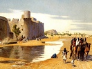

  
[Intangible Textual Heritage](../../index)  [Islam](../index) 
[Index](index)  [Previous](bus00)  [Next](bus02) 

------------------------------------------------------------------------

  
*The Bustan of Sadi*, tr. by A. Hart Edwards, \[1911\], at Intangible
Textual Heritage

------------------------------------------------------------------------

p. 5

### CONTENTS

|                                             |                                                                                                   |                                 |
|---------------------------------------------|---------------------------------------------------------------------------------------------------|---------------------------------|
|                                             |                                                                                                   | PAGE |
| Introduction |                                                                                                   | [12](bus03.htm#page_12)         |
|                                             | In the Name of God, the Compassionate, the Merciful                                               | [25](bus04.htm#page_25)         |
|                                             | On the Reason for the Writing of the Book                                                         | [27](bus04.htm#page_27)         |
|                                             | Concerning Atabak Abu Bakr, Son of Sad                                                            | [28](bus04.htm#page_28)         |
|                                             |                                                                                                   |                                 |
| CHAP.            |                                                                                                   |                                 |
| I.                                          | Concerning Justice, Counsel, and the Administration of Government: |                                 |
|                                             | Nushiravan's Counsel to his Son                                                                   | [31](bus05.htm#page_31)         |
|                                             | Discourse concerning Travellers                                                                   | [31](bus05.htm#page_31)         |
|                                             | Story illustrating the Need for Deliberation                                                      | [32](bus05.htm#page_32)         |
|                                             | Story of the King whose Coat was Coarse                                                           | [37](bus05.htm#page_37)         |
|                                             | Story of Darius and the Herdsman                                                                  | [37](bus05.htm#page_37)         |
|                                             | Story of Abdul Aziz and the Pearl                                                                 | [38](bus05.htm#page_38)         |
|                                             | Story of how Tukla was rebuked by a Devotee                                                       | [39](bus05.htm#page_39)         |
|                                             | Discourse concerning Riches and Poverty                                                           | [40](bus05.htm#page_40)         |
|                                             | Story of Qazal Arsalan and the Fort                                                               | [40](bus05.htm#page_40)         |
|                                             | A Story of Damascus                                                                               | [41](bus05.htm#page_41)         |
|                                             | Story of a Bully                                                                                  | [43](bus05.htm#page_43)         |
|                                             |                                                                                                   |                                 |
| II\.                                        | Concerning Benevolence:                                            |                                 |
|                                             | Story illustrative of doing good to the Evil                                                      | [45](bus06.htm#page_45)         |
|                                             | Story concerning Fasting                                                                          | [45](bus06.htm#page_45)         |
|                                             | p. 6                                                                     |                                 |
| CHAP.            |                                                                                                   | PAGE |
|                                             | Story illustrative of Practical Charity                                                           | [46](bus06.htm#page_46)         |
|                                             | Story of a Man and a Thirsty Dog                                                                  | [48](bus06.htm#page_48)         |
|                                             | Story Apropos of Nemesis                                                                          | [49](bus06.htm#page_49)         |
|                                             | Story of a Fool and a Fox                                                                         | [51](bus06.htm#page_51)         |
|                                             | Story of a Devout Miser                                                                           | [52](bus06.htm#page_52)         |
|                                             | Story of Hatim Tai                                                                                | [53](bus06.htm#page_53)         |
|                                             | Story of Hatim and the Messenger sent to kill him                                                 | [54](bus06.htm#page_54)         |
|                                             | Story illustrative of misdirected kindness                                                        | [57](bus06.htm#page_57)         |
|                                             | Discourse concerning Kindness to Orphans                                                          | [59](bus06.htm#page_59)         |
|                                             |                                                                                                   |                                 |
| III\.                                       | Concerning Love:                                                   |                                 |
|                                             | Discourse concerning Constancy                                                                    | [61](bus07.htm#page_61)         |
|                                             | Story of a Dancer                                                                                 | [62](bus07.htm#page_62)         |
|                                             | Story illustrating the Reality of Love                                                            | [63](bus07.htm#page_63)         |
|                                             | Story illustrative of Patience                                                                    | [63](bus07.htm#page_63)         |
|                                             | Story of One who was Assiduous in Prayer                                                          | [65](bus07.htm#page_65)         |
|                                             | Story of Sultan Mahmud and his Love for Ayaz                                                      | [65](bus07.htm#page_65)         |
|                                             | Story of a Village Chief                                                                          | [67](bus07.htm#page_67)         |
|                                             | Story of a Fire-fly                                                                               | [67](bus07.htm#page_67)         |
|                                             | Story of a Moth and a Candle                                                                      | [68](bus07.htm#page_68)         |
|                                             | Another Story on the same Subject                                                                 | [68](bus07.htm#page_68)         |
|                                             |                                                                                                   |                                 |
| IV\.                                        | Concerning Humility:                                               |                                 |
|                                             | Story of a Raindrop                                                                               | [70](bus08.htm#page_70)         |
|                                             | Story illustrative of Pious Men regarding themselves with Contempt                                | [71](bus08.htm#page_71)         |
|                                             | Story of Sultan Bayazid Bustami                                                                   | [72](bus08.htm#page_72)         |
|                                             | Discourse on Conceit                                                                              | [73](bus08.htm#page_73)         |
|                                             | Story of the Darwesh and the Proud Cadi                                                           | [74](bus08.htm#page_74)         |
|                                             | Story of the Honey-seller                                                                         | [78](bus08.htm#page_78)         |
|                                             | p. 7                                                                     |                                 |
| CHAP.            |                                                                                                   | PAGE |
|                                             | Story illustrating the Forbearance of Good Men                                                    | [79](bus08.htm#page_79)         |
|                                             | Story illustrating the Noble-mindedness of Men                                                    | [79](bus08.htm#page_79)         |
|                                             | Story of a Kind Master and his Disobedient Slave                                                  | [80](bus08.htm#page_80)         |
|                                             | Story of Maruf Karchi and the Sick Traveller                                                      | [82](bus08.htm#page_82)         |
|                                             | Story illustrating the Folly of the Ignoble                                                       | [84](bus08.htm#page_84)         |
|                                             | Story of One who had a Little Knowledge                                                           | [85](bus08.htm#page_85)         |
|                                             | Story illustrating the Humility of the Pious                                                      | [85](bus08.htm#page_85)         |
|                                             | Story illustrating the Value of Soft Words                                                        | [86](bus08.htm#page_86)         |
|                                             | Story illustrating the Wisdom of Feigning Deafness                                                | [87](bus08.htm#page_87)         |
|                                             | Story illustrating Forbearance for the Sake of Friends                                            | [88](bus08.htm#page_88)         |
|                                             | Story of Luqman, the Sage                                                                         | [89](bus08.htm#page_89)         |
|                                             |                                                                                                   |                                 |
| V.                                          | Concerning Resignation:                                            |                                 |
|                                             | Story of a Soldier of Isfahan                                                                     | [91](bus09.htm#page_91)         |
|                                             | Story of the Doctor and the Villager                                                              | [94](bus09.htm#page_94)         |
|                                             | Story of the Villager and his Ass                                                                 | [94](bus09.htm#page_94)         |
|                                             | Story illustrating Luck                                                                           | [95](bus09.htm#page_95)         |
|                                             | Story of One who blamed his Destiny                                                               | [95](bus09.htm#page_95)         |
|                                             | Story of a Darwesh and his Wife                                                                   | [96](bus09.htm#page_96)         |
|                                             | Story of a Vulture and a Kite                                                                     | [97](bus09.htm#page_97)         |
|                                             | Story of a Camel                                                                                  | [98](bus09.htm#page_98)         |
|                                             | Discourse concerning Hypocrisy                                                                    | [98](bus09.htm#page_98)         |
|                                             |                                                                                                   |                                 |
| VI\.                                        | Concerning Contentment:                                            |                                 |
|                                             | Story of the King of Khwarazm                                                                     | [101](bus10.htm#page_101)       |
|                                             | Concerning the Evil of Over-eating                                                                | [102](bus10.htm#page_102)       |
|                                             | Story of a Glutton                                                                                | [103](bus10.htm#page_103)       |
|                                             | Story of a Recluse                                                                                | [103](bus10.htm#page_103)       |
|                                             | p. 8                                                                     |                                 |
| CHAP.            |                                                                                                   | PAGE |
|                                             | Story illustrating the Evils of Avarice                                                           | [103](bus10.htm#page_103)       |
|                                             | Story of an Ambitious Cat                                                                         | [104](bus10.htm#page_104)       |
|                                             | Story of a short-sighted Man and his High-minded Wife                                             | [105](bus10.htm#page_105)       |
|                                             | Story of a Holy Man who built a House                                                             | [106](bus10.htm#page_106)       |
|                                             | Story of a Sheikh who became King                                                                 | [107](bus10.htm#page_107)       |
|                                             | Discourse concerning Riches                                                                       | [108](bus10.htm#page_108)       |
|                                             |                                                                                                   |                                 |
| VII\.                                       | Concerning Education:                                              |                                 |
|                                             | Discourse concerning the Excellence of Taciturnity                                                | [110](bus11.htm#page_110)       |
|                                             | Story concerning the keeping of Secrets                                                           | [111](bus11.htm#page_111)       |
|                                             | Story illustrating the Fact that Silence is Best for Fools                                        | [112](bus11.htm#page_112)       |
|                                             | Story illustrating the Folly of Impertinence                                                      | [113](bus11.htm#page_113)       |
|                                             | Discourse on Slander                                                                              | [114](bus11.htm#page_114)       |
|                                             | Story concerning the same Subject                                                                 | [114](bus11.htm#page_114)       |
|                                             | Why Thieving is better than Slandering                                                            | [115](bus11.htm#page_115)       |
|                                             | Sadi and his Envious Class-friend                                                                 | [115](bus11.htm#page_115)       |
|                                             | Story of Sadi's Childhood                                                                         | [115](bus11.htm#page_115)       |
|                                             | Story of a Sufi's Rebuke                                                                          | [117](bus11.htm#page_117)       |
|                                             | Concerning Absent Friends                                                                         | [117](bus11.htm#page_117)       |
|                                             | Where Slander is Lawful                                                                           | [118](bus11.htm#page_118)       |
|                                             | Tale-bearers worse than Back-biters                                                               | [118](bus11.htm#page_118)       |
|                                             | Faridun and his Wise Vazier                                                                       | [119](bus11.htm#page_119)       |
|                                             | Discourse concerning Wives                                                                        | [120](bus11.htm#page_120)       |
|                                             | Discourse on the Training of Sons                                                                 | [121](bus11.htm#page_121)       |
|                                             | Sadi rebuked for his Fault-finding                                                                | [122](bus11.htm#page_122)       |
|                                             |                                                                                                   |                                 |
| VIII\.                                      | Concerning Gratitude:                                              |                                 |
|                                             | A Mother's Warning to her Son                                                                     | [125](bus12.htm#page_125)       |
|                                             | Discourse concerning the Art of the Most High God                                                 | [126](bus12.htm#page_126)       |
|                                             | Discourse concerning the Condition of the Weak                                                    | [127](bus12.htm#page_127)       |
|                                             | p. 9                                                                     |                                 |
| CHAP.            |                                                                                                   | PAGE |
|                                             | Story of Tughral, King of Shiraz, and the Hindu Watchman                                          | [128](bus12.htm#page_128)       |
|                                             | Story of a Thief                                                                                  | [129](bus12.htm#page_129)       |
|                                             | Story of One who was not what he seemed                                                           | [130](bus12.htm#page_130)       |
|                                             | Story of a Sage Donkey                                                                            | [130](bus12.htm#page_130)       |
|                                             | Story illustrating the Evils of Pride                                                             | [131](bus12.htm#page_131)       |
|                                             | Story of Sadi and the Idolaters                                                                   | [131](bus12.htm#page_131)       |
|                                             |                                                                                                   |                                 |
| IX\.                                        | Concerning Repentance:                                             |                                 |
|                                             | An Old Man's Lament                                                                               | [136](bus13.htm#page_136)       |
|                                             | Advice and Warning                                                                                | [138](bus13.htm#page_138)       |
|                                             | Sadi's Rebuke from a Camel-driver                                                                 | [138](bus13.htm#page_138)       |
|                                             | Story concerning Sorrow for the Dead                                                              | [140](bus13.htm#page_140)       |
|                                             | Story of a Pious Man and a Gold Brick                                                             | [141](bus13.htm#page_141)       |
|                                             | Admonition                                                                                        | [143](bus13.htm#page_143)       |
|                                             | Moral from an Incident in Sadi's Childhood                                                        | [144](bus13.htm#page_144)       |
|                                             | Story of a Man who reared a Wolf                                                                  | [144](bus13.htm#page_144)       |
|                                             | Story of a Cheat                                                                                  | [145](bus13.htm#page_145)       |
|                                             | A Recollection of Childhood                                                                       | [146](bus13.htm#page_146)       |
|                                             | Story of One who burned his Harvest                                                               | [147](bus13.htm#page_147)       |
|                                             | Discourse on Repentance                                                                           | [147](bus13.htm#page_147)       |
|                                             |                                                                                                   |                                 |
| X.                                          | Concerning Prayer:                                                 |                                 |
|                                             | A Worshipper's Lament                                                                             | [150](bus14.htm#page_150)       |
|                                             | Story of an Idolater                                                                              | [151](bus14.htm#page_151)       |
| Notes        |                                                                                                   | [153](bus15.htm#page_153)       |

------------------------------------------------------------------------

[Next: Editorial Note](bus02)
