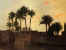

  
[Intangible Textual Heritage](../../index)  [Islam](../index) 
[Index](index)  [Previous](daa04)  [Next](daa06) 

------------------------------------------------------------------------

[Buy this Book at
Amazon.com](https://www.amazon.com/exec/obidos/ASIN/0766106071/internetsacredte)

------------------------------------------------------------------------

  
*The Diwan of Abu'l-Ala*, by Henry Baerlein, \[1909\], at Intangible
Textual Heritage

------------------------------------------------------------------------

p. 34

THE DIWAN OF ABU’L-ALA

I

Abandon worship in the mosque and shrink  
   From idle prayer, from sacrificial sheep,  
   For Destiny will bring the bowl of sleep  
Or bowl of tribulation——you shall drink.

II

The scarlet eyes of Morning are pursued  
   By Night, who growls along the narrow lane;  
   But as they crash upon our world the twain  
Devour us and are strengthened for the feud.

III

Vain are your dreams of marvellous emprise,  
   Vainly you sail among uncharted spaces,  
   Vainly seek harbour in this world of faces  
If it has been determined otherwise.

p. 35

IV

Behold, my friends, there is reserved for me  
   The splendour of our traffic with the sky:  
   You pay your court to Saturn, whereas I  
Am slain by One far mightier than he.

V

You that must travel with a weary load  
   Along this darkling, labyrinthine street——  
   Have men with torches at your head and feet  
If you would pass the dangers of the road.

VI

So shall you find all armour incomplete  
   And open to the whips of circumstance,  
   That so shall you be girdled of mischance  
Till you be folded in the winding-sheet.

VII

Have conversation with the wind that goes  
   Bearing a pack of loveliness and pain:  
   The golden exultation of the grain  
And the last, sacred whisper of the rose

VIII

But if in some enchanted garden bloom  
   The rose imperial that will not fade,  
   Ah! shall I go with desecrating spade  
And underneath her glories build a tomb?

p. 36

IX

Shall I that am as dust upon the plain  
   Think with unloosened hurricanes to fight?  
   Or shall I that was ravished from the night  
Fall on the bosom of the night again?

X

Endure! and if you rashly would unfold  
   That manuscript whereon our lives are traced,  
   Recall the stream which carols thro’ the waste  
And in the dark is rich with alien gold.

XI

Myself did linger by the ragged beach,  
   Whereat wave after wave did rise and curl;  
   And as they fell, they fell—I saw them hurl  
A message far more eloquent than speech:

XII

*We that with song our pilgrimage beguile,*  
   *With purple islands which a sunset bore,*  
   *We, sunk upon the sacrilegious shore,*  
*May parley with oblivion awhile.*

XIII

I would not have you keep nor idly flaunt  
   What may be gathered from the gracious land,  
   But I would have you sow with sleepless hand  
The virtues that will balance your account.

p. 37

XIV

The days are dressing all of us in white,  
   For him who will suspend us in a row.  
   But for the sun there is no death. I know  
The centuries are morsels of the night.

XV

A deed magnanimous, a noble thought  
   Are as the music singing thro’ the years  
   When surly Time the tyrant domineers  
Against the lute whereoutof it was wrought.

XVI

Now to the Master of the World resign  
   Whatever touches you, what is prepared,  
   For many sons of wisdom are ensnared  
And many fools in happiness recline.

XVII

Long have I tarried where the waters roll  
   From undeciphered caverns of the main,  
   And I have searched, and I have searched in vain,  
Where I could drown the sorrows of my soul.

XVIII

If I have harboured love within my breast,  
   ’Twas for my comrades of the dusty day,  
   Who with me watched the loitering stars at play,  
Who bore the burden of the same unrest,

p. 38

XIX

For once the witcheries a maiden flung——  
   Then afterwards I knew she was the bride  
   Of Death; and as he came, so tender-eyed,  
I—I rebuked him roundly, being young.

XX

Yet if all things that vanish in their noon  
   Are but the part of some eternal scheme,  
   Of what the nightingale may chance to dream  
Or what the lotus murmurs to the moon !

XXI

Have I not heard sagacious ones repeat  
   An irresistibly grim argument:  
   That we for all our blustering content  
Are as the silent shadows at our feet.

XXII

Aye, when the torch is low and we prepare  
   Beyond the notes of revelry to pass——  
   Old Silence will keep watch upon the grass,  
The solemn shadows will assemble there.

XXIII

No Sultan at his pleasure shall erect  
   A dwelling less obedient to decay  
   Than I, whom all the mysteries obey,  
Build with the twilight for an architect,

p. 39

XXIV

Dark leans to dark! the passions of a man  
   Are twined about all transitory things,  
   For verily the child of wisdom clings  
More unto dreamland than Arabistan.

XXV

Death leans to death! nor shall your vigilance  
   Prevent him from whate’er he would possess,  
   Nor, brother, shall unfilial peevishness  
Prevent you from the grand inheritance.

XXVI

Farewell, my soul!—bird in the narrow jail  
   Who cannot sing. The door is opened! Fly!  
   Ah, soon you stop, and looking down you cry  
The saddest song of all, poor nightingale.

XXVII

Our fortune is like mariners to float  
   Amid the perils of dim waterways;  
   Shall then our seamanship have aught of praise  
If the great anchor drags behind the boat?

XXVIII

Ah! let the burial of yesterday,  
   Of yesterday be ruthlessly decreed,  
   And, if you will, refuse the mourner’s reed,  
And, if you will, plant cypress in the way.

p. 40

XXIX

As little shall it serve you in the fight  
   If you remonstrate with the storming seas,  
   As if you querulously sigh to these  
Of some imagined haven of delight.

XXX

Steed of my soul! when you and I were young  
   We lived to cleave as arrows thro’ the night,——  
   Now there is ta’en from me the last of light,  
And wheresoe’er I gaze a veil is hung.

XXXI

No longer as a wreck shall I be hurled  
   Where beacons lure the fascinated helm,  
   For I have been admitted to the realm  
Of darkness that encompasses the world.

XXXII

Man has been thought superior to the swarm  
   Of ruminating cows, of witless foals  
   Who, crouching when the voice of thunder rolls,  
Are banqueted upon a thunderstorm.

XXXIII

But shall the fearing eyes of humankind  
   Have peeped beyond the curtain and excel  
   The boldness of a wondering gazelle  
Or of a bird imprisoned in the wind?

p. 41

XXXIV

Ah! never may we hope to win release  
   Before we that unripeness overthrow,——  
   So must the corn in agitation grow  
Before the sickle sings the songs of peace.

XXXV

Lo! there are many ways and many traps  
   And many guides, and which of them is lord?  
   For verily Mahomet has the sword,  
And he may have the truth—perhaps! *perhaps!*

XXXVI

Now this religion happens to prevail  
   Until by that religion overthrown,—  
   Because men dare not live with men alone,  
But always with another fairy-tale.

XXXVII

Religion is a charming girl, I say;  
   But over this poor threshold will not pass,  
   For I may not unveil her, and alas!  
The bridal gift I can’t afford to pay.

XXXVIII

I have imagined that our welfare is  
   Required to rise triumphant from defeat;  
   And so the musk, which as the more you beat,  
Gives ever more delightful fragrancies.

p. 42

XXXIX

For as a gate of sorrow-land unbars  
   The region of unfaltering delight,  
   So may you gather from the fields of night  
That harvest of diviner thought, the stars.

XL

Send into banishment whatever blows  
   Across the waves of your tempestuous heart;  
   Let every wish save Allah’s wish depart,  
And you will have ineffable repose.

XLI

My faith it is that all the wanton pack  
   Of living shall be—hush, poor heart!—withdrawn,  
   As even to the camel comes a dawn  
Without a burden for his wounded back.

XLII

If there should be some truth in what they teach  
   Of unrelenting Monkar and Nakyr,  
   Before whose throne all buried men appear——  
Then give me to the vultures, I beseech.

XLIII

Some yellow sand all hunger shall assuage  
   And for my thirst no cloud have need to roll,  
   And ah! the drooping bird which is my soul  
No longer shall be prisoned in the cage.

p. 43

XLIV

Life is a flame that flickers in the wind,  
   A bird that crouches in the fowler’s net—  
   Nor may between her flutterings forget  
That hour the dreams of youth were unconfined.

XLV

There was a time when I was fain to guess  
   The riddles of our life, when I would soar  
   Against the cruel secrets of the door,  
So that I fell to deeper loneliness.

XLVI

One is behind the draperies of life,  
   One who will tear these tanglements away—  
   No dark assassin, for the dawn of day  
Leaps out, as leapeth laughter, from the knife.

XLVII

If you will do some deed before you die,  
   Remember not this caravan of death,  
   But have belief that every little breath  
Will stay with you for an eternity.

XLVIII

Astrologers!—give ear to what they say!  
   "The stars be words; they float on heaven’s breath  
   And faithfully reveal the days of death,  
And surely will reveal that longer day."

p. 44

XLIX

I shook the trees of knowledge. Ah! the fruit  
   Was fair upon the bleakness of the soil.  
   I filled a hundred vessels with my spoil,  
And then I rested from the grand pursuit.

L

Alas! I took me servants: I was proud  
   Of prose and of the neat, the cunning rhyme,  
   But all their inclination was the crime  
Of scattering my treasure to the crowd.

LI

And yet—and yet this very seed I throw  
   May rise aloft, a brother of the bird,  
   Uncaring if his melodies are heard——  
Or shall I not hear anything below?

LII

The glazier out of sounding Erzerûm,  
   Frequented us and softly would conspire  
   Upon our broken glass with blue-red fire,  
As one might lift a pale thing from the tomb.

LIII

He was the glazier out of Erzerûm,  
   Whose wizardry would make the children cry——  
   There will be no such wizardry when I  
Am broken by the chariot-wheels of Doom.

p. 45

LIV

The chariot-wheels of Doom! Now, hear them roll  
   Across the desert and the noisy mart,  
   Across the silent places of your heart——  
Smile on the driver you will not cajole.

LV

I never look upon the placid plain  
   But I must think of those who lived before  
   And gave their quantities of sweat and gore,  
And went and will not travel back again.

LVI

Aye! verily, the fields of blandishment  
   Where shepherds meditate among their cattle,  
   Those are the direst of the fields of battle,  
For in the victor’s train there is no tent.

LVII

Where are the doctors who were nobly fired  
   And loved their toil because we ventured not,  
   Who spent their lives in searching for the spot  
To which the generations have retired?

LVIII

"Great is your soul,"—these are the words they preach,—  
  "It passes from your framework to the frame  
   Of others, and upon this road of shame  
Turns purer and more pure."—Oh, let them teach!

p. 46

LIX

I look on men as I would look on trees,  
   That may be writing in the purple dome  
   Romantic lines of black, and are at home  
Where lie the little garden hostelries.

LX

Live well! Be wary of this life, I say;  
   Do not o’erload yourself with righteousness.  
   Behold! the sword we polish in excess,  
We gradually polish it away.

LXI

God who created metal is the same  
   Who will devour it. As the warriors ride  
   With iron horses and with iron pride——  
Come, let us laugh into the merry flame.

LXII

But for the grandest flame our God prepares  
   The breast of man, which is the grandest urn;  
   Yet is that flame so powerless to burn  
Those butterflies, the swarm of little cares.

LXIII

And if you find a solitary sage  
   Who teaches what is truth—ah, then you find  
   The lord of men, the guardian of the wind,  
The victor of all armies and of age.

p. 47

LXIV

See that procession passing down the street,  
   The black and white procession of the days——  
   Far better dance along and bawl your praise  
Than if you follow with unwilling feet.

LXV

But in the noisy ranks you will forget  
   What is the flag. Oh, comrade, fall aside  
   And think a little moment of the pride  
Of yonder sun, think of the twilight’s net.

LXVI

The songs we fashion from our new delight  
   Are echoes. When the first of men sang out,  
   He shuddered, hearing not alone the shout  
Of hills but of the peoples in the night.

LXVII

And all the marvels that our eyes behold  
   Are pictures. There has happened some event  
   For each of them, and this they represent——  
Our lives are like a tale that has been told.

LXVIII

There is a palace, and the ruined wall  
   Divides the sand, a very home of tears,  
   And where love whispered of a thousand years  
The silken-footed caterpillars crawl.

p. 48

LXIX

And where the Prince commanded, now the shriek  
   Of wind is flying through the court of state:  
   "Here," it proclaims, "there dwelt a potentate  
Who could not hear the sobbing of the weak."

LXX

Beneath our palaces the corner-stone  
   Is quaking. What of noble we possess,  
   In love or courage or in tenderness,  
Can rise from our infirmities alone.

LXXI

We suffer—that we know, and that is all  
   Our knowledge. If we recklessly should strain  
   To sweep aside the solid rocks of pain,  
Then would the domes of love and courage fall.

LXXII

But there is one who trembles at the touch  
   Of sorrow less than all of you, for he  
   Has got the care of no big treasury,  
And with regard to wits not overmuch.

LXXIII

I think our world is not a place of rest,  
   But where a man may take his little ease,  
   Until the landlord whom he never sees  
Gives that apartment to another guest.

p. 49

LXXIV

Say that you come to life as ’twere a feast,  
   Prepared to pay whatever is the bill  
   Of death or tears or——surely, friend, you wilt  
Not shrink at death, which is among the least?

LXXV

Rise up against your troubles, cast away  
   What is too great for mortal man to bear.  
   But seize no foolish arms against the share  
Which you the piteous mortal have to pay.

LXXVI

Be gracious to the King. You canot feign  
   That nobody was tyrant, that the sword  
   Of justice always gave the just award  
Before these Ghassanites began to reign.

LXXVII

You cultivate the ranks of golden grain,  
   He cultivates the cavaliers. They go  
   With him careering on some other foe,  
And your battalions will be staunch again.

LXXVIII

The good law and the bad law disappear  
   Below the flood of custom, or they float  
   And, like the wonderful Sar’aby coat,  
They captivate us for a little year.

p. 50

LXXIX

God pities him who pities. Ah, pursue  
   No longer now the children of the wood;  
   Or have you not, poor huntsman, understood  
That somebody is overtaking you?

LXXX

God is above. We never shall attain  
   Our liberty from hands that overshroud;  
   Or can we shake aside this heavy cloud  
More than a slave can shake aside the chain?

LXXXI

"There is no God save Allah!"—that is true,  
   Nor is there any prophet save the mind  
   Of man who wanders through the dark to find  
The Paradise that is in me and you.

LXXXII

The rolling, ever-rolling years of time  
   Are as a diwan of Arabian song;  
   The poet, headstrong and supremely strong,  
Refuses to repeat a single rhyme.

LXXXIII

An archer took an arrow in his hand;  
   So fair he sent it singing to the sky  
   That he brought justice down from—ah, so high!  
He was an archer in the morning land.

p. 51

LXXXIV

The man who shot his arrow from the west  
   Made empty roads of air; yet have I thought  
   Our life was happier until we brought  
This cold one of the skies to rule the nest.

LXXXV

Run! follow, follow happiness, the maid  
   Whose laughter is the laughing waterfall;  
   Run! call to her—but if no maiden call,  
’Tis something to have loved the flying shade.

LXXXVI

You strut in piety the while you take  
   That pilgrimage to Mecca. Now beware,  
   For starving relatives befoul the air,  
And curse, O fool, the threshold you forsake.

LXXXVII

How man is made! He staggers at the voice,  
   The little voice that leads you to the land  
   Of virtue; but, on hearing the command  
To lead a giant army, will rejoice.

LXXXVIII

Behold the cup whereon your slave has trod;  
   That is what every cup is falling to.  
   Your slave—remember that he lives by you,  
While in the form of him we bow to God.

p. 52

LXXXIX

The lowliest of the people is the lord  
   Who knows not where each day to make his bed,  
   Whose crown is kept upon the royal head  
By that poor naked minister, the sword.

XC

Which is the tyrant? say you. Well, ’tis he  
   That has the vine-leaf strewn among his hair  
   And will deliver countries to the care  
Of courtesans——but I am vague, you see.

XCI

The dwellers of the city will oppress  
   Your days: the lion, a fight-thirsty fool,  
   The fox who wears the robe of men that rule——  
So run with me towards the wilderness.

XCII

Our wilderness will be the laughing land,  
   Where nuts are hung for us, where nodding peas  
   Are wild enough to press about our knees,  
And water fills the hollow of our hand.

XCIII

My village is the loneliness, and I  
   Am as the travellers through the Syrian sand,  
   That for a moment see the warning hand  
Of one who breasted up the rock, their spy.

p. 53

XCIV

Where is the valiance of the folk who sing  
   These valiant stories of the world to come?  
   Which they describe, forsooth! as if it swum  
In air and anchored with a yard of string.

XCV

Two merchantmen decided they would battle,  
   To prove at last who sold the finest wares;  
   And while Mahomet shrieked his call to prayers,  
The true Messiah waved his wooden rattle.

XCVI

Perchance the world is nothing, is a dream,  
   And every noise the dreamland people say  
   We sedulously note, and we and they  
May be the shadows flung by what we seem.

XCVII

Zohair the poet sang of loveliness  
   Which is the flight of things. Oh, meditate  
   Upon the sorrows of our earthly state,  
For what is lovely we may not possess.

XCVIII

Heigho! the splendid air is full of wings,  
   And they will take us to the——friend, be wise  
   For if you navigate among the skies  
You too may reach the subterranean kings.

p. 54

XCIX

Now fear the rose! You travel to the gloom  
   Of which the roses sing and sing so fair,  
   And, but for them, you’d have a certain share  
In life: your name be read upon the tomb.

C

There is a tower of silence, and the bell  
   Moves up—another man is made to be.  
   For certain years they move in company,  
But you, when fails your song do fail as well.

CI

No sword will summon Death, and he will stay  
   For neither helm nor shield his falling rod.  
   We are the crooked alphabet of God,  
And He will read us ere he wipes away.

CII

How strange that we, perambulating dust,  
   Should be the vessels of eternal fire,  
   That such unfading passion of desire  
Should be within our fading bodies thrust.

CIII

*Deep in a silent chamber of the rose  
There was a fattened worm. He looked around,  
Espied a relative and spoke at him:  
It seems to me this world is very good.*

p. 55

CIV

*A most unlovely world, said brother worm,  
For all of us are piteous prisoners.  
And if, declared the first, your thought is true,  
And this a prison be, melikes it well.*

CV

*So well that I shall weave a song of praise  
And thankfulness because the world was wrought  
For us and with such providential care——  
My brother, I will shame you into singing.*

CVI

*Then, cried the second, I shall raise a voice  
And see what poor apologies are made.  
And so they sang, these two, for many days,  
And while they sang the rose was beautiful.*

CVII

*But this affected not the songful ones,  
And evermore in beauty lived the rose.  
And when the worms were old and wiser too,  
They fell to silence and humility.*

CVIII

A night of silence! ’Twas the swinging sea  
   And this our world of darkness. And the twain  
   Rolled on below the stars; they flung a chain  
Around the silences which are in me.

p. 56

CIX

The shadows come, and they will come to bless  
   Their brother and his dwelling and his fame,  
   When I shall soil no more with any blame  
Or any praise the silence I possess.

------------------------------------------------------------------------

[Next: Appendix](daa06)
