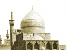

  
[Intangible Textual Heritage](../../index)  [Islam](../index) 
[Index](index)  [Previous](gsw00)  [Next](gsw02) 

------------------------------------------------------------------------

  
*The Glory of the Shia World*, by P. M. Sykes and Khan Bahadur Ahmad din
Khan, \[1910\], at Intangible Textual Heritage

------------------------------------------------------------------------

p. iii

### PREFATORY NOTE

Owing to the fact that a majority of
reviewers consider *The Glory of the Shia World* to be the work of a
Persian, whereas it has been written entirely by myself, it seems best
to explain the precise position.

I would state frankly that my ambition has been to write a second *Haji
Baba*, which would serve as a true picture of Persia some ten years ago,
before constitutional reform appeared on the horizon, just as Morier in
his immortal work depicted it in the reign of Fath Ali Shah.

The events take place in parts of Persia and Baluchistan with which I am
familiar, and, throughout, I narrate what I have actually seen or heard;
though naturally the names and circumstances have been altered.

Khan Bahadur Ahmad Din Khan assisted me to collect information on birth,
death, marriage, and the New Year ceremonies. He also described

p. iv

the Meshed Shrine to me and brought me many of the quotations and
aphorisms which are scattered about in the book.

I can guarantee the accuracy of the various customs which are described,
and my familiarity with the life has helped me to give the standpoint of
the Persian, which is so different from our own.

Finally, I did not intend to deceive the reviewers or the reading public
any more than Morier did; and I imagined that as the hero proclaimed
himself the grandson of "*Haji* Baba" no further clue was needed. At the
same time, for high authorities to consider that my work must have been
written by a Persian constitutes high praise.

P. M. SYKES, *Major*.  
H.M.'s *Consul-General*.

MESHED, 7*th* *January* 1911.

------------------------------------------------------------------------

[Next: Contents](gsw02)
