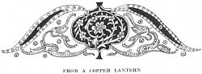
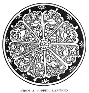

  
[Intangible Textual Heritage](../../index)  [Islam](../index) 
[Index](index)  [Previous](gsw03)  [Next](gsw05) 

------------------------------------------------------------------------

  
*The Glory of the Shia World*, by P. M. Sykes and Khan Bahadur Ahmad din
Khan, \[1910\], at Intangible Textual Heritage

------------------------------------------------------------------------

p. xi

  [  
Click to enlarge](img/_01100.jpg)  
FROM AN OLD IVORY DAGGER-HILT  

  [  
Click to enlarge](img/_01101.jpg)  
(Persian text)  

p. xii

 

### *PROLOGUE*

*In the name of Allah, the Compassionate, the Merciful.*

*Boundless praise and countless expressions of gratitude are due and
befitting to that Lord of the Universe, in the understanding of the
substance of whose nature the intelligence of the Wise and the deep
thoughts of the Philosophers are confounded and stupefied*.

*If dried grass can reach the bottom of the Sea:  
Then human intelligence can comprehend the substance of His nature*.

.        .        .        .        .        .

*Salutations and praise be a sacrifice to the feet of the Presence of
the noblest of the Universe and the Epitome of all that exists: the
Sovereign who wears the ring, by which he is ordained to be the last
Prophet*, [1](#fn_0) *and who bears the Seal of
Prophecy on his back*.

p. xiii

*Thou wert created before all the Mighty Sovereigns:  
Although Thou hast appeared the last,  
O the last of the prophets, I know thy nearness to Allah:  
Thou hast come late, because thou hast come from a great distance*.

.        .        .        .        .        .

*Boundless praise and peace be on his innocent descendants and his
crowned Vice-regents, who are the Kings of all the world, and of what it
contains: especially on His Cousin, Son-in-law, Vice-regent and
incomparable Vizier, the Chief of the Mohamedans, the Leader of the
Pious, the Victorious Lion of Allah, Ali, son of Abu Talib, on him be
Peace! He whose birth place was the House of Allah* [1](#fn_1) *and whose resting-place was the shoulders
of the Prophet*. [2](#fn_2)

*The "Lion of Allah" has been born,  
Whatever there was behind the curtain has appeared*.

\[paragraph continues\] *And thousands of
praises be on the eleven descendants, who are the Signs of the Zodiac in
the heaven of the* Imamate; *and more especially upon Ali Ibn Musa,
Al-Rita, who is the eighth* *Imam* [3](#fn_3)
*and the seventh* Kibla *or point of adoration*. [4](#fn_4)

.        .        .        .        .        .

p. xiv

*Nurullah Khan, son of Mohamed Husein Khan, of Isfahan by descent, has
written these few lines, describing his life and his pilgrimage to the
Glory of the Shia World, the Shrine of the holy Imam Riza, on Him be
Peace, for the information of the inhabitants of the Seven Climates*.

*In short this is composed  
That our memory may remain*.

*From my readers, I beseech their prayers and beg that, if they perceive
any error or mistake, they will cover it with the eye of forgiveness and
overlook it because*,

*No human being is free from error*.

 

 

 

 

 

 

------------------------------------------------------------------------

### Footnotes

[xii:1](gsw04.htm#fr_0) *This refers to Mohamed*.

[xiii:1](gsw04.htm#fr_1) *This refers to the fact
that Ali was actually born inside the* haram *at Mecca*.

[xiii:2](gsw04.htm#fr_2) *The Prophet wished to
destroy the idols at Mecca; and, to reach them, Ali mounted on his
shoulders*.

[xiii:3](gsw04.htm#fr_3) *According to Shia
tenets, the Imams were spiritual and temporal successors of the Prophet
by divine right*.

[xiii:4](gsw04.htm#fr_4) *Mecca, Medina, Najaf,
Kerbela, Samira, and Kazimain are the other six* Kibla.

------------------------------------------------------------------------

[Next: Chapter I. My Parentage And Birth](gsw05)
