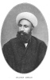
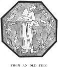

  
[Intangible Textual Heritage](../../index)  [Islam](../index) 
[Index](index)  [Previous](gsw06)  [Next](gsw08) 

------------------------------------------------------------------------

  
*The Glory of the Shia World*, by P. M. Sykes and Khan Bahadur Ahmad din
Khan, \[1910\], at Intangible Textual Heritage

------------------------------------------------------------------------

p. 34

 

### CHAPTER III

#### A PERSIAN ENTERTAINMENT

<table data-border="0">
<colgroup>
<col style="width: 100%" />
</colgroup>
<tbody>
<tr class="odd">
<td data-valign="top">
Bring wine! let first the hand of Hafiz 
  The cheery cup embrace! 
Yet only upon one condition 
  No word beyond this place! 
                                      HAFIZ.
</td>
</tr>
</tbody>
</table>

About a month after our return from the
war in Baluchistan, His Excellency the Vakil-ul-Mulk informed my father
that he would honour him by being his guest at luncheon on the following
Friday.

This information threw the entire household into a state of great
excitement; and when it is remembered that the Vakil-ul-Mulk never
honoured a *Khan* with an escort of less than three hundred sowars,
apart from the nobles of the province who were in attendance, and who
also had their retinues, it may be understood that even to provide
accommodation for so

  [  
Click to enlarge](img/03401.jpg)  
LAILA AND MAJNUN.  
*From the collection of Major Sykes*.  

p. 35

many people and forage for so many horses was, in itself, a heavy task;
and that heavy task was laid on me.

However, thanks be to Allah, the garden at Mahun was fitted to receive
even such a distinguished guest as the Vakil-ul-Mulk; and, since

  [  
Click to enlarge](img/03500.jpg)  
THE GARDEN AT MAHUN.  
*H. R. Sykes, phot*.  

it is one of the famous gardens of Persia, itself a land most famous for
gardens, it is right that I should describe its beauties to you.

We Persians, whenever possible, build our gardens on a gentle slope; and
the garden I am describing was so constructed that two streams of
crystal-like water met in front of the building and formed an immense
lake, on the surface of

p. 36

which numerous swans, geese, and ducks disported themselves.

Below this lake there were seven waterfalls, just as there are seven
planets; and below these again there was a second lake of smaller
dimensions, and a superb gateway decorated with blue tiles.

Perhaps the reader may think that this was all; but no, not only in the
lakes, but also between the waterfalls, jets of water spouted up into
the air so high that the falling spray resembled masses of diamonds. And
often, when reclining in the beautiful tiled room, the plash of the jets
of water and the murmur of the stream hurrying down the terraced garden
between rose bushes, backed by weeping willows, planes, acacias,
cypresses, and every other description of tree, have moved me strangely;
and I have wept from pure joy, and have then been lulled to sleep by the
overpowering sense of beauty and the murmur of the running water. By
Allah! I think, indeed, that this garden is not surpassed in beauty by
even that famous garden mentioned in the Koran:

The garden of Iram, adorned with lofty pillars:  
The like of which had not been created in the world.

On the appointed day, one hour before noon, my father, his chief
officers and myself, duly met the Vakil-ul-Mulk at the main gate. His
Excellency was in a truly good humour, and, in

p. 37

reply to my father's welcome and assurance that "the garden was a gift
to him," replied that he regarded him as his own son. To this my father,
with proud humility, answered "I am a slave born in your family." His
Excellency next said that he had heard a good report of me, which made
me hang my head from modesty.

Accompanied by the nobles, the Vakil-ul-Mulk walked along the edge of
the lake with great dignity and very slowly, for, in Persia, only
Europeans and men of low extraction walk quickly. He then ordered some
bread to be brought, and fed the swans for quite a long time, while we
stood waiting in attendance.

At length His Excellency entered the chief room alone, and we all stood
respectfully outside by the open windows.

Opposite the cushions, on which the Vakil-ul-Mulk reclined, were two
large trays full of sweetmeats prepared in the women's apartments. Among
these were toffee, almond paste, "elephant's ears" in pastry, burnt
almonds, sugar drawn as fine as hair, and many other delicious
sweetmeats which are only made in Iran. There was also a box of manna
from Isfahan. Between the trays of sweetmeats was a silver tray, on
which was spread an exquisitely fine shawl, worth at least two hundred
*tomans* [1](#fn_25); and on

p. 38

the shawl was a sealed packet, containing two hundred *ashrafis* or gold
pieces.

The Vakil-ul-Mulk tasted the sweetmeats, and, looking at the jets of
water shining in the sun and the lovely garden, repeated:

If there is a Paradise on the face of the earth:  
It is this, it is this, it is this.

His Excellency then invited his Vizier and my father to enter by a nod
of the head; and, in the same manner, he dismissed the nobles and his
attendants, who were shown by me to the different rooms prepared for
them, as the chief servants all have their separate staffs, and so have
to sit in separate rooms.

The Vakil-ul-Mulk again tasted the sweetmeats, and especially praised
the toffee and also the manna which, with quails, formed the food of the
Beni Israel [1](#fn_26) during the forty years
they wandered in the deserts; and my father bowed low to express his
gratitude.

Tea was then served, and the special water pipe of the Vakil-ul-Mulk, of
beaten gold studded with turquoises, for which Iran is famous, was
brought in.

After pulling at it in silence for a minute, His Excellency inquired
from his chief waiter where he had procured such excellent tobacco; and
that official replied that it was given by my

p. 39

father who, to grace the auspicious occasion, had bought up a stock that
had reached Kerman on the previous day from Shiraz. He added that my
father had supplied a large quantity of this tobacco if he might accept
it. His Excellency said it was not needed; but finally accepted the
gift, and my father afterwards gave the servant a handsome sum of money
for his friendly behaviour.

After a while, my father represented that luncheon was ready to be
served, and went into the adjoining room to superintend the spreading of
the table-cloth, which is made of red Hamadan leather and covered with
chintz.

The waiters of the Vakil-ul-Mulk, however, declined to spread the cloth
without orders from the chief of the Private Apartments, who equally
declined to pay any attention until the whispered promise of a gift made
him energy personified.

On the edge of the cloth twelve flat loaves of very white flour were
placed; and there were huge trays of plain rice boiled as only it is
boiled in Persia, with the savoury browned parts, flanked by other
mounds of rice, in which the flesh of lambs and chickens with raisins,
almonds, and saffron were all skilfully blended.

The bowls of broth, the dishes of meat cooked in pomegranate or lime
juice, or with walnuts, were smaller, and were placed in an

p. 40

outer line, together with cheese, curds, vegetables, and preserved
fruits.

At length all was ready, down to the priceless china bowls of sherbet,
in which floated the translucent spoons of Abadeh in a mass of crushed
ice, sherbet alone being drunk in public; and the Vakil-ul-Mulk, on
being informed that the luncheon was served, rose from his cushion and,
walking to the next room, seated himself in the place of honour.

After having partaken of some food with a good appetite, His Excellency
gave orders that the Vizier and my father should be sent for. They
appeared, bowed low, and were honoured by being invited to join the
Governor-General, whereupon they sat down very respectfully in the
lowest place. This was, in truth, a great distinction for my father, as
His Excellency always sat down alone to meals, not even permitting his
sons to partake of food in his presence.

*Kabobs* of gazelle were brought in, wrapped up in a piece of bread to
keep them hot; and His Excellency said that it was not necessary to ask
who lead shot it.

The repast was eaten almost in silence; and so large were the mounds of
food that they seemed almost intact when, after tasting a Natanz pear
preserved in syrup, and praising its

p. 41

flavour, the Vakil-ul-Mulk called for the jug and basin, with which he
washed his hands and beard, for you must know that we Persians not only
sit on our knees, but, like the Prophet, on Him be Peace, eat with our
fingers, rolling together our rice into balls and then inserting them
with our thumbs into the mouth.

In later years I once saw an English officer try to do this, but we all
agreed that he ate just like a tiger, and that only Persians could eat,
in this fashion, in a refined manner; also we know by experience that
food eaten with the hand is of a better flavour, and that it is
impossible to satisfy the appetite if knife and fork be used.

After this the Vakil-ul-Mulk retired with his most confidential servant
for a siesta, and then, and not until then, was the sealed packet of
gold coins opened and the shawl examined. His Excellency reclined on a
cushion embroidered with pearls, on which was placed a large pillow and
a second very small one, stuffed with swan's down, brought from the
province of Sistan. A thin silk coverlet kept off the flies.

The confidential servant, when his master had composed himself to sleep,
went out, gently closed the door, and lay down outside ready to be in
attendance when summoned.

In less than an hour a cough announced the awakening of the
Governor-General, who again

p. 42

washed his hands and face, and carefully combed his majestic beard, his
moustaches, his eyebrows, and even his black eyelashes. He then arose,
proceeded to the chief room, and, sending for the *Khans* and his
attendants, said that, as it was too hot to go outside, he wished every
one to sit down. After this he ordered tea to be served.

The conversation turned on allusion, in which Persians excel, and the
Vakil-ul-Mulk himself, who was in a remarkably good humour, and did not
order a single servant to eat sticks that day, told us of how Mahmud of
Ghazni requited Firdausi, the author of the greatest poem in the world,
so inadequately, that the poet wrote a famous satire on him which runs:

Long years this *Shahnama* I toiled to complete,  
That the King might award me some recompense meet,  
But naught save a heart wrung with grief and despair  
Did I get from those promises empty as air!  
Had the sire of the King been some Prince of renown,  
My forehead had surely been graced by a crown!  
Were his mother a lady of high pedigree,  
In silver and gold had I stood to the knee!  
But, being by birth not a prince but a boor,  
The praise of the noble he could not endure!

Fearing retribution, Firdausi wisely fled some days before the satire
was delivered, and ultimately took refuge with the *Sipahbud* of
Tabaristan, who was the only prince of Persian descent reigning in
Persia, which was then unhappily divided into separate principalities.

  [  
Click to enlarge](img/04200.jpg)  
SHAYKH SINAN MEETS THE CHRISTIAN MAIDEN.  
*From the collection of Major Sykes*.  

p. 43

Sultan Mahmud was so furious when he read the satire that he fainted
from excess of anger. He then sent messengers with copies of the poet's
portrait to every court to inquire whether Firdausi was there, and on
finding that he had taken refuge in Tabaristan, he wrote to the
*Sipahbud* demanding the surrender of the poet, and ended his letter by
threatening that, if his desire were not complied with, he would come
with his war elephants and trample the country beneath their feet.

The *Sipahbud*, who was prepared to defend his guest to the death, sent
back the Sultan's letter and merely wrote "Alm" on the back. Mahmud was
too ignorant to understand what this meant and was utterly amazed; but
one of his Persian courtiers at once explained that by "Alm" the
*Sipahbud* intended to remind the Sultan of the fate of Abraha the
Abyssinian, who, also relying on war elephants, invaded Mecca in the
very year of the Prophet's birth; but Allah the All-wise did he not
cause flocks of birds to pelt them with pellets of baked clay so that
they were discomforted? He added that the "Chapter of the Elephant"
began with "Alm." When Sultan Mahmud understood this matter he trembled,
and his threat remained unfulfilled.

For a long while every one was silent, and

p. 44

then the conversation turned to the politeness of Persians, and Husein
Ali Khan said that when he was an attendant at the foot of the throne of
Mohamed Shah there was a great dispute with the Minister of France
because the Governor of Shiraz had, so he averred, seized a large sum of
money, twenty thousand *tomans*, belonging to a French merchant, whereas
that trustworthy official explained that he had merely taken charge of
it to save it from Kashgai robbers.

In any case, at the fête in honour of the birth of the Shah, when the
Chief Vizier gave a banquet, the Minister refused to be among the guests
unless this sum were paid; and this abstention being reported to Mohamed
Shah, that exalted monarch was displeased.

Finally, the noble Vizier not only paid the money from his private
purse, but, greeting the Minister of France with exquisite urbanity, he
said: "Your Excellency, this banquet has cost me twenty thousand
*tomans*; but I would gladly have paid double the sum for the pleasure
of entertaining the Minister of France." Hearing this, we felt that it
was in Persia alone that such noble, high-souled ministers were born;
and we all thanked Allah that we were Iranis.

The Commander-in-Chief then said that, not only in allusion and in
politeness were Persians far ahead of all other nations, but that in

p. 45

 
[  
Click to enlarge](img/04500.jpg)  
*SHAYKH* AHMAD  

p. 46 p. 47

astuteness there was no other people even second to them.

In proof of this, he told us that on one occasion he had to pay his
regiment about ten *tomans* a man; but, owing to his misfortunes, he had
only a hundred *tomans* instead of the necessary five thousand. However,
astuteness came to his aid, and he paid every man his due, made him seal
his receipt, and then, as he passed into an outer room, the money was
taken from him and returned. In short, after paying away five thousand
*tomans*, he had still a hundred *tomans* left. At hearing this every
one laughed, and the Vakil-ul-Mulk called the Commander-in-Chief a
blackguard; but only in jest.

*Shaykh* Ahmad then said that he knew of yet another story connected
with Sultan Mahmud, who, the son of a slave, rose to be a mighty monarch
and thirsted for a title from the Caliph. He sent a large gift to the
Caliph, but nothing for his Vizier, who was, of course, a Persian, and
who, in drawing up the order, gave instructions that *Mir* should be
written instead of *Amir*.

Now *Mir* means a chief, but also a slave; so Mahmud was furious at this
insult, until a Persian courtier explained to him that the "A" [1](#fn_27) which was omitted conveyed a delicate

p. 48

hint that he had not sent one thousand gold coins to the Vizier; but
that, if the order were returned with that sum, no doubt apologies would
be made and a fresh order, written as His Majesty desired, would be
sent. And so, by Allah, it turned out; and thus was Sultan Mahmud
educated by clever Iranis.

Abu Turab Khan represented that he could give a case which had happened
only a few years ago at the court of the Vakil-ul-Mulk, but that he
would not dare to mention it without permission. His Excellency was very
curious to hear the story, and agreed to pardon the Khan, who said that,
three years ago, a Tehran merchant came down to examine into the
accounts of his agent, who had been in charge of his land for ten years
and who had embezzled thousands of *tomans*.

But this agent was very clever, and so he paid the chief executioner two
hundred *tomans* to come secretly to the Tehrani the morning after his
arrival, and whisper in his ear that orders had just come by telegram to
the Vakil-ul-Mulk for him to be thrown into chains and sent back to
Tehran.

This so alarmed *Aga* Hadi that he too paid the chief executioner two
hundred *tomans* and, mounting his horse, he rode off and never returned
to Kerman!

Hearing this, the Vakil-ul-Mulk rolled on the

p. 49

ground, helpless with laughter. He then called for the chief executioner
and asked him if this were true, and finally it was acknowledged.

"Blackguard," screamed the Vakil-ul-Mulk, and again rolled over.

"By Allah!" quoth he, "how fast *Aga* Hadi must have ridden, and how
tired such a fat man as he is must have been!"

It was now two hours to sunset, and His Excellency exclaimed,
"*Bismillala!* let us go." Everything was in a tumult, all the chief
servants shouting out their orders; but by the time His Excellency had
walked slowly past the lake to the great gate, his carriage was ready,
guarded by three hundred sowars; and, preceded by mounted attendants
bearing silver maces, who shouted out to clear the road, the stately
cortège disappeared in a cloud of dust on the road to Kerman.

 

------------------------------------------------------------------------

### Footnotes

[37:1](gsw07.htm#fr_25) A *toman* is worth four
shillings and a *kran* is one-tenth of a *toman*.

[38:1](gsw07.htm#fr_26) *Sc*. the children of
Israel.

[47:1](gsw07.htm#fr_27) *Alif* or *A* signifies
one thousand.

------------------------------------------------------------------------

[Next: Chapter IV. An Awful Tragedy](gsw08)
