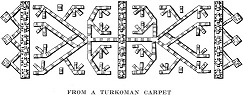

  
[Intangible Textual Heritage](../../index)  [Islam](../index) 
[Index](index)  [Previous](gsw17)  [Next](gsw19) 

------------------------------------------------------------------------

  
*The Glory of the Shia World*, by P. M. Sykes and Khan Bahadur Ahmad din
Khan, \[1910\], at Intangible Textual Heritage

------------------------------------------------------------------------

p. 234

 

### CHAPTER XIV

#### THE SACRED SHRINE OF THE *IMAM* RIZA

In the presence of the King what should he said but "I am ready?"  
It is not befitting to say, "Peace be on thee":  
This is the most sacred spot, respect it:  
It is the holy Throne of Allah, remove thy shoes.

Perhaps there is no harm, O ye wise men
of Europe, if, before I act as a guide to the Sacred Threshold, which no
one except a Mussulman can cross, I give you some preliminary
instruction to prepare you for the glory and splendour which I shall
describe to you.

Now, many of you, I dare say, are not aware that Iskandar traversed the
valley of the Kashaf Rud, and that it was revealed to him that, on the
site now occupied by the Shrine, one of the holiest men of all time
would be buried.

To honour the spot Iskandar enclosed the land with a wall, and for many
centuries the prophecy was unfulfilled, until Harun-al-Rashid,

p. 235

  [  
Click to enlarge](img/23500.jpg)  
THE IMAM TAKING THE POISONED GRAPES FROM THE CALIPH  
*From a Persian picture*.  

p. 236 p. 237

the accursed, heard of it, and, when about to die, ordered his servants
to bury him and erect a dome over his body on this site. His
instructions were carried out and the dome still exists, with the body
of Harun-al-Rashid buried beneath it.

I now approach, with feelings of grief, the subject of our *Imam* Riza,
on Him be Peace, who was the eighth in descent from Ali, and who was of
such transcendent virtue that Mamun, son of Harun-al-Rashid, made him
heir-apparent to the Caliphs, who, the Curse of Allah be on them, had
hitherto slain or poisoned almost all the ancestors of the immaculate
*Imam*.

Mamun not only coined money on which both their names appeared, but he
even ordered that the sacred green of the *Imam* should be substituted
for the black worn by the sons of Abbas. Truly, the rejoicings of the
lovers of the Prophet's household knew no bounds, and they thought that
"The discharged water had returned to the stream, and that right was
about to be restored to the rightful heir."

However, this accursed Caliph, hearing from Baghdad that his relations
were hostile to his purpose, not only changed his plans, but, with his
own hands, offered poisoned grapes to the innocent *Imam*.

They say that, after partaking of the grapes,

p. 238

the ever-blessed *Imam* rose to depart, whereupon Mamun the Accursed,
the spawn of Iblis, said, "Whither goest thou, my cousin?" To this the
Saint replied, "I go to the place to which thou sendest me."

Shortly afterwards our Lord the *Imam* expired, and, in accordance with
his own wish, was buried in the same shrine as Harun-al-Rashid.

Owing to the ignorance of mankind the tomb of the holy *Imam* was
neglected for many generations, until it chanced that the son of the
Vizier of Sultan Sanjar was residing at Tus, at that time the capital,
and trying to regain his health by hunting. It happened that a gazelle,
pursued by the youth, took refuge in the tomb of the *Imam*, and when he
urged his horse in pursuit it declined to move.

After trying every means in his power to make his horse proceed, he
finally understood that he was on holy ground, so he dismounted, entered
the deserted tomb, and, praying to the *Imam*, was miraculously healed
of his malady. That very night the *Imam* appeared to the wife of the
Vizier in a dream, and when she heard of the miraculous recovery of her
son she informed the Vizier and the news reached the Sultan, who at once
gave orders that the Shrine should be repaired and other buildings

p. 239

added to it. The garden of Sanabad, which lies close by, was also
brought into cultivation once again.

From this date, although Khorasan has been ravaged again and again, the
Shrine has never been deserted, and when Tus was utterly destroyed, and
most of its inhabitants massacred by the pitiless Moghuls, the remnant
gathered round the tomb of the *Imam*, which has now been the capital of
Khorasan for many cycles of years.

Among those who honoured themselves by giving gifts to the Shrine, was
Shah Rukh, the son of Amir Timur, who presented a candelabrum of pure
gold; but Gauhar Shad *Aga*, his wife, who, as I shall detail later on,
built many of the glorious buildings, far surpassed her husband, her
name being honoured to this day.

After the death of Shah Rukh confusion again ensued, and the savage
Uzbegs from Khiva captured the holy city and murdered men, women, and
children, not even sparing the *Sayyids*. They also carried off the
golden candlesticks and lamps, and stripped the Shrine of its jewels and
carpets, and, worse than all, they destroyed its priceless library.

After this gloomy night, however, the dazzling sun rose high in the
heaven, and the Safavi dynasty, descended from the holy *Imam*,
completed

p. 240

this glorious pile of buildings which form the marvel of the world.
*Inshallah*, I will conduct you thither.

The Shrine, needless to say, forms the centre or heart of Holy Meshed,
and all around it for some distance lies the property of the *Imam*, who
is still living. In proof of this I could mention that when the Pivot of
the Universe, the deceased Nasir-u-Din Shah, had constructed a telegraph
line from the capital to the Sacred City he addressed the first message
to the ever-living *Imam*, who graciously vouchsafed a reply.

To continue, you may well comprehend that all the property belonging to
the *Imam* is sacred, and that all those who flee from injustice receive
sanctuary, once they are inside the chains which hang across the road.

To make everything clear to even the ignorant, I procured a plan of the
Shrine prepared by the architect, *Haji* *Muavin-u-Sanaia*. This pious
individual, in order to render service to the *Imam*, worked incessantly
to prepare this plan for a space of two years, and, hearing of this, our
renowned Shah bestowed on him the high title of "Adjutor of the
Architects." In short, I, after a careful examination of the plan, can
state that it is correct.

Looking then at it, you must understand, O readers, that we approached
the Sacred

p. 241

  [  
Click to enlarge](img/24100.jpg)  
THE “OLD COURT,” SHOWING NADIR'S FOUNTAIN IN THE FOREGROUND  

p. 242 p. 243

\[paragraph continues\] Threshold from the
"Upper Avenue," and stooped to pass the chain, which we touched with our
hands and then kissed, while our guide recited an appropriate prayer.

Inside on both sides were shops which are famous throughout Asia; and I
am ready to confess that although the Kermanis excel all others in
weaving and in many other ways, their shops cannot be compared with
those of Meshed. However, this is not due to superior ability on the
part of the Khorasanis, but simply to the fact that Meshed is near
Bokhara, Samarcand, and also Herat; and, indeed, I found upon inquiry
that the beautiful silks which I saw all came from Bokhara. The Turkoman
carpets, too, which are very fine, are not produced in Khorasan. I will,
however, praise its fruit, which is very good, albeit, owing to the
cold, there are no figs or pomegranates grown in the gardens near
Meshed.

The *Sayyid* would not allow us to delay, nor indeed did we wish to, and
very soon we passed through a lofty gateway, with an inscription warning
the pilgrim that he was approaching holy ground, and were informed that
the court of dazzling richness which we had entered was the "Old Court."

Being a lover of history I examined everything in detail, and if I tell
you that the court

p. 244

was some ninety by sixty metres, with four great porches, and that it
was covered with tiles of many colours which not only cannot be made
except by Persians, but require the sapphire blue of the sky of Iran to
show them in their perfection, you may faintly imagine its beauty. It is
paved with hewn stones, and underneath lies the dust of thousands of
pious Mussulmans.

The court is two-storied, the upper row of chambers being occupied by
the high officials of the Shrine. The lesser officials, such as the
carpenter, the goldsmith, and the repairers of the holy Korans, occupy
the lower chambers, some of which have even been converted into tombs.

There are four porches, the most beautiful of which is known as "The
Golden Porch of Nadir." It was indeed built by *Sultan* Husein, but was
enriched by the mighty Afshar, may Allah forgive him, who not only paved
and panelled it with white marble brought from distant Maragha, [1](#fn_64) but covered the walls with tiles cased in
gold.

The inscription in great golden letters on a blue ground is very
perfect, and, Allah knows, Nadir was a World Conqueror and a Lord of
Perception, albeit cruel.

Of his power of perception they relate that

p. 245

  [  
Click to enlarge](img/24500.jpg)  
THE GOLDEN PORCH OF NADIR SHAH  
(With group of Shrine officials)  

p. 246 p. 247

one day when he entered the Sacred Shrine he saw a blind man invoking
the aid of the *Imam*, and upon inquiry he learned that he had been
there for several months. The Great Monarch asked him why his faith was
so weak that his sight had not been restored, and swore that if on his
return he found him still blind he would cut off his head. The wretched
man prayed so fervently, and fixed his mind so intently on the *Imam*,
that within a few minutes his sight was restored, and in honour of the
miracle the bazaars were illuminated.

Upon entering the court we first performed our ablutions at the famous
"Fountain of Nadir." This unique fountain is formed from a single block
of white marble decorated with exquisitely chiselled flowers; it is
octagonal in shape, three feet in height, and eighteen feet in
circumference. The top is hollowed out, and copper cups are suspended
for drinkers; above it is a gilded cover.

They say that Nadir saw this stone at Herat, and agreed to pay a large
sum for its transport to Meshed in twelve days, which, for a distance of
sixty-five *farsakhs*, would be very difficult.

Yet, urged by the hope of a royal reward, the man brought the stone in
nine days and presented himself before Nadir full of hope and happiness.
The Shah, however, upbraided him for not

p. 248

keeping his contract and blinded him. His descendant was the owner of
the house we were lodging in, and I am convinced of the truth of this
story. In short, I have by these two examples shown to you both the
perfect perception and also the cruel nature of Nadir Shah, the
Conqueror of Delhi.

To complete my description of this court, there are two unrivalled
minarets which are also cased in gold. Indeed, when the pilgrim stands
where he can see the Golden Porch, the minarets, and the dome, he has no
breath left in him; and it was only at my second visit that I noticed
that round the dome were two inscriptions by Shah Abbas and Shah Suliman
respectively. The Safavi dynasty is too famous to need praise from me.
As they say, "Our enduring record is engraved in the history of the
world."

After admiring the glorious blue tiling and the Golden Porch, we
approached a grating of steel covered with brass, through which we could
see the sacred *haram*. [1](#fn_65) This we
touched, and then bowing towards the Shrine, left our shoes at the
*Kafshkan*, which was in charge of a man who really seemed to be worthy
to be a Vizier, as, although hundreds of pairs of shoes are always in
his charge, he apparently never forgets to whom they belong!

p. 249

Leaving, then, our shoes to the care of this individual, we entered the
passage leading into the Porch of Nadir, and saw that on both sides were
silver-plated doors. Traversing the corner of the Porch we entered a
second "Fountain House," in which is a large tank hewn out of a single
piece of marble. Under the dome lie the remains of the favourite eunuch
of Gauhar Shad *Aga*. They say that this individual was so honest that
he was entrusted with all the money expended on these buildings by his
mistress; and that when he died it was proved that he had not
accumulated any wealth whatever. As the poet sings:

A black slave is often by his character whiter than others,  
And a musk-coloured body has often a heart pure as camphor.  
This dark colour then resembles the pupil of the eye, which is termed
black,  
But which is, nevertheless, its light.

From this building we entered the *Dar-ul-Siada* or "Place of
Greatness," and surely it is worthy of its name. Its extreme length is
one hundred feet, and in the middle it rises to a central dome, with a
smaller dome at each end. Its decoration consists of a panelling of blue
and gold tiles; and above, the wall and ceiling are covered with glass
facets resembling diamonds, which, were not the chamber dark, would make
the gazer blind. Set in the wall is the round

p. 250

golden dish from which the immaculate *Imam*, on him be Peace, had
partaken of the poisoned fruit. In the centre of it is a hole from which
ignorant people extract a little dust and rub it on their eyes,
believing it to be the very dust of the holy *Imam*.

Here also the *Sayyid* drew our attention to a second grating which is
made of silver, and was presented by the father of the deceased
*Kawam-ul-Mulk* of Shiraz, whose ancestor, *Haji* Ibrahim, was boiled to
death by Fath Ali Shah.

This *Haji* Ibrahim was the famous Vizier of *Aga* Mohamed Shah, whom he
joined at Kerman after deserting Luft Ali Khan Zand. So powerful was he
that the far-seeing Shah advised his successor not to trust him, but to
put him to death on a suitable occasion.

At this period almost all the governorships in Persia were held by his
sons, but such devoted servants had the Shah, that they were all seized
on the same day at the same hour; and *Haji* Ibrahim was thrown into a
cauldron of boiling oil as a punishment for his many crimes.

Looking through the silver grating, we, once again, saw the *Imam's*
tomb, and once again we bowed towards it; and, burning with desire, we
hastened on by the gate of the Hissam-u-Saltana, which is also plated
with silver, to the *Dar-ul-Huffaz*,

p. 251

  [  
Click to enlarge](img/25100.jpg)  
THE TOMB CHAMBER  
*From a Persian picture*.  

p. 252 p. 253

or "Place of the Reciters," [1](#fn_66) which
resembles the "Place of Greatness," but is not so magnificent.

Here we prostrated ourselves, touching the ground with the sides of our
face, as in honour of Allah alone may the forehead touch the ground; and
we prayed in accordance with the verse of the Holy Koran, "O believers,
do not enter the house of the Prophet without the permission of its
owner."

At last, thanks be to Allah, we moved forward and again prostrated
ourselves, rubbing our faces on the threshold of the Golden Gate, one of
the marvels of the world. We then rose, overjoyed to be inside the
*haram*, and, approaching the grating round the tomb, shook it, with
prayers and entreaties to His Highness the *Imam*, and kissed it. We
also kissed the lock, and you must know that every pilgrim, after
handling and kissing the lock on his own account, and that of his dead
relations, must do likewise on behalf of his living relations and
friends, whose petition to visit the Shrine in person is thereby placed
before His Highness.

I must now tell you that when the immaculate *Imam* died, it was desired
by Mamum to bury

p. 254

him under the dome in the centre of the building, that his accursed
father might attain his salvation from the contact of his body with that
of the sacred *Imam*; but no tool could break open the Caliph's tomb,
may the curse of Allah be on him! And, lo! a miracle befell as, while
the workers were toiling in a discouraged fashion, they suddenly saw a
grave ready dug in the north-east corner, and there the innocent martyr
was buried with his feet towards the head of Harun-al-Rashid, the
accursed.

The richness of the Shrine is unspeakable. The price alone of the door
facing the foot of the tomb is worth the revenue of seven kingdoms, as
it is of pure gold. The floor is inlaid with the choicest slabs of
coloured marble from Shandiz, and the walls are covered with tiles in
white, blue, and gold, like the work of China. Above them there is glass
facet work of such beauty that how can I represent it?

The tomb of the accursed Caliph is beneath the earth and is nowhere
visible, but round the tomb of the sacred *Imam* are three gratings. The
outer of these is of steel, the one next beneath was, they say, taken
from Nadir's tomb, and is of silver, studded with rubies and emeralds:
the inmost grating is also of steel inlaid with gold. Above the tomb are
hung jewelled aigrettes, daggers, swords, and other offerings of

p. 255

  [  
Click to enlarge](img/25500.jpg)  
THE GOLDEN DOOR AT THE FOOT OF THE TOMB  

p. 256 p. 257

such value that the treasure of Karun [1](#fn_67) is nothing in comparison.

We pilgrims, after kissing the blessed lock, moved round to "The Foot of
the Saint," and here, after prostrating ourselves close to a second
gold-plated door, which is studded with rare jewels, the appropriate
prayer was read.

Continuing on, we moved slowly and solemnly round to "Behind the Head,"
facing the "Old Court." Thence by a narrow passage to "The Head."

In the passage all the enemies of the *Imam* are cursed, and *Sayyid*
*Mirza* Ali called out, "A curse be on Harun and on Mamun!" to which we
responded, "Let it be more!" At the head of the tomb the grating was
again kissed, and, after prostrations, the two prayers were read.

Thrice was the tomb encircled and thrice were the curses pronounced,
after which, with tears of joy and in deep humility, we each lifted up
our hands to heaven and said: "O Allah, accept my prayers and receive my
praises of Thee and bind me to thy chosen people."

.        .        .        .        .        .

\[paragraph continues\] Thus, at last, was
fulfilled the great desire of my life.

------------------------------------------------------------------------

### Footnotes

[244:1](gsw18.htm#fr_66) Maragha is near Tabriz,
and over 1000 miles distant from Meshed.

[248:1](gsw18.htm#fr_67) Haram is the name for
the sacred tomb chamber.

[253:1](gsw18.htm#fr_68) The exact meaning is
that the man knows the Koran by heart and has the title of *Hafiz*.
To-day, in Persia, this title is unknown, whereas a *Hafiz* is highly
honoured by Sunnis.

[257:1](gsw18.htm#fr_69) Karun, the Korah of the
Old Testament, corresponds to the Croesus of the Greek world.

------------------------------------------------------------------------

[Next: Chapter XV. The Pilgrimage Is Accepted](gsw19)
