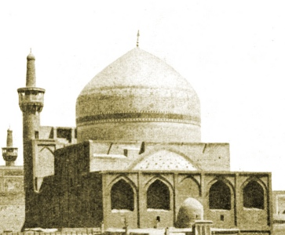

  
[Intangible Textual Heritage](../../index)  [Islam](../index) 

------------------------------------------------------------------------

<table width="75%">
<colgroup>
<col style="width: 50%" />
<col style="width: 50%" />
</colgroup>
<tbody>
<tr class="odd">
<td width="50%" data-valign="TOP"></td>
<td width="50%" data-valign="CENTER"><h1 id="the-glory-of-the-shia-world" data-align="CENTER">The Glory of the Shia World</h1>
<h5 id="the-tale-of-a-pilgrimage" data-align="CENTER">The Tale of a Pilgrimage</h5>
<h3 id="by-p.-m.-sykes-and-khan-bahadur-ahmad-din-khan" data-align="CENTER">by P. M. Sykes and Khan Bahadur Ahmad din Khan</h3>
<h4 id="section" data-align="CENTER">[1910]</h4></td>
</tr>
</tbody>
</table>

------------------------------------------------------------------------

[Contents](#contents)    [Start Reading](gsw00)    [Page
Index](pageidx)    [Text](gsw.txt)

------------------------------------------------------------------------

This is a slightly fictionalized account of life in Persia (Iran) in the
19th century, capped off by a perilous pilgrimage to the Shiite holy
city of Meshed (Mashhad), in the foothills of the mountains that run up
to the Zoroastrian Olympus, Damavand. The book is a rare collaboration
between a turn of the 20th century English and Persian author. The
narrative method presages the classic Oscar Lewis ethnographies of poor
Mexican families. In both cases, a straightforward account would have
been dangerous because of the repressive nature of the society being
studied. This is, on one level, an orientalist conceit of an Englishman
writing the life story of a (semi-fictional) Persian *from the point of
view of a Persian*. However, Sykes manages to pull off this literary
feat convincingly, even for readers at this later date. He also uses the
opportunity as a perfect Swiftian setup to gently satire European
civilization, which adds an entire ironic layer to the read.

This long-out-of-print (and quite rare) book is a delightful read,
particularly for connoisseurs of travelogues. The Shiite, Sufi, Islamic,
and Persian lore and legends which are described here will be of great
interest to folklorists. The photographs and other illustrations will be
of use to graphic designers, anthropologists and historians. This is
obviously a primary source on the architecture of the Mashhad pilgrimage
site. Largely unknown to outsiders, this complex has some very
spectacular (and gorgeous) structures. Most of all, this book is an
eye-opener for westerners interested in the deep culture and history of
Iran.

------------------------------------------------------------------------

 [Title Page](gsw00)  
[Prefatory Note](gsw01)  
[Contents](gsw02)  
[Illustrations](gsw03)  
[Prologue](gsw04)  
[Chapter I. My Parentage And Birth](gsw05)  
[Chapter II. A Campaign In Baluchistan](gsw06)  
[Chapter III. A Persian Entertainment](gsw07)  
[Chapter IV. An Awful Tragedy](gsw08)  
[Chapter V. My Betrothal And Marriage](gsw09)  
[Chapter VI. Kerman, the Heart of the World](gsw10)  
[Chapter VII. The Death of *Mirza* Hasan Khan, *Mustaufi*](gsw11)  
[Chapter VIII. My First *Mamuriat*](gsw12)  
[Chapter IX. The Persian New Year](gsw13)  
[Chapter X. The Pilgrimage Is Vowed](gsw14)  
[Chapter XI. Yezd, the Prison of Alexander](gsw15)  
[Chapter XII. Robbed In the Lut](gsw16)  
[Chapter XIII. The Arrival at the Sacred Threshold](gsw17)  
[Chapter XIV. The Sacred Shrine of the *Imam* Riza](gsw18)  
[Chapter XV. The Pilgrimage Is Accepted](gsw19)  
[Epilogue](gsw20)  
