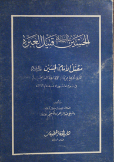
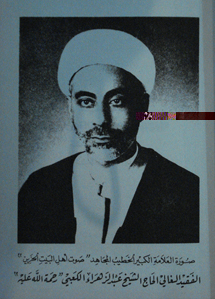

  
[Intangible Textual Heritage](../../index)  [Islam](../index)  [Shiite
Documents](../shi)  [Index](index)  [Previous](hus00)  [Next](hus02) 

------------------------------------------------------------------------

 

Al-<u>H</u>usayn (PUH) The Dead Man of The Tear

The Death of Imam Al-<u>H</u>usayn (PUH)  
That was broadcasted from the Iraq Radio Station  
at the day of Ashurah since 1379 A.H.

Composed by  
The pious scholar, the preacher of Karbala  
Sheik, \`Abdul-Zahrá' Al-Ka\`bee (MMAUH)

Dár Al-Ðakhá'ir for publishing  

------------------------------------------------------------------------

 

A picture of the great scholar, the preacher, the freedom fighter "the
sad voice of the Household"  
The dearly missed, the pilgrim, Sheikh \`Abdul-Zahrá' Al-Ka\`bee (MMAUH)

------------------------------------------------------------------------

  
A Short Biography  
The Late Great Sheik \`Abdul-Zahrá' Al-Ka\`bee (MMAUH)  
The preacher of Holy Karbala  
taken from Al-\`Irfán, The Lebanese Magazine

------------------------------------------------------------------------

  
Sheik \`Abdul-Zahrá' Al-Ka\`bee in Way of Eternity

The evening of the 15th of the month Jamadi-Oolah (5th month of islamic
calendar), 1394 A.H. was a painful evening in the city of Holy Karbala,
in Iraq. At that time, the great scholar and preacher and the poet,
Sheik \`Abdul-Zahrá' ben Falá<u>h</u> Al-Ka\`bee, may Allah accept him
in His wide mercy and may He make him live in His wide paradise, and may
He join him with the chosen prophet and the purified imams (PUT).  
The 15th day of Jamadi-Oolah, 1394 A.H. was a memorable day in the holy
city of Karbala in Iraq. The crowded people marched from every corner to
join the funeral of the late along the long que from his house in
"<u>H</u>ay Al-<u>H</u>usayn" to his grave in Al-Wádi, passing by
Al-Moghtasal around the camp, (and passing by) the purified
<u>H</u>usaynid \[C\] shrine, and the holy \`Abbasid shrine, and some
witnesses said: the procedures of his funeral were similar to those of
great scholars, like putting his body in Al-\`Ammári \[\`Ammari:
something made of wood and used to put the tomb inside it as a sign of
respect for the dead and it is used only for great scholars and those
who are close to that level of wisdom. It is a custom used in Iran and
Iraq\], and the marches that went in front of the funeral.  
And since the late was one of the greatest preachers in Iraq and the
gulf, and since all the visitors of Al-<u>H</u>usayn (PUH) from all
around the islamic lands used to listen to his speeches in the holy city
of Karbala especially when he used to read the first part of the epical
story at the 10th day of Mo<u>h</u>arram every year, and since more than
one radio station used to broadcast at the 10th day of Mo<u>h</u>arram a
recording with his own voice for the first part of the epical story in
every year, and since more than one radio station used to broadcast at
the 20th day of <u>S</u>afar \[2nd month\] of every year a recording of
his own voice for the narration of the second part of the epical story,
thus, many islamic lands got shocked for his death, and many newspapers
and magazines wrote about his death and many mourning places were set in
many cities, and I mention here for example: holy Karbala, Baghdad,
Al-Samáwah, Basra, Kuwait, Beirut, Tehran and Qum.  
Thus, just to give some right back to him from fellow muslims in
general, and fellow shiites in special, I write here some points that
elaborate some sides of the life of the late, may they become guide
lines for the good faithful youth:  
\* His birth was at the same day of birth for the Lady of the women of
the worlds, Fatima Al-Zahrá' (PUH) \[the daughter of prophet Mohammed
(PUH)\] and for this he was called \`Abdul-Zahrá' \[meaning: Slave of
Al-Zahrá'\] and his death day was the same of her as well. This is
enough as to be a coincedence of deep meanings.

\* He used to sleep in one night and day, for 4 hours or 5, and that was
because he was cautious to use the maximum of his life in the field of
goodness.

\* He was a good poet (but didn't compose much) in Arabic and in the
Iraqi dialect, and he used to say what he made of poetry on the
<u>H</u>usaynid pulpit and the listener would not recognize if this
poetry was made by him or by some great poets at that time who used to
say the poetry about the battle of Karbala in Arabic and the Iraqi
dialect.

\* He used to give most of what comes of gifts to the pulpit to the poor
people in secret, and keeps the little left for himself for his life
needs.

\* He involved himself in an effective manner to prepare for islamic
projects in all the fields, and also in establishing them, and pushing
them to be continuous, so much that you wouldn't find a single islamic
project in the holy city of Karbala that he didn't have any part in it.

\* He took care of the young preachers until they become by time - and
under the visual training and the practical work - great preachers that
will call back to Allah the Exalted and the rightful path, and this is
for him to help in the continuation of his preaching pupils. In recent
times, Iraq, Iran and the gulf have many preachers that were took care
of by him.

\* He was humble to the bone, and especially to Sádah \[Sádah: plural of
Sayid, or Sayed. A title usually used to denote a descendant of the
prophet. However, in literature it is used for other meanings\], thus he
used not to walk in front of a Sayid however young he might be, or
humble in his social status.

\* He was "<u>H</u>usaynid" to the bone, meaning that he was sincere
about everything that is related to imam Al-<u>H</u>usayn (PUH). His
joining to the funeral sets that was held by the people of
<u>T</u>owaireej at the afternoon of the 10th day of Mo<u>h</u>arram in
every year is a clue for this sincerity, although he was so tired at
that time for working day and night in the funerals (of
Al-<u>H</u>usayn).

\* In every morning of Ashurah (the 10th day of Mo<u>h</u>arram) he used
to read the story of the first part of the <u>H</u>usaynid Death in
heart of the holy city of Karbala, which is considered a historical
document for everything that happened with imam Al-<u>H</u>usayn and his
Household and his companions and their patriotic martyrdom in the field
of the battle by the hands of the ummayads. All the crowds, visiting or
living there, used to gather in the markets and the streets in thousands
just to listen to that story with their cries and weeping, and the radio
station of Baghdad and other radio stations used to broadcast that
regularly every year, and many recordings of his voice for the first
part of the story were distributed all over the lands to be broadcasted
at the day of Ashurah, in mosques and husayniyyas \[Husayniyya or
<u>H</u>usayniyya: A place for preaching and telling the stories of the
prophet and his Household and giving lectures\].

\* Also, the late used to read the second part of the story, and it is
what happened to the prisoners from the Household and from the
companions after the killing of Al-<u>H</u>usayn at the 20th day of
<u>S</u>afar in Al-<u>H</u>usayniyyah Al-<u>T</u>ahrániyyah \[meaning:
The Tehranic Husayniyya\] that was situated in the holy city of Karbala,
and the occasion was the passage of 40 days since the martyrdom of the
imam. Many radio stations used to broadcast that annually. The
attractiveness was close to that of narrating the first part.

\* The late used to travel to the Jámi\` of Kufa \[Jámi\`: a mosque but
on a large scale\] at the night of the 21st of Ramadan every year, and
that was to narrate the story of the death of imam \`Ali (PUH) \[imam
\`Ali is the father of imam Al-<u>H</u>usayn and the husband of the
prophet's daughter, Fatima\] for the gathering crowds in that historical
mosque, and the occasion is: the imam was praying the morning prayer in
the same Jámi\` at the day of the 19th of Ramadan when he received a
vital hit by the hand of Ibn Moljam Al-Morádi (MADH) which caused him to
die on the night of the 21st of Ramadan.

\* Thus, the life of our dear late was over, and it is a bright page of
directing and hard working on the way of the Household (PUT), who he
used to go up the pulpit by their names and try to make himself and his
listeners as examples for them. May Allah have mercy upon him when he
preached and guided, and may Allah have mercy upon him when he fought
(worked) and when he had the patience.

------------------------------------------------------------------------

[Next: Introduction](hus02)
