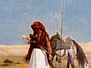

  
[Intangible Textual Heritage](../../index)  [Islam](../index) 
[Index](index)  [Previous](iq11)  [Next](iq13) 

------------------------------------------------------------------------

[Buy this Book at
Amazon.com](https://www.amazon.com/exec/obidos/ASIN/1417977868/internetsacredte)

------------------------------------------------------------------------

  
*The Secrets of the Self*, by Muhammad Iqbal, tr. by Reynold A.
Nicholson, \[1920\], at Intangible Textual Heritage

------------------------------------------------------------------------

p. 72

### IX

*Showing that the education of the Self has three stages: Obedience,
Self-control, and Divine Vicegerency*.

#### 1. Obedience

815 Service
and toil are traits of the camel,  
Patience and perseverance are ways of the camel.  
Noiselessly he steps along the sandy track,  
He is the ship of those who voyage in the desert.  
Every thicket knows the print of his foot:  
820 He eats seldom, sleeps little, and is
inured to toil.

p. 73

He carries rider, baggage, and litter;  
He trots on and on to the journey's end,  
Rejoicing in his speed,  
More patient in travel than his rider.  
Thou, too, do not refuse the burden of Duty: 825  
So wilt thou enjoy the best dwelling-place, which is with God.  
Endeavour to obey, O heedless one!  
Liberty is the fruit of compulsion.  
By obedience the man of no worth is made worthy;  
By disobedience his fire is turned to ashes. 830  
Whoso would master the sun and stars,  
Let him make himself a prisoner of Law!  
The wind is enthralled by the fragrant rose;  
The perfume is confined in the navel of the musk-deer.  
The star moves towards its goal 835  
With head bowed in surrender to a law.

p. 74

The grass springs up in obedience to the law of growth:  
When it abandons that, it is trodden underfoot.  
To burn unceasingly is the law of the tulip,  
840 And so the blood leaps in its veins.  
Drops of water become a sea by the law of union,  
And grains of sand become a Sahara.  
Since Law makes everything strong within,  
Why dost thou neglect this source of strength?  
845 O thou that art emancipated from the
old Custom, [1](#fn_62)  
Adorn thy feet once more with the same fine silver chain!  
Do not complain of the hardness of the Law,  
Do not transgress the statutes of Mohammed!

p. 75

#### 2. Self-control

Thy soul cares only for itself, like the camel:  
It is self-conceited, self-governed, and self-willed. 850  
Be a man, get its halter into thine hand,  
That thou mayst become a pearl albeit thou art a potter's vessel.  
He that does not command himself  
Becomes a receiver of commands from others.  
When they moulded thee of clay, 855  
Love and fear were mingled in thy making:  
Fear of this world and of the world to come, fear of death,  
Fear of all the pains of earth and heaven;  
Love of riches and power, love of country,  
Love of self and kindred and wife. 860

p. 76

The mixing of clay with water nourishes the body, [1](#fn_63)  
But he that is drowned in sin dies an evil death.  
So long as thou hold’st the staff of "There is no God but He," [2](#fn_64)  
Thou wilt break every spell of fear.  
865 One to whom God is as the soul in his
body,  
His neck is not bowed before vanity.  
Fear finds no way into his bosom,  
His heart is afraid of none but Allah.  
Whoso dwells in the Moslem Faith  
870 Is free from the bonds of wife and
child.  
He withdraws his gaze from all except God  
And lays the knife to the throat of his son. [3](#fn_65)

p. 77

Though single, he is like a host in onset:  
Life is cheaper in his eyes than wind.  
The profession of Faith is the shell, but  
prayer is the pearl: 875  
The Moslem's heart deems prayer a lesser pilgrimage. [1](#fn_66)  
In the Moslem's hand prayer is like a dagger  
Killing sin and frowardness and wrong.  
Fasting makes an assault upon hunger and thirst  
And breaches the citadel of sensuality. 880  
The pilgrimage enlightens the minds of the Faithful:  
It teaches separation from one's home and destroys attachment to one's
native land;  
It is an act of devotion in which all feel themselves to be one,  
It binds together the leaves of the book of religion.

p. 78

885 Almsgiving causes love of riches to
pass away  
And makes equality familiar;  
It fortifies the heart with righteousness, [1](#fn_67)  
It increases wealth and diminishes fondness for wealth.  
All this is a means of strengthening thee:  
890 Thou art impregnable, if thy Islam be
strong.  
Draw might from the litany "O Almighty One!"  
That thou mayst ride the camel of thy body. [2](#fn_68)

#### 3. Divine Vicegerency [3](#fn_69)

If thou canst rule thy camel, thou wilt rule the world

p. 79

And wear on thine head the crown of Solomon.  
Thou wilt be the glory of the world whilst the world lasts, 895  
And thou wilt reign in the kingdom incorruptible.  
’Tis sweet to be God's vicegerent in the world  
And exercise sway over the elements.  
God's vicegerent is as the soul of the universe,  
His being is the shadow of the Greatest Name. 900  
He knows the mysteries of part and whole,  
He executes the command of Allah in the world.  
When he pitches his tent in the wide world,

p. 80

He rolls up this ancient carpet. [1](#fn_70)  
905 His genius abounds with life and
desires to manifest itself:  
He will bring another world into existence.  
A hundred worlds like this world of parts and wholes  
Spring up, like roses, from the seed of his imagination.  
He makes every raw nature ripe,  
910 He puts the idols out of the
sanctuary.  
Heart-strings give forth music at his touch,  
He wakes and sleeps for God alone.  
He teaches age the melody of youth  
And endows everything with the radiance of youth.  
915 To the human race he brings both a
glad message and a warning,  
He comes both as a soldier and as a marshal and prince.

p. 81

He is the final cause of "God taught Adam the names of all
things," [1](#fn_71)  
He is the inmost sense of "Glory to Him that transported His servant by
night." [2](#fn_72)  
His white hand is strengthened by the staff, [3](#fn_73)  
His knowledge is twinned with the power of a perfect man. 920  
When that bold cavalier seizes the reins,  
The steed of Time gallops faster.  
His awful mien makes the Red Sea dry,  
He leads Israel out of Egypt.  
At his cry, "Arise," the dead spirits 925  
Rise in their bodily tomb, like pines in the field.  
His person is an atonement for all the world,

p. 82

By his grandeur the world is saved. [1](#fn_74)  
His protecting shadow makes the mote familiar with the sun,  
930 His rich substance makes precious all
that exists.  
He bestows life by miraculous works,  
He founds a new system to work by.  
Splendid visions rise from the print of his foot,  
Many a Moses is entranced by his Sinai.  
935 He gives a new explanation of Life,  
A new interpretation of this dream.  
His hidden being is Life's mystery,  
The unheard music of Life's harp.  
Nature travails in blood for generations  
940 To compose the harmony of his
personality.  
When our handful of earth has reached the zenith,

p. 83

That champion will come forth from this dust!  
There sleeps amidst the ashes of To-day  
The flame of a world-consuming morrow.  
Our bud enfolds a garden of roses, 945  
Our eyes are bright with to-morrow's dawn.  
Appear, O rider of Destiny!  
Appear, O light of the dark realm of Change!  
Illumine the scene of existence,  
Dwell in the blackness of our eyes! 950  
Silence the noise of the nations,  
Imparadise our ears with thy music!  
Arise and tune the harp of brotherhood,  
Give us back the cup of the wine of love!  
Bring once more days of peace to the world, 955  
Give a message of peace to them that seek battle!

p. 84

Mankind are the cornfield and thou the harvest,  
Thou art the goal of Life's caravan.  
The leaves are scattered by Autumn's fury:  
960 Oh, do thou pass over our gardens as
the Spring!  
Receive from our downcast brows  
The homage of little children and of young men and old!  
When thou art there, we will lift up our heads,  
Content to suffer the burning fire of this world.

------------------------------------------------------------------------

### Footnotes

[74:1](iq12.htm#fr_62) The religious law of
Islam.

[76:1](iq12.htm#fr_63) *I.e.* water is an
indispensable element in the life of the body.

[76:2](iq12.htm#fr_64) The first article of the
Mohammedan creed.

[76:3](iq12.htm#fr_65) Like Abraham when he was
about to sacrifice Isaac or (as Moslems generally believe) Ishmael.

[77:1](iq12.htm#fr_66) The lesser pilgrimage
(*‘umra*) is not obligatory like the greater pilgrimage (*hajj*).

[78:1](iq12.htm#fr_67) The original quotes part
of a verse in the Koran (ch. 3, v. 86), where it is said, "Ye shall
never attain unto righteousness until ye give in alms of that which ye
love."

[78:2](iq12.htm#fr_68) *I.e.* overcome the lusts
of the flesh.

[78:3](iq12.htm#fr_69) Here Iqbal interprets in
his own way the Súfí doctrine of the *Insán al-kámil* or Perfect Man,
which p. 79 teaches that every man is
potentially a microcosm, and that when he has become spiritually
perfect, all the Divine attributes are displayed by him, so that as
saint or prophet he is the God-man, the representative and vicegerent of
God on earth.

[80:1](iq12.htm#fr_70) *I.e.* his appearance
marks the end of an epoch.

[81:1](iq12.htm#fr_71) Koran, ch. 2, v. 29. The
Ideal Man is the final cause of creation.

[81:2](iq12.htm#fr_72) Koran, ch. 17, v. 1,
referring to the Ascension of the Prophet.

[81:3](iq12.htm#fr_73) For the white hand (of
Moses) cf. Koran, ch. 7, v. 105, ch. 26, v. 32, and Exodus, ch. 4, v. 6.

[82:1](iq12.htm#fr_74) These four lines may
allude to Jesus, regarded as a type of the Perfect Man.

------------------------------------------------------------------------

[Next: X. Inner Meanings of the Names of Ali](iq13)
