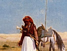

  
[Intangible Textual Heritage](../../index)  [Islam](../index) 
[Index](index)  [Previous](iq19)  [Next](iq21) 

------------------------------------------------------------------------

[Buy this Book at
Amazon.com](https://www.amazon.com/exec/obidos/ASIN/1417977868/internetsacredte)

------------------------------------------------------------------------

  
*The Secrets of the Self*, by Muhammad Iqbal, tr. by Reynold A.
Nicholson, \[1920\], at Intangible Textual Heritage

------------------------------------------------------------------------

p. 134

### XVII

*Time is a sword*.

Green be the pure grave of Sháfi‘í, [1](#fn_104)  
Whose vine hath cheered a whole world!  
His thought plucked a star from heaven:  
He named Time " a cutting sword."  
1535 How shall I say what is the secret of
this sword?  
All its brilliance is derived from Life.  
Its owner is exalted above hope and fear,  
His hand is whiter than the hand of Moses.

p. 135

At one stroke thereof water gushes from the rock  
And the sea becomes land from dearth of moisture. 1540  
Moses held this sword in his hand,  
Therefore he wrought more than man may contrive.  
He clove the Red Sea asunder  
And made its waters like dry earth.  
The arm of Ali, the conqueror of Khaibar, 1545  
Drew its strength from this same sword.  
The revolution of the sky is visible,  
The change of day and night is perceived.  
Look, O thou enthralled by Yesterday and To-morrow,  
Behold another world in thine own heart! 1550  
Thou hast sown the seed of darkness in thy clay,  
Thou hast imagined Time as a line:  
Thy thought measures length of Time  
With the measure of night and day.

p. 136

1555 Thou mak’st this line a girdle on
thine infidel waist;  
Thou art an advertiser of falsehood, like idols.  
Thou wert the Elixir, and thou hast become a peck of dust;  
Thou wert born the conscience of Truth, and thou hast become a lie!  
Art thou a Moslem? Then cast off this girdle!  
1560 Be a candle to the feast of the
religion of the free!  
Knowing not the origin of Time,  
Thou art ignorant of everlasting Life.  
How long wilt thou be a thrall of night and day?  
Learn the mystery of Time from the words "I have a time with God." [1](#fn_105)  
1565 Phenomena arise from the march of
Time,

p. 137

Life is a part of the contents of Time's consciousness.  
The cause of Time is not the revolution of the sun:  
Time is everlasting, but the sun does not last for ever.  
Time is joy and sorrow, festival and fast;  
Time is the secret of moonlight and sunlight. 1570  
Thou hast extended Time, like Space,  
And distinguished Yesterday from To-morrow.  
Thou hast fled, like a scent, from thine own garden;  
Thou hast made thy prison with thine own hand.  
Our Time, which has neither beginning nor end, 1575  
Blossoms from the flower-bed of our mind.  
To know its root quickens the living with new life:

p. 138

Its being is more splendid than the dawn.  
Life is of Time, and Time is of Life:  
1580 "Do not abuse Time!" was the command
of the Prophet.  
Oh, the memory of those days when Time's sword  
Was allied with the strength of our hands! [1](#fn_106)  
We sowed the seed of religion in men's hearts  
And unveiled the face of Truth;  
1585 Our nails tore loose the knot of this
world,  
Our bowing in prayer gave blessings to the earth.  
From the jar of Truth we made rosy wine gush forth,  
We charged against the ancient taverns.  
O thou in whose cup is old wine,

p. 139

A wine so hot that the glass is well-nigh turned to water, 1590  
Wilt thou in thy pride and arrogance and self-conceit  
Taunt us with our emptiness?  
Our cup, too, hath graced the symposium;  
Our breast hath owned a spirit.  
A new age hath been endued with our beauty 1595  
And hath risen from the dust of our feet.  
Our blood hath watered God's harvest,  
All worshippers of God are our debtors.  
The *takbír* was our gift to the world, [1](#fn_107)  
Ka‘bas were built of our clay. 1600  
By means of us God taught the Koran,  
From our hand He dispensed His bounty.  
Although crown and signet have passed from us,

p. 140

Do not look with contempt on our beggarliness!  
1605 In thine eyes we are good for
nothing,  
Thinking old thoughts, despicable.  
We have honour from "There is no god but Allah,"  
We are the preservers of the universe.  
Freed from the vexation of to-day and to-morrow,  
1610 We have pledged ourselves to love
One.  
We are the conscience hidden in God's heart,  
We are the heirs of Moses and Aaron.  
Sun and moon are still bright with our radiance,  
Lightning-flashes still lurk in our cloud.  
1615 Our essence is the mirror of the
Divine essence:  
The Moslem's being is one of the signs of God.

------------------------------------------------------------------------

### Footnotes

[134:1](iq20.htm#fr_104) Founder of one of the
four great Mohammedan schools of law.

[136:1](iq20.htm#fr_105) The Prophet said, "I
have a time with God of such sort that neither angel nor prophet is my
peer," meaning (if we interpret his words according to the sense of this
passage) that he felt himself to be timeless.

[138:1](iq20.htm#fr_106) The glorious days when
Islam first set out to convert and conquer the world.

[139:1](iq20.htm#fr_107) The *takbír* is the
cry "*Allah akbar*," "Allah is most great."

------------------------------------------------------------------------

[Next: XVIII. An Invocation](iq21)
