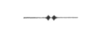
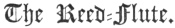

  
[Intangible Textual Heritage](../../index)  [Islam](../index) 
[Index](index)  [Previous](mes14)  [Next](mes16) 

------------------------------------------------------------------------

[Buy this Book at
Amazon.com](https://www.amazon.com/exec/obidos/ASIN/B002CVTTRU/internetsacredte)

------------------------------------------------------------------------

  
*The Mesnavi and The Acts of the Adepts*, by Jelal-'d-din Rumi and
Shemsu-'d-Din Ahmed, tr. by James W. Redhouse, \[1881\], at Intangible
Textual Heritage

------------------------------------------------------------------------

p. 1

# THE BOOK OF THE MESNEVĪ.

 

#### IN THE NAME OF GOD, THE ALL-MERCIFUL, THE VERY-COMPASSIONATE.

### Proem.  

From reed-flute [1](#fn_54) hear what tale it tells;  
What plaint it makes of absence’ ills:

"From jungle-bed since me they tore,  
Men's, women's, eyes have wept right sore.  
My breast I tear and rend in twain,  
To give, through sighs, vent to my pain.  
Who's from his home snatched far away,  
Longs to return some future day.  
I sob and sigh in each retreat,  
Be’t joy or grief for which men meet. 5  
They fancy they can read my heart;  
Grief's secrets I to none impart.  
My throes and moans form but one chain,  
Men's eyes and ears catch not their train.  
Though soul and body be as one,  
Sight of his soul hath no man won.

p. 2

A flame's the flute's wail; not a breath,  
That flame who feels not, doom him death.  
The flame of love, ’tis, prompts the flute,  
10 Wine's ferment,
love; its tongue not mute.  
The absent lover's flute's no toy;  
Its trills proclaim his grief, his joy.  
Or bane, or cure, the flute is still;  
Content, complaining, as you will.  
It tells its tale of burning grief;  
Recounts how love is mad, in brief.  
The lover lover's pangs best knows;  
As ear receives tongue's plaint of woes.  
Through grief, his day is but a dawn;  
15 Each day of
sorrow, torment's pawn.  
My days are waste; take thou no heed,  
Thou still are left; my joy, indeed.  
Whole seas a fish will never drown;  
A poor man's day seems all one frown.  
What boot from counsel to a fool?  
Waste not thy words; thy wrath let cool.  
Cast off lust's bonds; stand free from all.  
Slave not for pelf; be not greed's thrall.  
Pour rivers into one small gill,  
20 It can but hold
its little fill.  
The eye's a vase that's ne’er content;  
The oyster's filled ere pearl is sent. [1](#fn_55)  
The heart that's bleeding from love's dart,  
From vice of greed is kept apart.  
Then hie thee, love, a welcome guest;—  
Physician thou to soothe my breast.  
Thou cure of pride and shame in me;  
Old Galen's skill was nought to thee  
Through love, this earthly frame ascends  
25 To heaven; a
hill, to skip pretends.

p. 3

In trance of love, Mount Sinai shakes,  
At God's descent; 'and Moses quakes.' [1](#fn_56)  
Found I the friend on whom I dote,  
I'd emulate flute's dulcet note.  
But from my love, while torn away,  
Unmeaning words alone I say.  
The spring is o’er; the rose is gone;  
The song of Philomel is done.  
His love was all; himself, a note.  
His love, alive; himself, dead mote. 30  
Who feels not love's all-quick’ning flame,  
Is like the bird whose wing is lame.  
Can I be quiet, easy, glad,  
When my delight's away? No! Sad.  
Love bids my plaint all bonds to burst.  
My heart would break, with silence curst.  
A mirror best portrays when bright;  
Begrimed with rust, its gleam grows slight.  
Then wipe such foul alloy away;  
Bright shall it, so, reflect each ray." 35  
Thou’st heard what tale the flute can tell;  
Such is my case; sung all too well.

------------------------------------------------------------------------

### Footnotes

[m1:1](mes15.htm#fr_55) The reed-flute is the
sacred musical instrument of the Mevlevī dervishes, commonly known as
the Dancing Dervishes, from their peculiar religious waltz to the sound
of the reed-flute, &c., with outstretched arms and inclined head, in
their special public services of commemoration. They love the reed-flute
as the symbol of a sighing absent lover.

[m2:1](mes15.htm#fr_56) There is a poetical
Eastern notion by dewdrops or raindrops falling into that pearls are
formed in the oysters them at a certain season.

[m3:1](mes15.htm#fr_57) Qur’ān vii. 139, where
the words are: "*And Moses fell down, swooning*."

------------------------------------------------------------------------

[Next: I. The Prince and the Handmaid](mes16)
