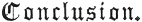

  
[Intangible Textual Heritage](../../index)  [Islam](../index) 
[Index](index)  [Previous](mes31) 

------------------------------------------------------------------------

[Buy this Book at
Amazon.com](https://www.amazon.com/exec/obidos/ASIN/B002CVTTRU/internetsacredte)

------------------------------------------------------------------------

  
*The Mesnavi and The Acts of the Adepts*, by Jelal-'d-din Rumi and
Shemsu-'d-Din Ahmed, tr. by James W. Redhouse, \[1881\], at Intangible
Textual Heritage

------------------------------------------------------------------------

p. 289

### XVII.

 

Alas! By one poor morsel, tasted through
a sin,  
The fount of thought's congealed; heart's blood diluted thin.  
One grain of wheat has cast eclipse o’er sun of mind,  
As "dragon's tail" doth dull the full moon, when inclined. [1](#fn_432)  
Behold. How delicate is thought! One mite of clay,  
From full-moon glory, it reduced to disarray.  
The bread of life, received, digested, gives man power.  
Material bread excites distrusts, contentions, sour.

The thorn, while green, cropped by the camel, far from fords,  
Not only pleasure gives, but nutriment affords. 5  
That selfsame thorn, grown dry and void of juicy sap,  
If ventured on by starving beast in desert gap,  
His palate and his lips will puncture, blood make flow;  
As if conserve of roses should with daggers glow.

The word of life's the green, the tender, juicy thorn.  
Material become, it's dry, as hard as horn.  
And thou, poor flesh, expectant of the living word,  
Bitest at the word material, dreaming not of sword;—  
Snappest at the hard, unyielding dictum, with fond zest;  
And findest it horny, flinty, irksome to digest. 10

p. 290

It has become a stone. It wounds; it draws forth blood.  
Then shun it, human camel. Seek it not for food.  
Words are most foully mixed with troubling thoughts of earth.  
The water's muddy. Close the spring whence it comes forth.  
Until the Lord, again, shall make it clear and sweet;—  
Shall purify the inky stream, as He deems meet,—  
Shall patience add to wish,—not haste and oversight,—  
14 Wait thou
contentedly. God best knows what is right.

 

 

 

THE END.

 

 

 

\_\_\_\_\_\_\_\_\_\_\_\_\_\_\_\_\_\_\_\_\_\_\_\_\_\_\_\_\_\_\_\_

PRINTED BY BALLANTYNE, HANSON AND CO.  
EDINBURGH AND LONDON.

 

 

 

------------------------------------------------------------------------

### Footnotes

[m289:1](mes32.htm#fr_433) The
"[*cauda*](errata.htm#3) *draconis*" was the "descending node," one of
the ecliptical points. The "forbidden fruit," in Islām, is held to have
been wheat.

 
