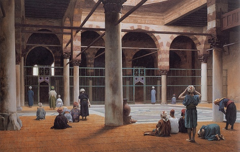

  
[Intangible Textual Heritage](../../index)  [Islam](../index) 

------------------------------------------------------------------------

[Buy this Book at
Amazon.com](https://www.amazon.com/exec/obidos/ASIN/0766144569/internetsacredte)

------------------------------------------------------------------------

[Buy this Book on
Kindle](https://www.amazon.com/exec/obidos/ASIN/B002JTWO8Q/internetsacredte)

------------------------------------------------------------------------

<table width="75%">
<colgroup>
<col style="width: 50%" />
<col style="width: 50%" />
</colgroup>
<tbody>
<tr class="odd">
<td width="50%" data-valign="TOP"> 
Interior of a Mosque, by Jean-Leon Gerome [1870] (Public Domain Image)</td>
<td width="50%" data-valign="CENTER"><h1 id="oriental-mysticism" data-align="CENTER">Oriental Mysticism</h1>
<h2 id="by-e.h.-palmer" data-align="CENTER">by E.H. Palmer</h2>
<h4 id="section" data-align="CENTER">[1867]</h4></td>
</tr>
</tbody>
</table>

------------------------------------------------------------------------

[Contents](#contents)    [Start Reading](omy00)    [Page
Index](pageidx)    [Text \[Zipped\]](omy.txt.gz)

------------------------------------------------------------------------

|                                                                                                                           |
|---------------------------------------------------------------------------------------------------------------------------|
|  |

"*The Universe is the mirror of God, and the heart of man is the mirror
of the Universe.*"--[p. 41](omy15.htm#page_41)

This is a concise study of the key concepts of Sufi philosophy, written
by a western scholar in the mid-19th century. Palmer discusses the
spiritual journey that Sufis take, the path to oneness with God. A very
useful feature of this book is the glossary of poetic symbols used in
Persian Sufi literature. Palmer also translated the Qur'an for the
Sacred Books of the East in two volumes, also at this site
[here](../sbe06/index) and [here](../sbe09/index).

------------------------------------------------------------------------

 [Title Page](omy00)  
[Dedication](omy01)  
[Preface](omy02)  
[Contents](omy03)  
[Introduction](omy04)  

### Part I

[Chapter I. Of the Traveller, the Goal, the Stages, and the
Road](omy05)  
[Chapter II. Of Law, Doctrine and Truth](omy06)  
[Chapter III. Concerning the Perfect Man, and the Perfectly Free
Man](omy07)  
[Chapter IV. Concerning Fellowship and Renunciation](omy08)  
[Chapter V. Concerning Attraction and Devotion](omy09)  
[Chapter VI. Concerning Counsel](omy10)  

### Part II

[Chapter I.](omy11)  
[Chapter II. Concerning the Attributes of God](omy12)  
[Chapter III. Concerning the Works of God, Physically
Considered](omy13)  
[Chapter IV. Concerning the Works of God, Metaphysically
Considered](omy14)  
[Chapter V. Of the Four Universal Sources](omy15)  

### Part III

[Chapter I. The Saintly and Prophetic Offices Defined](omy16)  

### Part IV

[Chapter I. On the Influence of Early Prejudice Upon Belief](omy17)  

### Part V. The Study of Man

[Chapter I. Grounds For the Discussion](omy18)  
[Chapter II. Of the Origin and Animal Development of Man](omy19)  
[Chapter III. Of the Intellectual and Spiritual Development of
Man.](omy20)  
[Chapter IV. Of the Upward Progress or Ascent of Man](omy21)  
[Chapter V. Conclusion](omy22)  

 

[Appendix](omy23)  
[Index](omy24)  
