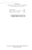

  
[Intangible Textual Heritage](../../index)  [Islam](../index) 
[Index](index)  [Next](omy01) 

------------------------------------------------------------------------

[Buy this Book at
Amazon.com](https://www.amazon.com/exec/obidos/ASIN/0766144569/internetsacredte)

------------------------------------------------------------------------

[Buy this Book on
Kindle](https://www.amazon.com/exec/obidos/ASIN/B002JTWO8Q/internetsacredte)

------------------------------------------------------------------------

  
*Oriental Mysticism*, by E.H. Palmer, \[1867\], at Intangible Textual
Heritage

------------------------------------------------------------------------

# ORIENTAL MYSTICISM

###### A TREATISE ON

##### Sufiistic and Unitarian Theosophy of the Persians

###### COMPILED FROM NATIVE SOURCES

###### BY

## E. H. PALMER

#### Cambridge: Deighton, Bell, and Co.; London: Bell and Daldy

#### \[1867\]

Scanned, proofed and formatted at Intangible Textual Heritage, August
2007, by John Bruno Hare. This text is in the public domain in the US
because it was published prior to 1923.

Copytext edition:

Published by

FRANK CASS AND COMPANY LIMITED

67 Great Russell Street, London WC1

First published 1867

Reprint with a new introduction 1938 —by A. J. Arberry \[Not included in
this etext\]

Reprint of the First edition 1969 \[This etext.\]

  [  
Click to enlarge](img/title.jpg)  
Title Page  

 
[  
Click to enlarge](img/verso.jpg)  
Verso  

------------------------------------------------------------------------

[Next: Dedication](omy01)
