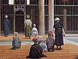

  
[Intangible Textual Heritage](../../index)  [Islam](../index) 
[Index](index)  [Previous](omy03)  [Next](omy05) 

------------------------------------------------------------------------

[Buy this Book at
Amazon.com](https://www.amazon.com/exec/obidos/ASIN/0766144569/internetsacredte)

------------------------------------------------------------------------

[Buy this Book on
Kindle](https://www.amazon.com/exec/obidos/ASIN/B002JTWO8Q/internetsacredte)

------------------------------------------------------------------------

  
*Oriental Mysticism*, by E.H. Palmer, \[1867\], at Intangible Textual
Heritage

------------------------------------------------------------------------

p. 1

### ORIENTAL MYSTICISM.

<table data-border="0">
<colgroup>
<col style="width: 100%" />
</colgroup>
<tbody>
<tr class="odd">
<td data-valign="top">
Thy prayer-mat stain with wine, if so 
  The Magian's favour thou canst win, 
For travellers in the land should know 
  The ways and customs of the inn. 
                                    HÁFIZ.
</td>
</tr>
</tbody>
</table>

THE verse above quoted, like most Oriental poetic Introduction. writings, is susceptible of a
mystical and much higher interpretation than appears from a merely
superficial perusal. It is peculiarly illustrative of the allegorical
form under which the intellectual life of the Religious Philosopher is
treated by the Persians, namely that of a journey, the ultimate object
of which is the knowledge of the Infinite Majesty of God; a plan similar
to that adopted with reference to the moral life by our own John Bunyan
in the Pilgrim's Progress. At the outset of their treatises the term
Traveller is applied to the intellectual man only, but the word is
afterwards used in a more

p. 2

general sense, just as in Christian writings man is not unfrequently
called a Wayfarer; it becomes often identical with Disciple. M. Garcia
de Tassy, in a work already referred to in the preface, has very
appropriately quoted a verse of St Thomas illustrating this point:

Ecce panis angelorum  
Factus cibus *viatorum*.

\[paragraph continues\] To an elucidation
of this system, and the technical terms employed therein, the following
pages are devoted; but to avoid breaking the continuity of the account,
I have endeavoured to present an epitome of the Oriental Mystic
Philosophy from the point of view taken by the Mohammedan writers, from
whom my information is chiefly derived. I must therefore premise that
any dogmatical statements that may occur in the course of the work are
not to be considered as enunciations of my own opinion, but as an
exposition of the views of those whose system I am attempting to
expound.

The first part will contain an explanation of, 1, The terms Traveller,
Road, Inns or Stages, and Goal. 2, The words Law, Doctrine, Truth, and
the Perfect Man, according to the Oriental definition of them. 3, What
is meant by Fellowship, Renunciation, Attraction and Devotion.

p. 3

The second, the Sufiistic account of, 1, The Nature; 2, The Attributes;
3, The Works of God; 4, The Four Universal Sources.

The third, a definition of, 1, The Saintly; 2, The Prophetic Office.

The fourth, a dissertation on the Influence of Early Prejudice upon
Belief.

The fifth, the Study of Man.

For the benefit of those who study oriental poetry I have added an
Appendix, containing a glossary of allegorical and technical terms in
use among the Sufiistic writers.

------------------------------------------------------------------------

[Next: Chapter I. Of the Traveller, the Goal, the Stages, and the
Road](omy05)
