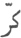
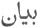
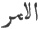
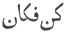
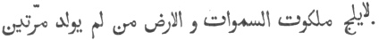
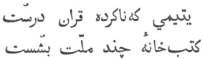
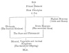

  
[Intangible Textual Heritage](../../index)  [Islam](../index) 
[Index](index)  [Previous](omy12)  [Next](omy14) 

------------------------------------------------------------------------

[Buy this Book at
Amazon.com](https://www.amazon.com/exec/obidos/ASIN/0766144569/internetsacredte)

------------------------------------------------------------------------

[Buy this Book on
Kindle](https://www.amazon.com/exec/obidos/ASIN/B002JTWO8Q/internetsacredte)

------------------------------------------------------------------------

  
*Oriental Mysticism*, by E.H. Palmer, \[1867\], at Intangible Textual
Heritage

------------------------------------------------------------------------

### CHAPTER III.

#### CONCERNING THE WORKS OF GOD, PHYSICALLY CONSIDERED.

THE Works of God are of two kinds, visible and invisible. The Worlds perceived and conceived. The first is
the Perceived, the second the Conceived World. The Perceived World is
also called The Material, Visible, Created, and Lower World. The
Conceived World is spoken of as the Invisible, Spiritual, or Future
World, and the World of Command [2](#fn_14):
this division is based on the words,

p. 30

\[paragraph continues\] "Are not creation
and command of Him?" (Cor. cap. 7, v. 52.) The material world may be
described in detail, but of the spiritual world we must be content with
a mere outline, for none but those who have gone hence, and entered into
the spiritual life, can know the condition thereof: as Jesus Christ has
said, "Except a man be born again he cannot enter into the kingdom of
heaven [1](#fn_15)."

Inhabitants of the Invisible World.There
are two classes of beings in the Invisible World, those whose existence
is revealed in inspiration (
), and those who make their existence felt

p. 31

\[paragraph continues\] ( ). The first are subdivided
into two classes, namely, Emanations and Agencies. Emanations Emanations. are what are addressed in the words
of Mohammed, "*Salve!* in the majesty of God, in His Glory which was
before the world began." They are called by the Mohammedans *Maláïk
Muhaymeh*, *i.e.* Angels designated by the word *hámú*, "*salve*."
Mohammed gives the following account of them: "Verily with the Most High
God there is a luminous land, the sun journeyeth there in 30 days, in an
orbit of 30 days, like the days of the world: its creation knows the
Most High God, but there are others in the earth who know not God, the
sons of Adam, and Iblís."

Agencies are, as it were, the door-keepers of Agencies. Divinity, and the means by which God's
bounty is vouchsafed to man. The head and chief of them, according to
the Muslims, is Mohammed, than whom there is no more exalted spirit. "I
have created nothing more honoured in my sight than thee."

The Holy Spirit, or Gabriel, is, according to them, the last of this
class of agencies, being the actual and intermediate agent of
intercourse between God and man. "There is not one of us who hath not
his assigned position."

The other beings whose existence is felt are also Agents. subdivided into two classes, namely,
Agents and Powers. The former are the presiding genii, or personified
laws of animal, vegetable and mineral production, whence the common
saying, "Everything has its angel." Mohammed himself says, "An angel
descends in every drop of rain or dew," and the mystics

p. 32

assert that God does not create a single leaf upon a tree without the
intervention of seven angels. The human soul, though compounded both of
the material and the immaterial, is reckoned amongst this class. It is
the masterpiece of creation, and the whole material world is placed
under its control [1](#fn_16).

Powers.The Powers who form the second
class are the Genii and Devils. They are created of fire, and constitute
the lower order of beings in the invisible world. Some of them have a
certain power over the race of man granted to them, but are rebellious
against the Most High; of these Iblís is the Head and Chief. Others,
again, although capable of harm, are subservient to the will of God.

p. 33

The material world is also of two kinds, heavenly Of Heavenly and the Earthly. and earthly. The
heavenly are the Throne and the Seat of God (or the Highest Heavens),
the Seven Inferior Heavens, the Firmament and the Stars. The Earthly are
the Face of the Earth, the Elements, Signs from on high (as thunder,
lightning and rain), Compound Bodies (as minerals, vegetables and
animals), the Sea, and other Works of God without end. Such is the
Sufiistic account of the works of God, physically considered.

------------------------------------------------------------------------

### Footnotes

[29:2](omy13.htm#fr_14)   The command of God   (*kun fa kán*), "be and it
was," is here alluded to. The Sufis in their poetry frequently p. 30 speak of God as the Lord of *káf* and *nún*,
*i.e.* of the two letters composing the word of command kun "be."

[30:1](omy13.htm#fr_15)  

The Mohammedans although denying the Divinity of Our Lord recognize the
inspiration of both the Old and New Testaments, which as well as the
Apocryphal Gospels they frequently quote as authorities. They even
assert that the promise of the Comforter referred to their own prophet,
and support their arguments by an ingenious perversion of the text,
reading περικλυτὸς for παράκλητος, the former being almost identical in
signification with the name of Mohammed (*Multum laudatus*). The charge
of inconsistency in not believing in our scriptures they meet by
accusing the Christians of having themselves altered many similar
portions of the original, and by maintaining that the mission of
Mohammed, the Seal of the Prophets as he is called, abrogated all other
religions. Thus Sa’adi says in his Bústán:

 

That Perfect one who, ere the whole of Gabriel's book he reads,  
Has blotted out the library of all the People's creeds."

[32:1](omy13.htm#fr_16) The accompanying table
of the Mohammedan Cosmogony may assist the reader in understanding this
and the following chapters.

  [  
Click to enlarge](img/03200.jpg)

------------------------------------------------------------------------

[Next: Chapter IV. Concerning the Works of God, Metaphysically
Considered](omy14)
