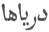

  
[Intangible Textual Heritage](../../index)  [Islam](../index) 
[Index](index)  [Previous](omy14)  [Next](omy16) 

------------------------------------------------------------------------

[Buy this Book at
Amazon.com](https://www.amazon.com/exec/obidos/ASIN/0766144569/internetsacredte)

------------------------------------------------------------------------

[Buy this Book on
Kindle](https://www.amazon.com/exec/obidos/ASIN/B002JTWO8Q/internetsacredte)

------------------------------------------------------------------------

  
*Oriental Mysticism*, by E.H. Palmer, \[1867\], at Intangible Textual
Heritage

------------------------------------------------------------------------

### CHAPTER V.

#### OF THE FOUR UNIVERSAL SOURCES [1](#fn_24).

Division of the Universe into four
Sources.THE Sufis and Unitarians divide the Universe into four
Sources, of which the first is the Nature of God the second, the
Constructive Spirit; and the third and fourth are the Invisible and
Sensible Worlds. This division is contrary to the doctrines contained in
the Corán and the Traditional Law, although many even of the strictest
Mollahs recognize it. These last say, however, that the First Source,
that is, God, created the other three out of nothing, and will, when it
pleases Him, reduce them to nothing again. The Unitarians maintain that
it is impossible for that which is not, to be, and for that which is,
not to be. That which exists, must ever exist, and that which exists
not, can never exist.

p. 39

How then, ask the Sufis, was the world made manifest? And the Unitarians
reply as follows.

The First Source, which is God, is a hidden treasure, Reconciled with the Unitarian account. and He
desired to be known [1](#fn_25). He therefore
appeared, coming from internal to external being; this was the beginning
of the Second Source or Constructive Spirit. This again appeared, and
the third and fourth Sources were in like manner made manifest; they are
the Invisible and Sensible Worlds. The manner in which these came into
being, and from them all material objects, has been narrated in a
previous chapter. Everything therefore proceeds from the First Source.
The Source then which was a hidden treasure was the internal Nature of
God, and every existent being a manifestation of His nature;
consequently everything which exists is the nature of God, and there
neither is nor can be any other existence save His.

It was to this doctrine that ’Abdallah ibn ’Abbás [2](#fn_26) ’Abdallah ibn
’Abbás. referred when he said, "I shall be accused of unbelief if
I interpret aright the verse, 'It is God who hath created the seven
heavens and of the earth like unto them, and His command descendeth
between them, that ye may know that He hath power over all things.'"
(Cor. cap. 65, v. 12.)

The Unitarians in general say that these four Precedence of the four Sources. Sources were
always exactly as they are now, and have no precedence whatever, the one
over the other.

p. 40

\[paragraph continues\] For to assert that
any one has such precedence, would be to assume that it must either have
been imperfect and grown to perfection, or have been originally perfect
and subsequently deteriorated; but any notion of deterioration is
incompatible with existence, since that must be the existence of God.

The initiated amongst them, however, allow that the First Source has
precedence over the Second, and the Second over the third and fourth;
but they state that it is a precedence of order and mind, not of place
or time; the precedence of the Sun's Orb over its rays, or of cause over
effect, each having been manifested by the preceding.

Summary of the Unitarian account.The
Unitarian theory may be summed up thus; God is the First Source, He is
the hidden treasure who desires to make Himself known; the others are
manifestations of the First, and the more manifestations take place, the
more the First becomes known.

Sufiistic account.The Sufis maintain that
these four Sources have a precedence the one over the other, both of
time and place; such precedence as Adam has over Mohammed. The origin of
the Universe is placed by them in Eternity (*azal*); that of the
Constructive Spirit, the Second Source from which it sprung, in Eternity
of Eternities (*azal i azál*), whilst the Nature of God, the First
Source, is Sempiternal (*lam yazul wa lá yuzál*).

The Traveller then must overcome the restraints of time and place,
before his footsteps can border on the threshold of Eternity.

p. 41

There are other Unitarians, who explain the Four Sources as follows.

The First Source, the Nature of God, they call Another Unitarian account. an Infinite and
Illimitable Light, a boundless and fathomless sea. The Second Source,
the Constructive Spirit, proceeding from Him, is likewise an Infinite
and Illimitable Light and a boundless and fathomless sea; it comprises
and comprehends every existent atom, and governs and administers the
entire Universe. The remaining two sources are manifestations of this
Infinite Light, and the recurring phenomena of nature are but continued
manifestations of the same.

The varied pictures I have drawn on space,  
Behold what fair and goodly sights they seem!  
One glimpse I gave them of my glorious face,  
And lo! ’tis now the universal theme.

In this the Unitarian account differs little from The Universe the Mirror of God. the Sufiistic;
but the former say that the sole object of such manifestation was that
God, the hidden treasure, might make Himself known. It is as it were the
mirror of God; the mirror in which His majesty and perfection is
reflected, the mirror in which He sees Himself.

Look not askance, the Holy one will ever be the
same,  
The God of all, though oft invoked by many a different name.

The Universe is the mirror of God, and the heart of man is the mirror of
the Universe; if the Traveller then would know God, he must look into
his own heart; if he would know the light, he must look into his own
heart. In short, if he desire to avoid sin

p. 42

and ignorance, and to attain to holiness and wisdom, the guide that
shall conduct him on his path is there, "a still small voice," that ever
bids him "eschew the evil and choose the good."

All the earth I'd wandered over seeking still the
beacon light,  
Never tarried in the daytime, never sought repose at night;  
Till I heard a reverend preacher all the mystery declare,  
Then I looked within my bosom, and 'twas shining brightly there.

 

 

------------------------------------------------------------------------

### Footnotes

[38:1](omy15.htm#fr_24) The Persians call them
  "seas."

[39:1](omy15.htm#fr_25) Cf. the answer to
David's enquiry quoted in p. 5.

[39:2](omy15.htm#fr_26) One of the companions of
Mohammed. Cf. *Hajji Khalfa*, Vol. II. p. 333.

------------------------------------------------------------------------

[Next: Chapter I. The Saintly and Prophetic Offices Defined](omy16)
