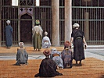

  
[Intangible Textual Heritage](../../index)  [Islam](../index) 
[Index](index)  [Previous](omy15)  [Next](omy17) 

------------------------------------------------------------------------

[Buy this Book at
Amazon.com](https://www.amazon.com/exec/obidos/ASIN/0766144569/internetsacredte)

------------------------------------------------------------------------

[Buy this Book on
Kindle](https://www.amazon.com/exec/obidos/ASIN/B002JTWO8Q/internetsacredte)

------------------------------------------------------------------------

  
*Oriental Mysticism*, by E.H. Palmer, \[1867\], at Intangible Textual
Heritage

------------------------------------------------------------------------

p. 43

# PART III.

### CHAPTER I.

#### THE SAINTLY AND PROPHETIC OFFICES DEFINED.

MOHAMMED said, "The first thing which God created Duplicate function of the Primal Element. was my
soul," and again, "My soul was the Primal Element;" the two therefore
are identical.

Now the Primal Element, it has been already stated, has two functions,
namely, that of receiving from God, and that of conveying to the world.
The first is called the Saintly, the second is called the Prophetic, and
is the manifestation of the other. But as it has been shewn that the
Primal Element and Mohammed are identical, it follows that these offices
are both vested in him. The Sufis, therefore, believe that Mohammed was
a prophet before the creation, and that he holds the office still,
although he has left the world; and this opinion is in conformity with
his own words, "I was a prophet while Adam was yet betwixt Earth and
Clay," and again, "There is no prophet after me."

Sheikh Sa’ad uddin Hamawí, who has been before In
whom vested. quoted, says that each of the functions of the
Primal

p. 44

\[paragraph continues\] Element requires
an exponent. The exponent of the Prophetic function was Mohammed, and he
is the Seal of the Prophets. Mehdí the last of
the Imáms. The exponent of the Saintly function is Mehdí, the
last of the Imams [1](#fn_27), who is yet to
come. Up to the present time the Prophetic Office has been manifested,
and assumed a definite form, and the particulars thereof are known; the
particulars of the Saintly Office cannot become known, nor can it assume
a definite form till the appearance of Mehdí, who will be the saint
(Welí), as Mohammed was the Prophet (Nebí).

Hitherto the discussions in the schools have been concerning the duties
imposed by prophecy, and the particulars of the revelation introduced by
it; on the appearance of Mehdí Prophecy, will have been completed, and
the era of Saintship commenced. When the duties and particulars of this
are known, they will form the subject of discussion until this era also
shall have been completed by the appearance of the Day of Resurrection.
Then shall the faithful behold the Lord face to face, according to the
promise, "Verily, ye shall behold your Lord on the Day of Resurrection,
even as ye behold the Sun and the Moon."

------------------------------------------------------------------------

### Footnotes

[44:1](omy16.htm#fr_27) Also called
*Sahibû’zzemán*, "The Lord of Time." He is to be the sovereign of the
world, to bear the name of Mohammed, and introduce the Millennium. Many
religious enthusiasts of the Muslems have claimed to be the
Sahibû’zzemán, amongst them Ali Mohammed, alias Báb el Islám (the door
of Islamism), who founded the sect of the Babis in Persia during the
present century. A history of the movement is given by Mirza Kazem-Beg
in the *Journal Asiatique*, No. 26. Paris, 1866.

------------------------------------------------------------------------

[Next: Chapter I. On the Influence of Early Prejudice Upon
Belief](omy17)
