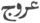
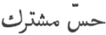
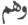
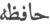

  
[Intangible Textual Heritage](../../index)  [Islam](../index) 
[Index](index)  [Previous](omy18)  [Next](omy20) 

------------------------------------------------------------------------

[Buy this Book at
Amazon.com](https://www.amazon.com/exec/obidos/ASIN/0766144569/internetsacredte)

------------------------------------------------------------------------

[Buy this Book on
Kindle](https://www.amazon.com/exec/obidos/ASIN/B002JTWO8Q/internetsacredte)

------------------------------------------------------------------------

  
*Oriental Mysticism*, by E.H. Palmer, \[1867\], at Intangible Textual
Heritage

------------------------------------------------------------------------

### CHAPTER II.

#### OF THE ORIGIN AND ANIMAL DEVELOPMENT OF MAN.

THE Lesser World is the counterpart of the Greater. The Sources of his being. In the Greater World
there are four Sources, namely, the nature of God, the Constructive
Spirit (or Primal Element), the Invisible and the Sensible World.

The nature of God begets, the Constructive Spirit conceives, and the
offspring is the tracts of heaven and the elements. The tracts of heaven
again beget, and the elements conceive, and their offspring is the
triple kingdom, Animal, Vegetable, and Mineral.

p. 52

In like manner there are four Sources in the Lesser World, namely, male
and female generation, and the body and soul of man.

Intelligence his starting point and final
aim.But the Constructive Spirit is identical with Primal
Intelligence, therefore when man has attained to  intelligence he has
completed his upward progress (
), and reached the point from which he started;

the circle is thus complete. But Intelligence is in direct communication
with God; therefore when man has attained to this point he has also
attained to God. "From Him is the beginning, and unto Him is the
return." The saying of Mohammed, "He who has seen me has seen God,"
refers to this, and not to any blasphemous assumption of divinity; for
we must bear in mind that he is identified by his followers with Primal
Intelligence.

Conception.It is unnecessary here to
describe the first germination of the embryo; the curious will find a
particular account of it, according to the Mohammedan theory, in Sale's
Translation of the Corán, cap. 22, v. 5, and in the Arab commentators
upon cap. 96.

Suffice it to say that according to them the cartilages, arteries, and
nerves are formed during the first three months after conception; in the
fourth month, whilst the sun is in the ascendant, the first germ of life
appears; the limbs and members are next formed and nourished by blood,
introduced through the placenta, by means of the umbilical cord; these
are followed by the successive developments of the body and the soul,
which arrive at Birth. perfection in the
eighth month; in the ninth, when

p. 53

\[paragraph continues\] Jupiter is in the
ascendant, the child is born into the world.

The embryo partakes of all four elements, earth, Successive developments. water, air and fire;
now these in the Greater World produce a triple offspring, mineral,
vegetable and animal. A similar division is therefore made in the human
body. The members and limbs which are first formed partake of the four
elements in different proportions, and the combined result corresponds
to the mineral kingdom. The powers of attraction, contraction,
absorption, digestion, rejection, growth and formation, are next
developed in the members and limbs, which then require nourishment. This
they receive in the shape of blood, introduced through the placenta; the
chyme contained in this becoming matured is developed into the
vegetative spirit, corresponding to the second division of the three
kingdoms. When the digestive and other internal organs have become fully
developed, the heart attracts to itself the essence of this vegetative
spirit, and having further matured it, forms the life; the essence of
this again is attracted to the brain, where, after being matured, it is
developed into the soul, and the remainder dispersed through the nerves
into the limbs, where it becomes the source of sense and motion. This
corresponds to the animal kingdom of the Greater World.

Each of these developments occupies one month, embryo, mineral,
vegetative and animal.

The senses are ten in number, five external and The senses.

p. 54

five internal. The external senses are Sight, Hearing, Taste, Smelling,
and Feeling.

The internal senses are the Common Sense (
), Imagination (
), Apprehension (
), Memory (
), and Reflection (
). The Common Sense is involved in the Imagination,
and the Apprehension in the Memory; the two former are situate in the
fore-part of the brain, the two latter in the after-part, and the
Reflection occupies the middle. The Common Sense is so called from
comprising every thing that perceives the outward senses. It comprehends
visible objects, while the Apprehension apprehends invisible subjects.

It is the Common Sense which appreciates the real nature of all that the
external senses perceive, as for instance, distinguishing a friend from
an enemy by the marks of which the external senses take cognizance. The
Reflection is that which similarly appreciates the conceptions of the
Imagination.

The faculties.The motive powers are also
of two kinds, causative and active. The active powers are subservient to
and obey the causative, producing motion and the like at their
instigation. The causative powers exercise two distinct functions,
namely attraction for the acquirement of pleasure or usefulness, and
repulsion for the avoidance of annoyance or harm. The former is called
Lust, the latter Indignation.

Hitherto only those qualities of man have been

p. 55

treated of which he shares in common with the other animals; his
spiritual and intellectual developments require another chapter.

------------------------------------------------------------------------

[Next: Chapter III. Of the Intellectual and Spiritual Development of
Man.](omy20)
