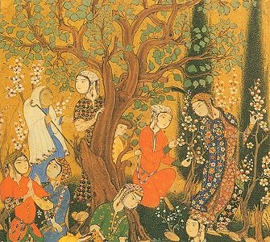

  
[Intangible Textual Heritage](../../index)  [Islam](../index) 

------------------------------------------------------------------------

[Buy this Book at
Amazon.com](https://www.amazon.com/exec/obidos/ASIN/0486431614/internetsacredte)

------------------------------------------------------------------------

<table width="75%">
<colgroup>
<col style="width: 50%" />
<col style="width: 50%" />
</colgroup>
<tbody>
<tr class="odd">
<td width="50%" data-valign="TOP"></td>
<td width="50%" data-valign="CENTER"><h1 id="poems-from-the-divan-of-hafiz" data-align="CENTER">Poems from the Divan of Hafiz</h1>
<h2 id="by-gertrude-lowthian-bell" data-align="CENTER">by Gertrude Lowthian Bell</h2>
<h4 id="section" data-align="CENTER">[1897]</h4></td>
</tr>
</tbody>
</table>

------------------------------------------------------------------------

[Contents](#contents)    [Start Reading](pdh00)    [Text](pdh.txt)

------------------------------------------------------------------------

|                                                                                                                           |
|---------------------------------------------------------------------------------------------------------------------------|
|  |

------------------------------------------------------------------------

 [Title Page](pdh00)  
[To Hafiz of Shiraz](pdh01)  
[Introduction](pdh02)  

### The Poems

[I. Arise, oh Cup-bearer, rise! and bring](pdh03)  
[II. The bird of gardens sang unto the rose](pdh04)  
[III. Wind from the east, oh Lapwing of the day](pdh05)  
[IV. Sleep on thine eyes, bright as narcissus flowers](pdh06)  
[V. Oh Turkish maid of Shiraz! in thy hand](pdh07)  
[VI. A flower-tinted cheek, the flowery close](pdh08)  
[VII. From the garden of Heaven a western breeze](pdh09)  
[VIII. The rose has flushed red, the bud has burst](pdh10)  
[IX. Oh Cup-bearer, set my glass afire](pdh11)  
[X. Singer, sweet Singer, fresh notes strew](pdh12)  
[XI. Mirth, Spring, to linger in a garden fair](pdh13)  
[XII. Where is my ruined life, and where the fame of noble
deeds?](pdh14)  
[XIII. Lady that hast my heart within thy hand](pdh15)  
[XIV. The nightingale with drops of his heart's blood](pdh16)  
[XV. Return! that to a heart wounded full sore](pdh17)  
[XVI. What is wrought in the forge of the living and life](pdh18)  
[XVII. Lay not reproach at the drunkard's door](pdh19)  
[XVIII. Slaves of thy shining eyes are even those](pdh20)  
[XIX. What drunkenness is this that brings me hope](pdh21)  
[XX. From out the street of So-and-So](pdh22)  
[XXI. Not all the sum of earthly happiness](pdh23)  
[XXII. The rose is not fair without the beloved's face](pdh24)  
[XXIII. My lady, that did change this house of mine](pdh25)  
[XXIV. Not one is filled with madness like to mine](pdh26)  
[XXV. The days of absence and the bitter nights](pdh27)  
[XXVI. The secret draught of wine and love repressed](pdh28)  
[XXVII. My friend has fled! alas, my friend has fled](pdh29)  
[XXVIII. Hast thou forgotten when thy stolen glance](pdh30)  
[XXIX. From Canaan Joseph shall return, whose face](pdh31)  
[XXX. All hail, Shiraz, hail! oh site without peer!](pdh32)  
[XXXI. The breath of Dawn's musk-strewing wind shall blow](pdh33)  
[XXXII. Upon a branch of the straight cypress-tree](pdh34)  
[XXXIII. The jewel of the secret treasury](pdh35)  
[XXXIV. Last night I dreamed that angels stood without](pdh36)  
[XXXV. Forget not when dear friend to friend returned](pdh37)  
[XXXVI. Beloved, who has bid thee ask no more](pdh38)  
[XXXVII. Arise! and fill a golden goblet up](pdh39)  
[XXXVIII. I cease not from desire till my desire](pdh40)  
[XXXIX. Cypress and Tulip and sweet Eglantine](pdh41)  
[XL. The margin of a stream, the willow's shade](pdh42)  
[XLI. The days of Spring are here! the eglantine](pdh43)  
[XLII. True love has vanished from every heart](pdh44)  
[XLIII. Where are the tidings of union? that I may arise](pdh45)  

### Notes

[I](pdh46)  
[II](pdh47)  
[III](pdh48)  
[IV](pdh49)  
[V](pdh50)  
[VII](pdh51)  
[VIII](pdh52)  
[IX](pdh53)  
[X](pdh54)  
[XI](pdh55)  
[XIV](pdh56)  
[XV](pdh57)  
[XVI](pdh58)  
[XVII](pdh59)  
[XVIII](pdh60)  
[XIX](pdh61)  
[XXI](pdh62)  
[XXIII](pdh63)  
[XXIV](pdh64)  
[XXV](pdh65)  
[XXVI](pdh66)  
[XXVIII](pdh67)  
[XXIX](pdh68)  
[XXX](pdh69)  
[XXXI](pdh70)  
[XXXII](pdh71)  
[XXXIV](pdh72)  
[XXXV](pdh73)  
[XXXVI](pdh74)  
[XXXVII](pdh75)  
[XXXIX](pdh76)  
[XL](pdh77)  
[XLII](pdh78)  
[XLIII](pdh79)  
