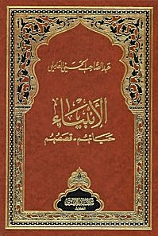

[Intangible Textual Heritage](../../index)  [Islam](../index) 

------------------------------------------------------------------------

<table width="75%">
<colgroup>
<col style="width: 50%" />
<col style="width: 50%" />
</colgroup>
<tbody>
<tr class="odd">
<td data-valign="CENTER" width="50%"></td>
<td data-valign="CENTER" width="50%"><h1 id="the-prophets-their-lives-and-their-stories" data-align="CENTER">THE PROPHETS, THEIR LIVES AND THEIR STORIES</h1>
<h2 id="by-abdul-sâhib-al-hasani-al-âmili" data-align="CENTER">by Abdul-Sâhib Al-Hasani Al-'âmili</h2></td>
</tr>
</tbody>
</table>

------------------------------------------------------------------------

[Translator's Word](pro00)  
[Facade](facade)  
[Introduction of The Book](intro)  
[Introduction of 2nd Edition](i2e)  

### Adam

[About some conditions of the father of Human beings ''Adam''
(PUH)](adam00)  
[Subjects from different sources with agreement in contents](adam01)  
[Angels prostration for Adam PUH](adam02)  
[Useful Caution](adam03)  
[The Inhabitation of Adam in Paradise](adam04)  
[How was it correct to prostrate before Adam by angels and he's just a
creation](adam05)  
[Some tales related to our research](adam06)  
[The reasons for getting Adam down from paradise to earth](adam07)  
[What is the tree that was porhibited for Adam PUH](adam08)  
[Place of falling of Adam and Eve](adam09)  
[Crying of Adam for paradise](adam10)  
[Having a tent for them in the place of the Holy house](adam11)  
[Of what was the dog created](adam12)  
[Marriage of Adam and Eve](adam13)  
[The marriage of the children of Adam PUH](adam14)  
[Summary of the story of Adam PUH](adam15)  

### Enoch

[Conditions of Enoch the Prophet PUH](enoc00)  
[Some of what was mentioned in the books of Enoch PUH](enoc01)  

### Noah

[Sheikh of messengers, Noah PUH](noa00)  
[The Ark of Noah and its creation](noa01)  
[The coming down of Noah and his fellows from the Ark](noa02)  
[A completion with the help of the Holy Quran for the case of
Noah](noa03)  

### Hud

[Hud PUH](hud00)  
[The Land of A'ad and Their Crafts](hud01)  
[Anti-Critiscism or Imagination](hud02)  
[And Here Is An Amazing Story](hud03)  
[And Some Historians Said](hud04)  

### Sâlih

[The Prophet Sâlih (PUH)](sal00)  
[Properities of The She-Camel](sal01)  
[The Land of Sâlih's (PUH) People](sal02)  

### Abraham

[Abraham The God's Friend (PUH)](abr00)  
[The Infallibility of God's Viceroys](abr01)  
[The Birth of Abraham (PUH)](abr02)  
[Breaking The Idols and Throwing Abraham in The Fire](abr03)  
[Getting Out From Iraq To The Land of Shem](abr04)  
[The Books of Abraham (PUH) and Some of What Was Revealed By God to
Him](abr05)  
[Taking Ishmael (PUH) and His Mother Hagar to The Holy House](abr06)  
[Building The Holy House](abr07)  
[Some Sentences About Sarah The Wife of Abraham As Told By
Historians](abr08)  
[Chapters and Phrases That Mentioned Abraham (PUH)](abr09)  
[The Trial of Abraham (PUH) to Slay His Son Ishmael (PUH)](abr10)  
[A Completion With The Ancestry of The Prophet (PUH)](abr11)  

### Isaac

[Isaac ben Abraham (PUT)](isa00)  

### Lot

[The Prophet Lot (PUH)](lot00)  
[Some Funny Stories](lot01)  
[Some Benefits That Should Not be Left](lot02)  
[Presenting His Daughters to The People of His Village and His Wife
Conditions](lot03)  
[The Wife of Lot (PUH)](lot04)  
[Sermons to be Taken From The Story of Abraham and Others Mentioned With
Him](lot05)  

### Jacob and Joseph

[Jacob and Joseph (PUT)](jj00)  
[About Calling Jacob as Israel](jj01)  
[The Punishment of God for His Viceroys](jj02)  
[Joseph The Righteous (PUH)](jj03)  
[Gifts Are in Troubles](jj04)  
[Getting Joseph Into The Jail](jj05)  
[Getting Out From The Jail to The King of Egypt](jj06)  
[The Beginning of Easiness For The Household of Jacob (PUH)](jj07)  
[Another Tale](jj08)  
[Lot of Sermons in The Josephite Virtues](jj09)  

### Ðul-Qarnain

[Some Conditions of Ðul-Qarnain](qar00)  
[Getting Back From West to The East](qar01)  
[Other Tales About Gog and Magog and What Ðul-Qarnain Faced](qar02)  
[Alexander and Al-Khidhr Were Born in The Same Day](qar03)  

### Job

[Ayub (Job) The Prophet (PUH)](job00)  
[The Back of Gifts From God to Job (PUH)](job01)  
[Another Story Similar to What Was Mentioned Before](job02)  

### Shu\`ayb (Jethro)

[Shu\`ayb (Jethro) The Prophet (PUH)](jet00)  

### Moses

[Musa ben \`Imrân (Moses ben Amram) (PUH)](mos00)  
[The Birth of Moses (PUH)](mos01)  
[Going Out of Egypt to Midian](mos02)  
[Moses Going Out From Egypt to Midian With Fear](mos03)  
[The Marriage of Jethro's Daughter and Moses](mos04)  
[Moses' Stick and Its Deeds](mos05)  
[Aaron as A Henchman as Moses Requested](mos06)  
[Taking Off The Shoes in The Valley of Tuwa](mos07)  
[Moses Entering Egypt After Sending Him With His Brother Aaron](mos08)  
[The Nine Continuous Miracles by Moses (PUH)](mos09)  
[The Miracles of Moses and The Ash\`abite Psychology of The
Pharaoh](mos10)  
[The Ash\`abite Imaginations of The Pharaoh](mos11)  
[The Pharaoh Wants to Kill Moses and The Believing Man From The Pharaoh
Family Defending Him](mos12)  
[The Exit of The Israelites From Egypt to Palestine](mos13)  
[The Wife of The Pharaoh, Âsiyyah bent Muzâhim](mos14)  
[Moses and His People Going Out From The Sea Into The Land](mos15)  
[Some Historians Said](mos16)  
[Moses Only Wanted to Get Them Into The Holy Lands](mos17)  
[The Chieftains and \`Iwaj ben \`Inâq and what Happened With
Them](mos18)  
[Revelation of Torah and Worshipping of The Calf and Related
Stories](mos19)  
[Place of Revelation of Torah](mos20)  
[Worshipping The Calf](mos21)  
[Qârun (Korah) and What He Was Given and His End](mos22)  
[The Story of The Cow](mos23)  
[Moses Choosing Seventy Men For God's Appointed Tryst](mos24)  
[Al-Khidhr and Moses (PUT)](mos25)  
[Moses' Soliloquy With His Lord](mos26)  
[The Death of Moses and Aaron (PUT)](mos27)  
[Something About Johsua ben Nun](mos28)  
[Some Sermons From The Stories of Moses and Aaron (PUT)](mos29)  

### Elias, Elisha, Ishmael and Balaam

[Some of The Conditions of a Group of Prophets (PUT)](grp00)  
[Escaping The Plague](grp01)  
[Ishmael, Other Than The Son of Abraham (PUT)](grp02)  
[Elias (Elijah) and Alyasa\` (Elisha) (PUT)](grp03)  
[Some Conditions of Ðul-Kifl (PUH)](grp04)  

### David

[David (PUH)](dav00)  
[The Awaited Manifesto](dav01)  
[Climbing Into The Champer and Straying of Sheeps Into The
Farm](dav02)  
[Some of What Was Inspired to David (PUH) and Some of What Was Copied
From His Sermons](dav03)  
[Mutation of Israelites](dav04)  

### Yunus (Jonah)

[Yunus (Jonah) (PUH)](jon00)  

### Zacharias and John

[Zacharias and John (PUT)](zjo00)  
[The Death Zacharias and John](zjo01)  

### Jesus The Son of Mary

[Jesus The Son of Mary (PUH)](jes00)  
[The Pregnancy of Mary With Jesus And His Birth (PUT)](jes01)  
[Jesus is One of Those of Will](jes02)  
[The Table And The Mutation Among The Israelites](jes03)  
[Some Additions of Narrations About The Messiah, Jesus (PUH)](jes04)  
[The Bell](jes05)  
[The Uplift of Jesus The Son of Mary Into Heaven](jes06)  
[The Injeel (Gospel) is A Heavenly Revealed Book](jes07)  
[Gospel of Mark](jes08)  
[Gospel of Luke](jes09)  
[Gospel of John](jes10)  
[Gospel of Barnaba](jes11)  
[Bukht Nassar (Nebuchadnezzar)](jes12)  

### Dâniâl (Daniel)

[Dâniâl (Daniel) (PUH)](dan00)  

### \`Uzair (Ezra) Iramyâ' (Jeremiah)

[\`Uzair (Ezra) Iramyâ' (Jeremiah) (PUT)](eja00)  
[People of The Cave and The Inscription (Seven Sleepers of
Ephesus)](eja01)  
[Owners of The Ditch](eja02)  

### The Prophet Jerjees (Georgeous)

[The Prophet Jerjees (Georgeous) (PUH)](geo00)  
[Khâlid ben Sinân Al-\`Absi](geo01)  
