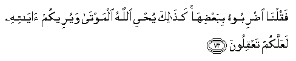
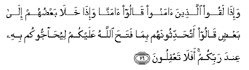
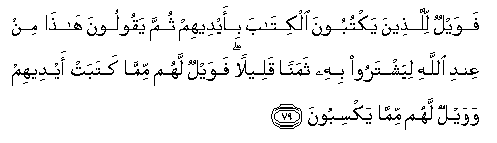

  
[Intangible Textual Heritage](../../index)  [Islam](../index) 
[Index](index)   
[Hypertext Qur'an](../htq/index)  [Unicode](../uq/002.htm#002_072) 
[Palmer](../sbe06/002)  [Pickthall](../pick/002.htm#002_072)  [Yusuf Ali
English](../yaq/yaq002)  [Rodwell](../qr/002)   
  
[Sūra II.: Baqara, or the Heifer. Index](002)  
  [Previous](00208)  [Next](00210) 

------------------------------------------------------------------------

  
*The Holy Quran*, tr. by Yusuf Ali, \[1934\], at Intangible Textual
Heritage

------------------------------------------------------------------------

# Sūra II.: Baqara, or the Heifer.

### Section 9

------------------------------------------------------------------------

72. Wa-i<u>th</u> qataltum nafsan fa**i**dd<u>a</u>ra/tum feeh<u>a</u>
wa**A**ll<u>a</u>hu mukhrijun m<u>a</u> kuntum taktumoon**a**

72\. Remember ye slew a man  
And fell into a dispute  
Among yourselves as to the crime:  
But God was to bring forth  
What ye did hide.

------------------------------------------------------------------------

73. Faquln<u>a</u> i<u>d</u>riboohu bibaAA<u>d</u>ih<u>a</u>
ka<u>tha</u>lika yu<u>h</u>yee All<u>a</u>hu almawt<u>a</u> wayureekum
<u>a</u>y<u>a</u>tihi laAAallakum taAAqiloon**a**

73\. So We said: "Strike the (body)  
With a piece of the (heifer)."  
Thus God bringeth the dead  
To life and showeth you His Signs:  
Perchance ye may understand.

------------------------------------------------------------------------

74. Thumma qasat quloobukum min baAAdi <u>tha</u>lika fahiya
ka**a**l<u>h</u>ij<u>a</u>rati aw ashaddu qaswatan wa-inna mina
al<u>h</u>ij<u>a</u>rati lam<u>a</u> yatafajjaru minhu al-anh<u>a</u>ru
wa-inna minh<u>a</u> lam<u>a</u> yashshaqqaqu fayakhruju minhu
alm<u>a</u>o wa-inna minh<u>a</u> lam<u>a</u> yahbi<u>t</u>u min
khashyati All<u>a</u>hi wam<u>a</u> All<u>a</u>hu bigh<u>a</u>filin
AAamm<u>a</u> taAAmaloon**a**

74\. Thenceforth were your hearts  
Hardened: they became  
Like a rock and even worse  
In hardness. For among rocks  
There are some from which  
Rivers gush forth; others  
There are which when split  
Asunder send forth water;  
And others which sink  
For fear of God. And God is  
Not unmindful of what ye do.

------------------------------------------------------------------------

75. Afata<u>t</u>maAAoona an yu/minoo lakum waqad k<u>a</u>na fareequn
minhum yasmaAAoona kal<u>a</u>ma All<u>a</u>hi thumma
yu<u>h</u>arrifoonahu min baAAdi m<u>a</u> AAaqaloohu wahum
yaAAlamoon**a**

75\. Can ye (O ye men of Faith)  
Entertain the hope that they  
Will believe in you?—  
Seeing that a party of them  
Heard the Word of God,  
And perverted it knowingly  
After they understood it.

------------------------------------------------------------------------

76. Wa-i<u>tha</u> laqoo alla<u>th</u>eena <u>a</u>manoo q<u>a</u>loo
<u>a</u>mann<u>a</u> wa-i<u>tha</u> khal<u>a</u> baAA<u>d</u>uhum
il<u>a</u> baAA<u>d</u>in q<u>a</u>loo atu<u>h</u>addithoonahum
bim<u>a</u> fata<u>h</u>a All<u>a</u>hu AAalaykum liyu<u>ha</u>jjookum
bihi AAinda rabbikum afal<u>a</u> taAAqiloon**a**

76\. Behold! when they meet  
The men of Faith, they say:  
"We believe": but when  
They meet each other in private,  
They say: "Shall you tell them  
What God hath revealed to you,  
That they may engage you  
In argument about it  
Before your Lord?"—  
Do ye not understand (their aim)?

------------------------------------------------------------------------

77. Awa l<u>a</u> yaAAlamoona anna All<u>a</u>ha yaAAlamu m<u>a</u>
yusirroona wam<u>a</u> yuAAlinoon**a**

77\. Know they not that God  
Knoweth what they conceal  
And what they reveal?

------------------------------------------------------------------------

78. Waminhum ommiyyoona l<u>a</u> yaAAlamoona alkit<u>a</u>ba
ill<u>a</u> am<u>a</u>niyya wa-in hum ill<u>a</u>
ya*<u>th</u>*unnoon**a**

78\. And there are among them  
Illiterates, who know not the Book,  
But (see therein their own) desires,  
And they do nothing but conjecture.

------------------------------------------------------------------------

79. Fawaylun lilla<u>th</u>eena yaktuboona alkit<u>a</u>ba bi-aydeehim
thumma yaqooloona h<u>atha</u> min AAindi All<u>a</u>hi liyashtaroo bihi
thamanan qaleelan fawaylun lahum mimm<u>a</u> katabat aydeehim wawaylun
lahum mimm<u>a</u> yaksiboon**a**

79\. Then woe to those who write  
The Book with their own hands,  
And then say: "This is from God,"  
To traffic with it  
For a miserable price!—  
Woe to them for what their hands  
Do write, and for the gain  
They make thereby.

------------------------------------------------------------------------

80. Waq<u>a</u>loo lan tamassan<u>a</u> a**l**nn<u>a</u>ru ill<u>a</u>
ayy<u>a</u>man maAAdoodatan qul attakha<u>th</u>tum AAinda All<u>a</u>hi
AAahdan falan yukhlifa All<u>a</u>hu AAahdahu am taqooloona AAal<u>a</u>
All<u>a</u>hi m<u>a</u> l<u>a</u> taAAlamoon**a**

80\. And they say: "The Fire  
Shall not touch us  
But for a few numbered days:"  
Say: "Have ye taken a promise  
From God, for He never  
Breaks His promise?  
Or is it that ye say of God  
What ye do not know?"

------------------------------------------------------------------------

81. Bal<u>a</u> man kasaba sayyi-atan waa<u>hat</u>at bihi
kha<u>t</u>ee-atuhu faol<u>a</u>-ika a<u>s</u>-<u>ha</u>bu
a**l**nn<u>a</u>ri hum feeh<u>a</u> kh<u>a</u>lidoon**a**

81\. Nay, those who seek gain  
In Evil, and are girt round  
By their sins,  
They are Companions of the Fire:  
Therein shall they abide  
(For ever).

------------------------------------------------------------------------

82. Wa**a**lla<u>th</u>eena <u>a</u>manoo waAAamiloo
a**l**<u>ssa</u>li<u>ha</u>ti ol<u>a</u>-ika a<u>s</u>-<u>ha</u>bu
aljannati hum feeh<u>a</u> kh<u>a</u>lidoon**a**

82\. But those who have faith  
And work righteousness,  
They are Companions of the Garden:  
Therein shall they abide  
(For ever).

------------------------------------------------------------------------

[Next: Section 10 (83-86)](00210)

