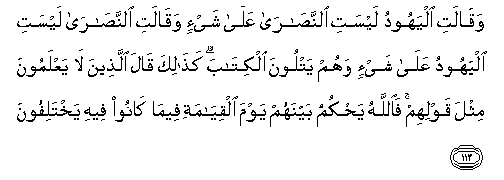
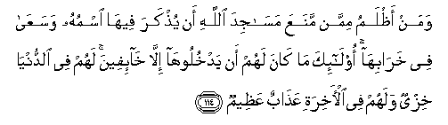

  
[Intangible Textual Heritage](../../index)  [Islam](../index) 
[Index](index)   
[Hypertext Qur'an](../htq/index)  [Unicode](../uq/002.htm#002_113) 
[Palmer](../sbe06/002)  [Pickthall](../pick/002.htm#002_113)  [Yusuf Ali
English](../yaq/yaq002)  [Rodwell](../qr/002)   
  
[Sūra II.: Baqara, or the Heifer. Index](002)  
  [Previous](00213)  [Next](00215) 

------------------------------------------------------------------------

  
*The Holy Quran*, tr. by Yusuf Ali, \[1934\], at Intangible Textual
Heritage

------------------------------------------------------------------------

# Sūra II.: Baqara, or the Heifer.

### Section 14

------------------------------------------------------------------------

113. Waq<u>a</u>lati alyahoodu laysati a**l**nna<u>sa</u>r<u>a</u>
AAal<u>a</u> shay-in waq<u>a</u>lati a**l**nna<u>sa</u>r<u>a</u> laysati
alyahoodu AAal<u>a</u> shay-in wahum yatloona alkit<u>a</u>ba
ka<u>tha</u>lika q<u>a</u>la alla<u>th</u>eena l<u>a</u> yaAAlamoona
mithla qawlihim fa**A**ll<u>a</u>hu ya<u>h</u>kumu baynahum yawma
alqiy<u>a</u>mati feem<u>a</u> k<u>a</u>noo feehi yakhtalifoon**a**

113\. The Jews say: "The Christians  
Have naught (to stand) upon;  
And the Christians say:  
"The Jews have naught  
(To stand) upon." Yet they  
(Profess to) study the (same) Book.  
Like unto their word  
Is what those say who know not;  
But God will judge  
Between them in their quarrel  
On the Day of Judgment.

------------------------------------------------------------------------

114. Waman a*<u>th</u>*lamu mimman manaAAa mas<u>a</u>jida All<u>a</u>hi
an yu<u>th</u>kara feeh<u>a</u> ismuhu wasaAA<u>a</u> fee
khar<u>a</u>bih<u>a</u> ol<u>a</u>-ika m<u>a</u> k<u>a</u>na lahum an
yadkhulooh<u>a</u> ill<u>a</u> kh<u>a</u>-ifeena lahum fee
a**l**dduny<u>a</u> khizyun walahum fee al-<u>a</u>khirati
AAa<u>tha</u>bun AAa*<u>th</u>*eem**un**

114\. And who is more unjust  
Than he who forbids  
That in places for the worship  
Of God, God's name should be  
Celebrated?—whose zeal  
Is (in fact) to ruin them?  
It was not fitting that such  
Should themselves enter them  
Except in fear. For them  
There is nothing but disgrace  
In this world, and in the world  
To come, an exceeding torment.

------------------------------------------------------------------------

115. Walill<u>a</u>hi almashriqu wa**a**lmaghribu faaynam<u>a</u>
tuwalloo fathamma wajhu All<u>a</u>hi inna All<u>a</u>ha w<u>a</u>siAAun
AAaleem**un**

115\. To God belong the East  
And the West: whithersoever  
Ye turn, there is the Presence  
Of God. For God is All-Pervading,  
All-Knowing.

------------------------------------------------------------------------

116. Waq<u>a</u>loo itakha<u>th</u>a All<u>a</u>hu waladan
sub<u>ha</u>nahu bal lahu m<u>a</u> fee a**l**ssam<u>a</u>w<u>a</u>ti
wa**a**l-ar<u>d</u>i kullun lahu q<u>a</u>nitoon**a**

116\. They say: "God hath begotten  
A son": Glory be to Him.—Nay,  
To Him belongs all  
That is in the heavens  
And on earth: everything  
Renders worship to Him.'"

------------------------------------------------------------------------

117. BadeeAAu a**l**ssam<u>a</u>w<u>a</u>ti wa**a**l-ar<u>d</u>i
wa-i<u>tha</u> qa<u>da</u> amran fa-innam<u>a</u> yaqoolu lahu kun
fayakoon**u**

117\. To Him is due  
The primal origin  
Of the heavens and the earth:  
When He decreeth a matter,  
He saith to it: "Be,"  
And it is.

------------------------------------------------------------------------

118. Waq<u>a</u>la alla<u>th</u>eena l<u>a</u> yaAAlamoona lawl<u>a</u>
yukallimun<u>a</u> All<u>a</u>hu aw ta/teen<u>a</u> <u>a</u>yatun
ka<u>tha</u>lika q<u>a</u>la alla<u>th</u>eena min qablihim mithla
qawlihim tash<u>a</u>bahat quloobuhum qad bayyann<u>a</u>
al-<u>a</u>y<u>a</u>ti liqawmin yooqinoon**a**

118\. Say those without knowledge:  
"Why speaketh not God  
Unto us? Or why cometh not  
Unto us a Sign?"  
So said the people before them  
Words of similar import.  
Their hearts are alike.  
We have indeed made clear  
The Signs unto any people  
Who hold firmly  
To Faith (in their hearts).

------------------------------------------------------------------------

119. Inn<u>a</u> arsaln<u>a</u>ka bi**a**l<u>h</u>aqqi basheeran
wana<u>th</u>eeran wal<u>a</u> tus-alu Aaan a<u>s</u>-<u>ha</u>bi
alja<u>h</u>eem**i**

119\. Verily We have sent thee  
In truth as a bearer  
Of glad tidings and a warner:  
But of thee no question  
Shall be asked of the Companions  
Of the Blazing Fire.

------------------------------------------------------------------------

120. Walan tar<u>da</u> AAanka alyahoodu wal<u>a</u>
a**l**nna<u>sa</u>r<u>a</u> <u>h</u>att<u>a</u> tattabiAAa millatahum
qul inna hud<u>a</u> All<u>a</u>hi huwa alhud<u>a</u> wala-ini
ittabaAAta ahw<u>a</u>ahum baAAda alla<u>th</u>ee j<u>a</u>aka mina
alAAilmi m<u>a</u> laka mina All<u>a</u>hi min waliyyin wal<u>a</u>
na<u>s</u>eer**in**

120\. Never will the Jews  
Or the Christians be satisfied  
With thee unless thou follow  
Their form of religion. Say:  
"The Guidance of God,—that  
Is the (only) Guidance."  
Wert thou to follow their desires  
After the knowledge  
Which hath reached thee,  
Then wouldst thou find  
Neither Protector nor Helper  
Against God.

------------------------------------------------------------------------

121. Alla<u>th</u>eena <u>a</u>tayn<u>a</u>humu alkit<u>a</u>ba
yatloonahu <u>h</u>aqqa til<u>a</u>watihi ol<u>a</u>-ika yu/minoona bihi
waman yakfur bihi faol<u>a</u>-ika humu alkh<u>a</u>siroon**a**

121\. Those to whom We have sent  
The Book study it as it  
Should be studied: they are  
The ones that believe therein:  
Those who reject faith therein,—  
The loss is their own.

------------------------------------------------------------------------

[Next: Section 15 (122-129)](00215)

