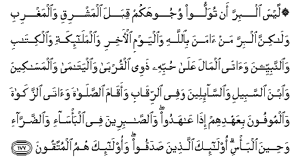
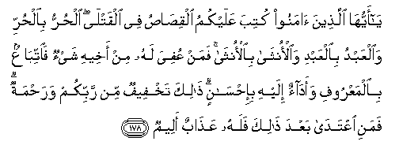
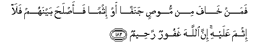

  
[Intangible Textual Heritage](../../index)  [Islam](../index) 
[Index](index)   
[Hypertext Qur'an](../htq/index)  [Unicode](../uq/002.htm#002_177) 
[Palmer](../sbe06/002)  [Pickthall](../pick/002.htm#002_177)  [Yusuf Ali
English](../yaq/yaq002)  [Rodwell](../qr/002)   
  
[Sūra II.: Baqara, or the Heifer. Index](002)  
  [Previous](00221)  [Next](00223) 

------------------------------------------------------------------------

  
*The Holy Quran*, tr. by Yusuf Ali, \[1934\], at Intangible Textual
Heritage

------------------------------------------------------------------------

# Sūra II.: Baqara, or the Heifer.

### Section 22

------------------------------------------------------------------------

177. Laysa albirra an tuwalloo wujoohakum qibala almashriqi
wa**a**lmaghribi wal<u>a</u>kinna albirra man <u>a</u>mana
bi**A**ll<u>a</u>hi wa**a**lyawmi al-<u>a</u>khiri
wa**a**lmal<u>a</u>-ikati wa**a**lkit<u>a</u>bi wa**al**nnabiyyeena
wa<u>a</u>t<u>a</u> alm<u>a</u>la AAal<u>a</u> <u>h</u>ubbihi
<u>th</u>awee alqurb<u>a</u> wa**a**lyat<u>a</u>m<u>a</u>
wa**a**lmas<u>a</u>keena wa**i**bna alssabeeli wa**al**ss<u>a</u>-ileena
wafee a**l**rriq<u>a</u>bi waaq<u>a</u>ma a**l**<u>ss</u>al<u>a</u>ta
wa<u>a</u>t<u>a</u> a**l**zzak<u>a</u>ta wa**a**lmoofoona biAAahdihim
i<u>tha</u> AA<u>a</u>hadoo wa**al**<u>ssa</u>bireena fee
alba/s<u>a</u>-i wa**al**<u>dd</u>arr<u>a</u>-i wa<u>h</u>eena alba/si
ol<u>a</u>-ika alla<u>th</u>eena <u>s</u>adaqoo waol<u>a</u>-ika humu
almuttaqoon**a**

177\. It is not righteousness  
That ye turn your faces  
Towards East or West;  
But it is righteousness—  
To believe in God  
And the Last Day,  
And the Angels,  
And the Book,  
And the Messengers;  
To spend of your substance,  
Out of love for Him,  
For your kin,  
For orphans,  
For the needy,  
For the wayfarer,  
For those who ask,  
And for the ransom of slaves;  
To be steadfast in prayer,  
And practice regular charity;  
To fulfil the contracts  
Which ye have made;  
And to be firm and patient,  
In pain (or suffering)  
And adversity,  
And throughout  
All periods of panic.  
Such are the people  
Of truth, the God-fearing.

------------------------------------------------------------------------

178. Y<u>a</u> ayyuh<u>a</u> alla<u>th</u>eena <u>a</u>manoo kutiba
AAalaykumu alqi<u>sas</u>u fee alqatl<u>a</u> al<u>h</u>urru
bi**a**l<u>h</u>urri wa**a**lAAabdu bi**a**lAAabdi wa**a**lonth<u>a</u>
bi**a**lonth<u>a</u> faman AAufiya lahu min akheehi shay-on
fa**i**ttib<u>a</u>AAun bi**a**lmaAAroofi waad<u>a</u>on ilayhi
bi-i<u>h</u>s<u>a</u>nin <u>tha</u>lika takhfeefun min rabbikum
wara<u>h</u>matun famani iAAtad<u>a</u> baAAda <u>tha</u>lika falahu
AAa<u>tha</u>bun aleem**un**

178\. O ye who believe!  
The law of equality  
Is prescribed to you  
In cases of murder:  
The free for the free,  
The slave for the slave,  
The woman for the woman.  
But if any remission  
Is made by the brother  
Of the slain, then grant  
Any reasonable demand,  
And compensate him  
With handsome gratitude.  
This is a concession  
And a Mercy  
From your Lord.  
After this whoever  
Exceeds the limits  
Shall be in grave penalty.

------------------------------------------------------------------------

179. Walakum fee alqi<u>sas</u>i <u>h</u>ay<u>a</u>tun y<u>a</u> olee
al-alb<u>a</u>bi laAAallakum tattaqoon**a**

179\. In the Law of Equality  
There is (saving of) Life  
To you, O ye men of understanding;  
That ye may  
Restrain yourselves.

------------------------------------------------------------------------

180. Kutiba AAalaykum i<u>tha</u> <u>h</u>a<u>d</u>ara a<u>h</u>adakumu
almawtu in taraka khayran alwa<u>s</u>iyyatu lilw<u>a</u>lidayni
wa**a**l-aqrabeena bi**a**lmaAAroofi <u>h</u>aqqan AAal<u>a</u>
almuttaqeen**a**

180\. It is prescribed,  
When death approaches  
Any of you, if he leave  
Any goods, that he make a bequest  
To parents and next of kin,  
According to reasonable usage;  
This is due  
From the God-fearing.

------------------------------------------------------------------------

181. Faman baddalahu baAAda m<u>a</u> samiAAahu fa-innam<u>a</u> ithmuhu
AAal<u>a</u> alla<u>th</u>eena yubaddiloonahu inna All<u>a</u>ha
sameeAAun AAaleem**un**

181\. If anyone changes the bequest  
After hearing it,  
The guilt shall be on those  
Who make the change.  
For God hears and knows  
(All things).

------------------------------------------------------------------------

182. Faman kh<u>a</u>fa min moo<u>s</u>in janafan aw ithman
faa<u>s</u>la<u>h</u>a baynahum fal<u>a</u> ithma AAalayhi inna
All<u>a</u>ha ghafoorun ra<u>h</u>eem**un**

182\. But if anyone fears  
Partiality or wrong-doing  
On the part of the testator,  
And makes peace between  
(The parties concerned),  
There is no wrong in him:  
For God is Oft-forgiving,  
Most Merciful.

------------------------------------------------------------------------

[Next: Section 23 (183-188)](00223)

