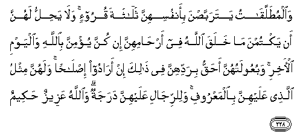

  
[Intangible Textual Heritage](../../index)  [Islam](../index) 
[Index](index)   
[Hypertext Qur'an](../htq/index)  [Unicode](../uq/002.htm#002_222) 
[Palmer](../sbe06/002)  [Pickthall](../pick/002.htm#002_222)  [Yusuf Ali
English](../yaq/yaq002)  [Rodwell](../qr/002)   
  
[Sūra II.: Baqara, or the Heifer. Index](002)  
  [Previous](00227)  [Next](00229) 

------------------------------------------------------------------------

  
*The Holy Quran*, tr. by Yusuf Ali, \[1934\], at Intangible Textual
Heritage

------------------------------------------------------------------------

# Sūra II.: Baqara, or the Heifer.

### Section 28

------------------------------------------------------------------------

222. Wayas-aloonaka AAani alma<u>h</u>ee<u>d</u>i qul huwa a<u>th</u>an
fa**i**AAtaziloo a**l**nnis<u>a</u>a fee alma<u>h</u>ee<u>d</u>i
wal<u>a</u> taqraboohunna <u>h</u>att<u>a</u> ya<u>t</u>hurna
fa-i<u>tha</u> ta<u>t</u>ahharna fa/toohunna min <u>h</u>aythu amarakumu
All<u>a</u>hu inna All<u>a</u>ha yu<u>h</u>ibbu a**l**ttaww<u>a</u>beena
wayu<u>h</u>ibbu almuta<u>t</u>ahhireen**a**

222\. They ask thee  
Concerning women's courses.  
Say: They are  
A hurt and a pollution:  
So keep away from women  
In their courses, and do not  
Approach them until  
They are clean.  
But when they have  
Purified themselves,  
Ye may approach them  
In any manner, time, or place  
Ordained for you by God.  
For God loves those  
Who turn to Him constantly  
And He loves those  
Who keep themselves pure and clean,

------------------------------------------------------------------------

223. Nis<u>a</u>okum <u>h</u>arthun lakum fa/too <u>h</u>arthakum
ann<u>a</u> shi/tum waqaddimoo li-anfusikum wa**i**ttaqoo All<u>a</u>ha
wa**i**AAlamoo annakum mul<u>a</u>qoohu wabashshiri almu/mineen**a**

223\. Your wives are  
As a tilth unto you;  
So approach your tilth  
When or how ye will;  
But do some good act  
For your souls beforehand;  
And fear God,  
And know that ye are  
To meet Him (in the Hereafter),  
And give (these) good tidings  
To those who believe.

------------------------------------------------------------------------

224. Wal<u>a</u> tajAAaloo All<u>a</u>ha AAur<u>d</u>atan
li-aym<u>a</u>nikum an tabarroo watattaqoo watu<u>s</u>li<u>h</u>oo
bayna a**l**nn<u>a</u>si wa**A**ll<u>a</u>hu sameeAAun AAaleem**un**

224\. And make not  
God's (name) an excuse  
In your oaths against  
Doing good, or acting rightly,  
Or making peace  
Between persons;  
For God is One  
Who heareth and knoweth  
All things.

------------------------------------------------------------------------

225. L<u>a</u> yu-<u>a</u>khi<u>th</u>ukumu All<u>a</u>hu bi**a**llaghwi
fee aym<u>a</u>nikum wal<u>a</u>kin yu-<u>a</u>khi<u>th</u>ukum
bim<u>a</u> kasabat quloobukum wa**A**ll<u>a</u>hu ghafoorun
<u>h</u>aleem**un**

225\. God will not  
Call you to account  
For thoughtlessness  
In your oaths,  
But for the intention  
In your hearts;  
And He is  
Oft-forgiving  
Most Forbearing.

------------------------------------------------------------------------

226. Lilla<u>th</u>eena yu/loona min nis<u>a</u>-ihim tarabbu<u>s</u>u
arbaAAati ashhurin fa-in f<u>a</u>oo fa-inna All<u>a</u>ha ghafoorun
ra<u>h</u>eem**un**

226\. For those who take  
An oath for abstention  
From their wives,  
A waiting for four months  
Is ordained;  
If then they return,  
God is Oft-forgiving,  
Most Merciful.

------------------------------------------------------------------------

227. Wa-in AAazamoo a**l**<u>tt</u>al<u>a</u>qa fa-inna All<u>a</u>ha
sameeAAun AAaleem**un**

227\. But if their intention  
Is firm for divorce,  
God heareth  
And knoweth all things.

------------------------------------------------------------------------

228. Wa**a**lmu<u>t</u>allaq<u>a</u>tu yatarabba<u>s</u>na
bi-anfusihinna thal<u>a</u>thata quroo-in wal<u>a</u> ya<u>h</u>illu
lahunna an yaktumna m<u>a</u> khalaqa All<u>a</u>hu fee
ar<u>ha</u>mihinna in kunna yu/minna bi**A**ll<u>a</u>hi wa**a**lyawmi
al-<u>a</u>khiri wabuAAoolatuhunna a<u>h</u>aqqu biraddihinna fee
<u>tha</u>lika in ar<u>a</u>doo i<u>s</u>l<u>ah</u>an walahunna mithlu
alla<u>th</u>ee AAalayhinna bi**a**lmaAAroofi wali**l**rrij<u>a</u>li
AAalayhinna darajatun wa**A**ll<u>a</u>hu AAazeezun <u>h</u>akeem**un**

228\. Divorced women  
Shall wait concerning themselves  
For three monthly periods.  
Nor is it lawful for them  
To hide what God  
Hath created in their wombs,  
If they have faith  
In God and the Last Day.  
And their husbands  
Have the better right  
To take them back  
In that period, if  
They wish for reconciliation.  
And women shall have rights  
Similar to the rights  
Against them, according  
To what is equitable;  
But men have a degree  
(Of advantage) over them.  
And God is Exalted in Power, Wise.

------------------------------------------------------------------------

[Next: Section 29 (229-231)](00229)

