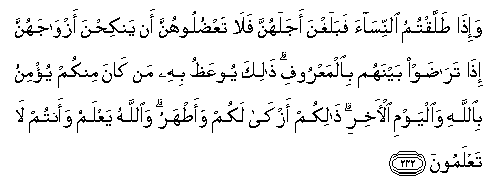
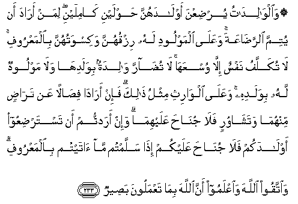
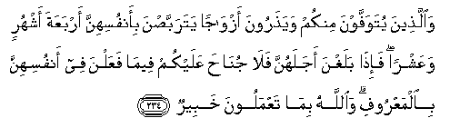
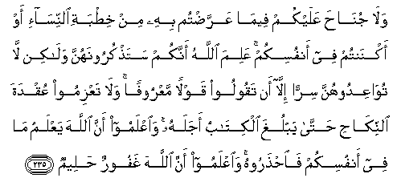

  
[Intangible Textual Heritage](../../index)  [Islam](../index) 
[Index](index)   
[Hypertext Qur'an](../htq/index)  [Unicode](../uq/002.htm#002_232) 
[Palmer](../sbe06/002)  [Pickthall](../pick/002.htm#002_232)  [Yusuf Ali
English](../yaq/yaq002)  [Rodwell](../qr/002)   
  
[Sūra II.: Baqara, or the Heifer. Index](002)  
  [Previous](00229)  [Next](00231) 

------------------------------------------------------------------------

  
*The Holy Quran*, tr. by Yusuf Ali, \[1934\], at Intangible Textual
Heritage

------------------------------------------------------------------------

# Sūra II.: Baqara, or the Heifer.

### Section 30

------------------------------------------------------------------------

232. Wa-i<u>tha</u> <u>t</u>allaqtumu a**l**nnis<u>a</u>a fabalaghna
ajalahunna fal<u>a</u> taAA<u>d</u>uloohunna an yanki<u>h</u>na
azw<u>a</u>jahunna i<u>tha</u> tar<u>ad</u>aw baynahum bi**a**lmaAAroofi
<u>tha</u>lika yooAAa*<u>th</u>*u bihi man k<u>a</u>na minkum yu/minu
bi**A**ll<u>a</u>hi wa**a**lyawmi al-<u>a</u>khiri <u>tha</u>likum
azk<u>a</u> lakum waa<u>t</u>haru wa**A**ll<u>a</u>hu yaAAlamu waantum
l<u>a</u> taAAlamoon**a**

232\. When ye divorce  
Women, and they fulfil  
The term of their (’Iddat),  
Do not prevent them  
From marrying  
Their (former) husbands,  
If they mutually agree  
On equitable terms.  
This instruction  
Is for all amongst you,  
Who believe in God  
And the Last Day.  
That is (the course  
Making for) most virtue  
And purity amongst you,  
And God knows,  
And ye know not.

------------------------------------------------------------------------

233. Wa**a**lw<u>a</u>lid<u>a</u>tu yur<u>d</u>iAAna awl<u>a</u>dahunna
<u>h</u>awlayni k<u>a</u>milayni liman ar<u>a</u>da an yutimma
a**l**rra<u>da</u>AAata waAAal<u>a</u> almawloodi lahu rizquhunna
wakiswatuhunna bi**a**lmaAAroofi l<u>a</u> tukallafu nafsun ill<u>a</u>
wusAAah<u>a</u> l<u>a</u> tu<u>da</u>rra w<u>a</u>lidatun
biwaladih<u>a</u> wal<u>a</u> mawloodun lahu biwaladihi waAAal<u>a</u>
alw<u>a</u>rithi mithlu <u>tha</u>lika fa-in ar<u>a</u>d<u>a</u>
fi<u>sa</u>lan AAan tar<u>ad</u>in minhum<u>a</u> watash<u>a</u>wurin
fal<u>a</u> jun<u>ah</u>a AAalayhim<u>a</u> wa-in aradtum an
tastar<u>d</u>iAAoo awl<u>a</u>dakum fal<u>a</u> jun<u>ah</u>a AAalaykum
i<u>tha</u> sallamtum m<u>a</u> <u>a</u>taytum bi**a**lmaAAroofi
wa**i**ttaqoo All<u>a</u>ha wa**i**AAlamoo anna All<u>a</u>ha
bim<u>a</u> taAAmaloona ba<u>s</u>eer**un**

233\. The mothers shall give suck  
To their offspring  
For two whole years,  
If the father desires  
To complete the term.  
But he shall bear the cost  
Of their food and clothing  
On equitable terms.  
No soul shall have  
A burden laid on it  
Greater than it can bear.  
No mother shall be  
Treated unfairly  
On account of her child.  
Nor father  
On account of his child,  
An heir shall be chargeable  
In the same way.  
If they both decide  
On weaning,  
By mutual consent,  
And after due consultation,  
There is no blame on them.  
If ye decide  
On a foster-mother  
For your offspring,  
There is no blame on you,  
Provided ye pay (the mother)  
What ye offered,  
On equitable terms.  
But fear God and know  
That God sees well  
What ye do.

------------------------------------------------------------------------

234. Wa**a**lla<u>th</u>eena yutawaffawna minkum waya<u>th</u>aroona
azw<u>a</u>jan yatarabba<u>s</u>na bi-anfusihinna arbaAAata ashhurin
waAAashran fa-i<u>tha</u> balaghna ajalahunna fal<u>a</u> jun<u>ah</u>a
AAalaykum feem<u>a</u> faAAalna fee anfusihinna bi**a**lmaAAroofi
wa**A**ll<u>a</u>hu bim<u>a</u> taAAmaloona khabeer**un**

234\. If any of you die  
And leave widows behind,  
They shall wait concerning themselves  
Four months and ten days:  
When they have fulfilled  
Their term, there is no blame  
On you if they dispose  
Of themselves in a just  
And reasonable manner.  
And God is well acquainted  
With what ye do.

------------------------------------------------------------------------

235. Wal<u>a</u> jun<u>ah</u>a AAalaykum feem<u>a</u> AAarra<u>d</u>tum
bihi min khi<u>t</u>bati a**l**nnis<u>a</u>-i aw aknantum fee anfusikum
AAalima All<u>a</u>hu annakum sata<u>th</u>kuroonahunna wal<u>a</u>kin
l<u>a</u> tuw<u>a</u>AAidoohunna sirran ill<u>a</u> an taqooloo qawlan
maAAroofan wal<u>a</u> taAAzimoo AAuqdata a**l**nnik<u>ah</u>i
<u>h</u>att<u>a</u> yablugha alkit<u>a</u>bu ajalahu wa**i**AAlamoo anna
All<u>a</u>ha yaAAlamu m<u>a</u> fee anfusikum fa**i**<u>hth</u>aroohu
wa**i**AAlamoo anna All<u>a</u>ha ghafoorun <u>h</u>aleem**un**

235\. There is no blame  
On you if ye make  
An offer of betrothal  
Or hold it in your hearts.  
God knows that ye  
Cherish them in your hearts:  
But do not make a secret contract  
With them except in terms  
Honourable, nor resolve on the tie  
Of marriage till the term  
Prescribed is fulfilled.  
And know that God  
Knoweth what is in your hearts,  
And take heed of Him;  
And know that God is  
Oft-forgiving, Most Forbearing.

------------------------------------------------------------------------

[Next: Section 31 (236-242)](00231)

