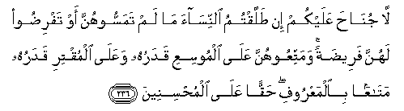

  
[Intangible Textual Heritage](../../index)  [Islam](../index) 
[Index](index)   
[Hypertext Qur'an](../htq/index)  [Unicode](../uq/002.htm#002_236) 
[Palmer](../sbe06/002)  [Pickthall](../pick/002.htm#002_236)  [Yusuf Ali
English](../yaq/yaq002)  [Rodwell](../qr/002)   
  
[Sūra II.: Baqara, or the Heifer. Index](002)  
  [Previous](00230)  [Next](00232) 

------------------------------------------------------------------------

  
*The Holy Quran*, tr. by Yusuf Ali, \[1934\], at Intangible Textual
Heritage

------------------------------------------------------------------------

# Sūra II.: Baqara, or the Heifer.

### Section 31

------------------------------------------------------------------------

236. L<u>a</u> jun<u>ah</u>a AAalaykum in <u>t</u>allaqtumu
a**l**nnis<u>a</u>a m<u>a</u> lam tamassoohunna aw tafri<u>d</u>oo
lahunna faree<u>d</u>atan wamattiAAoohunna AAal<u>a</u> almoosiAAi
qadaruhu waAAal<u>a</u> almuqtiri qadaruhu mat<u>a</u>AAan
bi**a**lmaAAroofi <u>h</u>aqqan AAal<u>a</u> almu<u>h</u>sineen**a**

236\. There is no blame on you  
If ye divorce women  
Before consummation  
Or the fixation of their dower;  
But bestow on them  
(A suitable gift),  
The wealthy  
According to his means,  
And the poor  
According to his means;—  
A gift of a reasonable amount  
Is due from those  
Who wish to do the right thing.

------------------------------------------------------------------------

237. Wa-in <u>t</u>allaqtumoohunna min qabli an tamassoohunna waqad
fara<u>d</u>tum lahunna faree<u>d</u>atan fani<u>s</u>fu m<u>a</u>
fara<u>d</u>tum ill<u>a</u> an yaAAfoona aw yaAAfuwa alla<u>th</u>ee
biyadihi AAuqdatu a**l**nnik<u>ah</u>i waan taAAfoo aqrabu
li**l**ttaqw<u>a</u> wal<u>a</u> tansawoo alfa<u>d</u>la baynakum inna
All<u>a</u>ha bim<u>a</u> taAAmaloona ba<u>s</u>eer**un**

237\. And if ye divorce them  
Before consummation,  
But after the fixation  
Of a dower for them,  
Then the half of the dower  
(Is due to them), unless  
They remit it  
Or (the man's half) is remitted  
By him in whose hands  
Is the marriage tie;  
And the remission  
(Of the man's half)  
Is the nearest to righteousness.  
And do not forget  
Liberality between yourselves.  
For God sees well  
All that ye do.

------------------------------------------------------------------------

238. <u>Ha</u>fi*<u>th</u>*oo AAal<u>a</u> a**l**<u>ss</u>alaw<u>a</u>ti
wa**al**<u>ss</u>al<u>a</u>ti alwus<u>ta</u> waqoomoo lill<u>a</u>hi
q<u>a</u>niteen**a**

238\. Guard strictly  
Your (habit of) prayers,  
Especially the Middle Prayer;  
And stand before God  
In a devout (frame of mind).

------------------------------------------------------------------------

239. Fa-in khiftum farij<u>a</u>lan aw rukb<u>a</u>nan fa-i<u>tha</u>
amintum fa**o**<u>th</u>kuroo All<u>a</u>ha kam<u>a</u> AAallamakum
m<u>a</u> lam takoonoo taAAlamoon**a**

239\. If ye fear (an enemy),  
Pray on foot, or riding,  
(As may be most convenient),  
But when ye are  
In security, celebrate  
God's praises in the manner  
He has taught you,  
Which ye knew not (before).

------------------------------------------------------------------------

240. Wa**a**lla<u>th</u>eena yutawaffawna minkum waya<u>th</u>aroona
azw<u>a</u>jan wa<u>s</u>iyyatan li-azw<u>a</u>jihim mat<u>a</u>AAan
il<u>a</u> al<u>h</u>awli ghayra ikhr<u>a</u>jin fa-in kharajna
fal<u>a</u> jun<u>ah</u>a AAalaykum fee m<u>a</u> faAAalna fee
anfusihinna min maAAroofin wa**A**ll<u>a</u>hu AAazeezun
<u>h</u>akeem**un**

240\. Those of you  
Who die and leave widows  
Should bequeath  
For their widows  
A year's maintenance  
And residence;  
But if they leave  
(The residence),  
There is no blame on you  
For what they do  
With themselves,  
Provided it is reasonable.  
And God is Exalted in Power, Wise.

------------------------------------------------------------------------

241. Walilmu<u>t</u>allaq<u>a</u>ti mat<u>a</u>AAun bi**a**lmaAAroofi
<u>h</u>aqqan AAal<u>a</u> almuttaqeen**a**

241\. For divorced women  
Maintenance (should be provided)  
On a reasonable (scale).  
This is a duty  
On the righteous.

------------------------------------------------------------------------

242. Ka<u>tha</u>lika yubayyinu All<u>a</u>hu lakum
<u>a</u>y<u>a</u>tihi laAAallakum taAAqiloon**a**

242\. Thus doth God  
Make clear His Signs  
To you: in order that  
Ye may understand.

------------------------------------------------------------------------

[Next: Section 32 (243-248)](00232)

